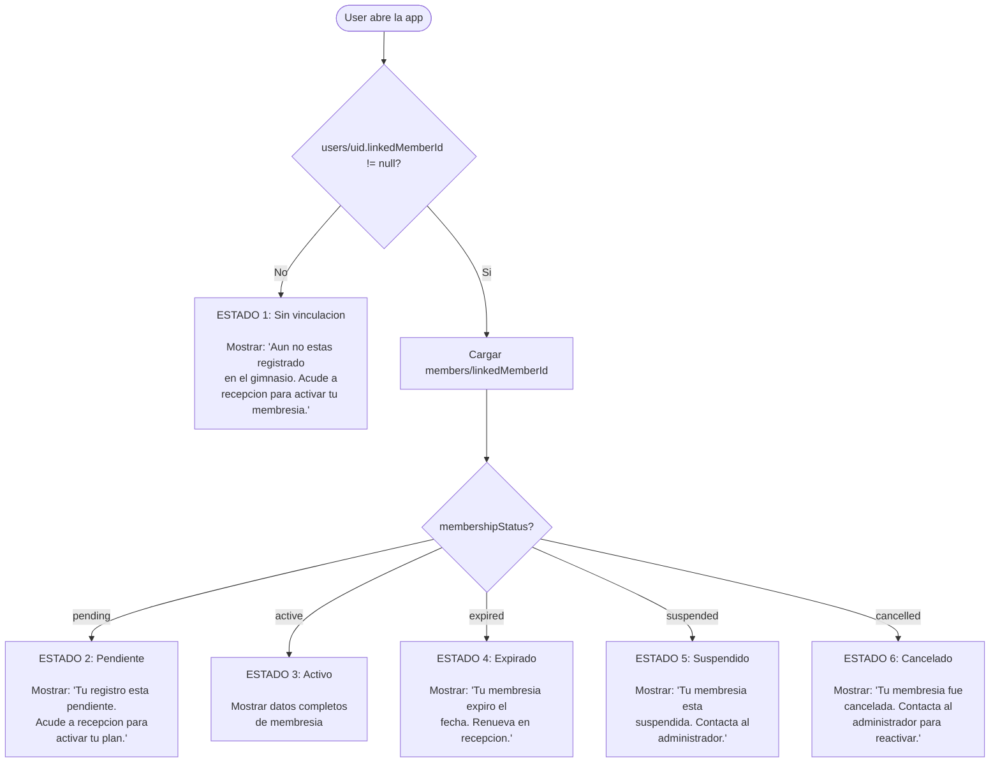

# Home del Miembro — Android

> Pantalla principal para usuarios con rol `member`.
> Muestra el estado de la membresia segun la vinculacion con la coleccion `members` (iOS).

---

## Los 6 estados del miembro

Cuando un usuario abre la app, lo que ve depende de su estado de vinculacion con `members`:



---

## Datos a mostrar para Estado 3 (activo)

| Dato | Fuente | Descripcion |
|------|--------|-------------|
| Nombre del plan | `members.membershipPlanSnapshot.planName` | Nombre al momento de asignar |
| Tipo de plan | `members.membershipPlanSnapshot.planType` | `time_based`, `visit_based`, `mixed` |
| Fecha de inicio | `members.membershipStartDate` | Timestamp de inicio |
| Fecha de vencimiento | `members.membershipEndDate` | Timestamp de fin (`null` si `visit_based`) |
| Dias restantes | Calculado: `membershipEndDate - hoy` | Solo si `planType != visit_based` |
| Visitas restantes | `members.remainingVisits` | Solo si `planType != time_based` |
| Check-ins este mes | Query en `check_ins` | Contar documentos del mes actual |
| Ultimo check-in | Query en `check_ins` | Fecha del mas reciente |
| Historial de pagos | Query en `payments` | Lista ordenada por fecha |

---

## Leer el estado del miembro desde Android

```kotlin
class MemberHomeViewModel(
    private val authRepository: AuthRepository
) : ViewModel() {

    private val db = FirebaseFirestore.getInstance()

    private val _memberState = MutableStateFlow<MemberHomeState>(MemberHomeState.Loading)
    val memberState: StateFlow<MemberHomeState> = _memberState.asStateFlow()

    init {
        loadMemberState()
    }

    fun loadMemberState() {
        viewModelScope.launch {
            _memberState.value = MemberHomeState.Loading

            val uid = authRepository.getUserId()
            if (uid == null) {
                _memberState.value = MemberHomeState.NotLinked
                return@launch
            }

            try {
                // 1. Leer el User para obtener linkedMemberId
                val userDoc = db.collection("users").document(uid).get().await()
                val linkedMemberId = userDoc.getString("linkedMemberId")

                if (linkedMemberId == null) {
                    _memberState.value = MemberHomeState.NotLinked
                    return@launch
                }

                // 2. Leer el Member vinculado
                val memberDoc = db.collection("members").document(linkedMemberId).get().await()
                if (!memberDoc.exists()) {
                    _memberState.value = MemberHomeState.NotLinked
                    return@launch
                }

                val status = memberDoc.getString("membershipStatus") ?: "pending"
                val snapshot = memberDoc.get("membershipPlanSnapshot") as? Map<*, *>

                _memberState.value = when (status) {
                    "active" -> {
                        val endDate = memberDoc.getTimestamp("membershipEndDate")
                        val remainingVisits = memberDoc.getLong("remainingVisits")?.toInt()
                        val planName = snapshot?.get("planName") as? String ?: ""
                        val planType = snapshot?.get("planType") as? String ?: ""

                        // 3. Contar check-ins del mes actual
                        val checkInsThisMonth = countCheckInsThisMonth(linkedMemberId)
                        val lastCheckIn = getLastCheckIn(linkedMemberId)

                        MemberHomeState.Active(
                            planName = planName,
                            planType = planType,
                            endDate = endDate,
                            remainingVisits = remainingVisits,
                            checkInsThisMonth = checkInsThisMonth,
                            lastCheckIn = lastCheckIn
                        )
                    }
                    "pending" -> MemberHomeState.Pending
                    "expired" -> MemberHomeState.Expired(
                        expiredAt = memberDoc.getTimestamp("membershipEndDate")
                    )
                    "suspended" -> MemberHomeState.Suspended
                    "cancelled" -> MemberHomeState.Cancelled
                    else -> MemberHomeState.Pending
                }
            } catch (e: Exception) {
                _memberState.value = MemberHomeState.Error("Error al cargar tu membresia.")
            }
        }
    }

    private suspend fun countCheckInsThisMonth(memberId: String): Int {
        val calendar = Calendar.getInstance()
        calendar.set(Calendar.DAY_OF_MONTH, 1)
        calendar.set(Calendar.HOUR_OF_DAY, 0)
        calendar.set(Calendar.MINUTE, 0)
        calendar.set(Calendar.SECOND, 0)
        val startOfMonth = Timestamp(calendar.time)

        val snapshot = db.collection("check_ins")
            .whereEqualTo("memberId", memberId)
            .whereGreaterThanOrEqualTo("checkInDate", startOfMonth)
            .get()
            .await()
        return snapshot.size()
    }

    private suspend fun getLastCheckIn(memberId: String): Timestamp? {
        val snapshot = db.collection("check_ins")
            .whereEqualTo("memberId", memberId)
            .orderBy("checkInDate", com.google.firebase.firestore.Query.Direction.DESCENDING)
            .limit(1)
            .get()
            .await()
        return if (snapshot.isEmpty) null
        else snapshot.documents.first().getTimestamp("checkInDate")
    }
}
```

---

## MemberHomeState — sealed class

```kotlin
sealed class MemberHomeState {
    object Loading : MemberHomeState()
    object NotLinked : MemberHomeState()  // Sin linkedMemberId
    object Pending : MemberHomeState()     // membershipStatus = pending
    object Suspended : MemberHomeState()   // membershipStatus = suspended
    object Cancelled : MemberHomeState()   // membershipStatus = cancelled
    data class Active(
        val planName: String,
        val planType: String,           // "time_based" | "visit_based" | "mixed"
        val endDate: Timestamp?,        // null si visit_based puro
        val remainingVisits: Int?,      // null si time_based puro
        val checkInsThisMonth: Int,
        val lastCheckIn: Timestamp?
    ) : MemberHomeState()
    data class Expired(
        val expiredAt: Timestamp?
    ) : MemberHomeState()
    data class Error(val message: String) : MemberHomeState()
}
```

---

## MemberHomeScreen — UI por estado

```kotlin
@Composable
fun MemberHomeScreen(
    viewModel: MemberHomeViewModel = viewModel(factory = MemberHomeViewModelFactory(LocalContext.current))
) {
    val memberState by viewModel.memberState.collectAsState()

    LaunchedEffect(Unit) {
        viewModel.loadMemberState()
    }

    when (val state = memberState) {
        is MemberHomeState.Loading -> {
            Box(Modifier.fillMaxSize(), contentAlignment = Alignment.Center) {
                CircularProgressIndicator()
            }
        }
        is MemberHomeState.NotLinked -> {
            MemberStateMessage(
                title = "Sin registro",
                message = "Aun no estas registrado en el gimnasio. Acude a recepcion para activar tu membresia.",
                icon = Icons.Default.PersonOff
            )
        }
        is MemberHomeState.Pending -> {
            MemberStateMessage(
                title = "Registro pendiente",
                message = "Tu registro esta pendiente. Acude a recepcion para activar tu plan.",
                icon = Icons.Default.HourglassEmpty
            )
        }
        is MemberHomeState.Active -> {
            MemberActiveMembershipContent(state = state)
        }
        is MemberHomeState.Expired -> {
            MemberStateMessage(
                title = "Membresia expirada",
                message = "Tu membresia expiro${state.expiredAt?.let { " el ${formatDate(it)}" } ?: ""}. Renueva en recepcion para seguir asistiendo.",
                icon = Icons.Default.EventBusy
            )
        }
        is MemberHomeState.Suspended -> {
            MemberStateMessage(
                title = "Membresia suspendida",
                message = "Tu membresia esta suspendida. Contacta al administrador.",
                icon = Icons.Default.PauseCircle
            )
        }
        is MemberHomeState.Cancelled -> {
            MemberStateMessage(
                title = "Membresia cancelada",
                message = "Tu membresia fue cancelada. Contacta al administrador para reactivar.",
                icon = Icons.Default.Cancel
            )
        }
        is MemberHomeState.Error -> {
            MemberStateMessage(
                title = "Error",
                message = state.message,
                icon = Icons.Default.Error
            )
        }
    }
}

@Composable
fun MemberActiveMembershipContent(state: MemberHomeState.Active) {
    Column(modifier = Modifier.fillMaxSize().padding(16.dp)) {
        // Nombre del plan
        Text(state.planName, style = MaterialTheme.typography.headlineMedium)

        // Vigencia (solo si time_based o mixed)
        if (state.endDate != null) {
            val daysRemaining = calculateDaysRemaining(state.endDate)
            Text("Vence: ${formatDate(state.endDate)}")
            Text("$daysRemaining dias restantes")
        }

        // Visitas restantes (solo si visit_based o mixed)
        if (state.remainingVisits != null) {
            Text("Visitas restantes: ${state.remainingVisits}")
        }

        // Check-ins del mes
        Text("Check-ins este mes: ${state.checkInsThisMonth}")

        // Ultimo check-in
        if (state.lastCheckIn != null) {
            Text("Ultima visita: ${formatDateTime(state.lastCheckIn)}")
        }
    }
}
```

---

## Calcular dias restantes

```kotlin
fun calculateDaysRemaining(endDate: Timestamp): Long {
    val now = System.currentTimeMillis()
    val end = endDate.toDate().time
    val diff = end - now
    return if (diff < 0) 0L else diff / (1000 * 60 * 60 * 24)
}
```

---

## Reglas de negocio

1. **No modificar** `members` desde Android — es de solo lectura para la app del miembro
2. `membershipPlanSnapshot` es un `Map` en Firestore — leer campo a campo con cast seguro
3. Si `membershipEndDate` es `null`, el plan es `visit_based` puro (sin fecha limite)
4. Si `remainingVisits` es `null`, el plan es `time_based` (sin limite de visitas)
5. Los check-ins se cuentan por `memberId` (no por `userId`)
6. El historial de pagos se lee de `payments` filtrando por `memberId`
7. Si la lectura de `members` falla por permisos, mostrar estado `NotLinked` (seguro por defecto)

---

## Errores comunes

### 1. Leer `membershipPlanSnapshot` como objeto

**Error:** `ClassCastException` al intentar `memberDoc.toObject(MemberWithSnapshot::class.java)`.

**Causa:** `membershipPlanSnapshot` es un `Map` anidado que Firestore no mapea automaticamente.

**Solucion:** Leer como `Map<*, *>` y acceder campo a campo:
```kotlin
val snapshot = memberDoc.get("membershipPlanSnapshot") as? Map<*, *>
val planName = snapshot?.get("planName") as? String ?: ""
val planType = snapshot?.get("planType") as? String ?: ""
val planPrice = (snapshot?.get("planPrice") as? Double) ?: 0.0
```

### 2. `remainingVisits` devuelve `Long` en lugar de `Int`

**Causa:** Firestore devuelve numeros como `Long`.

**Solucion:**
```kotlin
val remainingVisits = memberDoc.getLong("remainingVisits")?.toInt()
```

### 3. Query de check-ins sin indice compuesto

**Error:** `FirebaseFirestoreException: FAILED_PRECONDITION: The query requires an index.`

**Causa:** La query filtra por `memberId` y ordena por `checkInDate`.

**Solucion:** Crear el indice en Firestore Console o usar el link que aparece en el error de Logcat.

### 4. Fechas mostradas en UTC en lugar de hora local

**Causa:** `Timestamp.toDate()` devuelve UTC.

**Solucion:**
```kotlin
fun formatDate(timestamp: Timestamp): String {
    val sdf = SimpleDateFormat("dd/MM/yyyy", Locale("es", "MX"))
    sdf.timeZone = TimeZone.getDefault()  // Hora local
    return sdf.format(timestamp.toDate())
}
```
