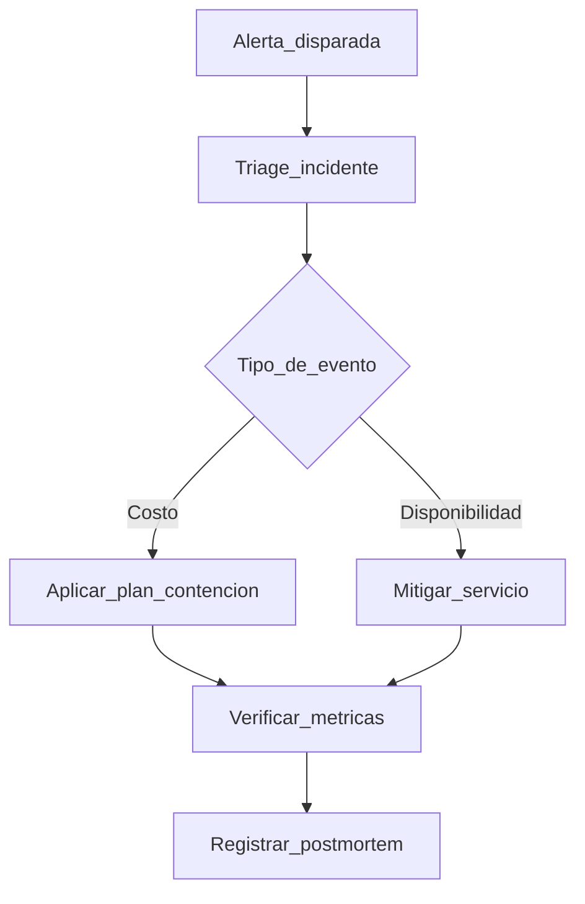

# Observabilidad y Control de Costos Backend

> Lineamientos operativos para mantener estabilidad y costo predecible.

---

## Objetivos

1. Detectar incidentes antes de impactar operación.
2. Medir consumo para evitar sobrecostos.
3. Tomar decisiones con métricas reales.

---

## Telemetria minima

### Logs

- JSON estructurado
- Campos minimos: `timestamp`, `level`, `requestId`, `userId`, `endpoint`, `statusCode`, `durationMs`

### Metricas

- Requests por minuto
- Error rate (4xx/5xx)
- p50/p95 latencia por endpoint
- Uso de CPU y memoria
- Conexiones activas a MySQL

### Alertas

- Error rate > 5% durante 5 min
- p95 > umbral definido por endpoint
- uso de recursos > 80%
- consumo mensual > 80% del presupuesto

---

## Politica de limites

1. Rate limit por IP para endpoints publicos.
2. Rate limit por usuario para operaciones sensibles.
3. Timeouts configurados en DB y HTTP clients.
4. Paginacion obligatoria para listas.

---

## Estrategias anti-sobrecosto

- Cache para lecturas frecuentes y estables.
- Jobs batch para reportes pesados.
- Evitar N+1 queries.
- Indices revisados periodicamente.
- Apagar procesos no criticos en contingencia.

---

## Runbook de contingencia

---

## Checklist semanal

- Revisar endpoints mas costosos.
- Revisar queries lentas.
- Revisar crecimiento de tablas.
- Revisar uso mensual acumulado vs presupuesto.
- Ajustar alertas y umbrales si hay falsos positivos.
