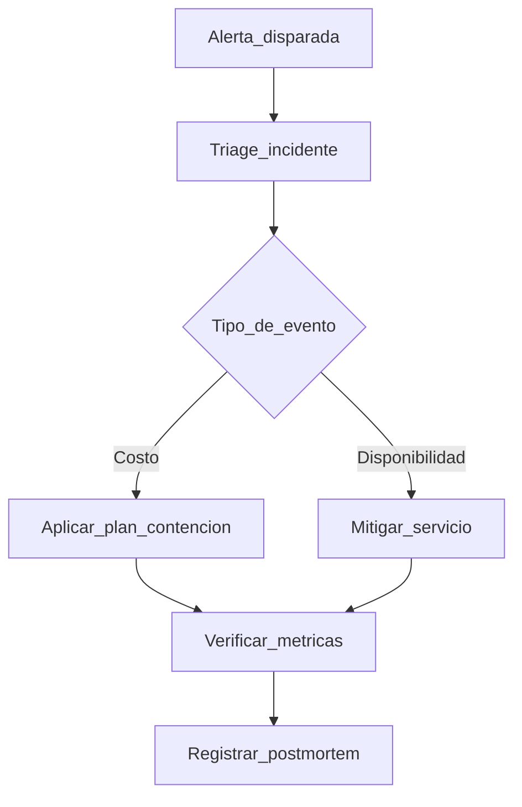

# Observabilidad y Control de Costos Backend

> Lineamientos operativos para estabilidad, trazabilidad y costo predecible.

---

## Objetivos

1. Detectar incidentes antes de afectar operacion.
2. Medir consumo para evitar sobrecostos.
3. Tomar decisiones con metricas reales.

---

## Telemetria minima

### Logs

- JSON estructurado en stdout
- Campos minimos: `timestamp`, `level`, `requestId`, `userId`, `endpoint`, `statusCode`, `durationMs`, `errorCode`
- Nunca loggear secretos ni tokens completos

### Metricas

- Requests por minuto
- Error rate 4xx/5xx
- p50/p95 latencia por endpoint
- CPU/memoria
- Conexiones activas a MySQL
- Saturacion de pool DB

---

## SLO iniciales por endpoint critico

| Endpoint | Disponibilidad | Latencia p95 |
|----------|----------------|--------------|
| `POST /api/v1/payments` | 99.9% mensual | <= 500 ms |
| `POST /api/v1/checkins` | 99.9% mensual | <= 350 ms |
| `POST /api/v1/membership-assignments` | 99.9% mensual | <= 700 ms |
| `GET /api/v1/members` | 99.5% mensual | <= 400 ms |

---

## Alertas

- Error rate > 5% por 5 min
- p95 fuera de SLO por 10 min
- CPU o memoria > 80% por 10 min
- Consumo mensual > 80% del presupuesto
- Fallo de healthcheck > 3 intentos consecutivos

---

## Politica de limites

1. Rate limit por IP para endpoints publicos.
2. Rate limit por usuario para operaciones sensibles.
3. Timeouts en DB y HTTP clients.
4. Paginacion obligatoria para listas.

---

## Estrategias anti-sobrecosto

- Cache para lecturas estables.
- Jobs batch para reportes pesados.
- Evitar N+1 queries.
- Revisar indices periodicamente.
- Plan de contencion para procesos no criticos.

---

## Runbook de contingencia

---

## Backup y recuperacion (obligatorio)

1. Backup diario de MySQL con retencion minima de 14 dias.
2. Prueba de restore en entorno staging al menos 1 vez por mes.
3. Objetivos de recuperacion:
   - `RPO <= 24h`
   - `RTO <= 2h`
4. Checklist de restore documentado con validacion de integridad.

---

## Checklist semanal

- Revisar endpoints mas costosos.
- Revisar queries lentas.
- Revisar crecimiento de tablas.
- Revisar uso mensual vs presupuesto.
- Revisar backlog de alertas y falsos positivos.
