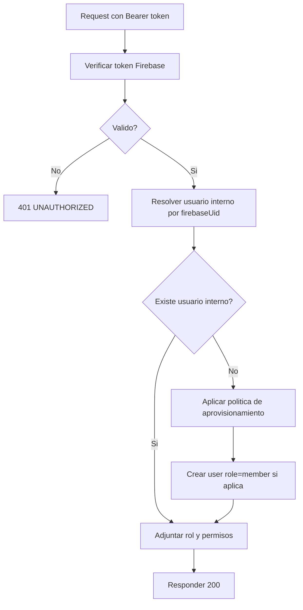

# Modulo Auth y Sesion (Backend)

> Implementacion operativa de autenticacion y resolucion de sesion interna.

---

## Objetivo

Garantizar que toda request protegida use:

1. token Firebase valido
2. usuario interno resuelto en MySQL
3. autorizacion por rol en backend

---

## Endpoints

- `POST /api/v1/auth/verify-token`
- `GET /api/v1/auth/me`

---

## Flujo canonico

---

## Reglas de aprovisionamiento

| Endpoint | Si no existe usuario interno |
|---------|-------------------------------|
| `verify-token` | Crear usuario interno con rol `member` |
| `me` | Crear usuario interno con rol `member` |
| Endpoint admin | No crear automaticamente |

---

## Errores comunes

| Caso | Codigo |
|------|--------|
| Header sin token | `401 UNAUTHORIZED` |
| Token expirado/invalido | `401 UNAUTHORIZED` |
| Usuario sin permiso | `403 FORBIDDEN` |
| Conflicto de vinculacion | `409 CONFLICT` |

---

## Checklist de implementacion

- [ ] Middleware `authGuard` validando token Firebase
- [ ] Middleware `userResolver` (firebaseUid -> user)
- [ ] Middleware `rbacGuard`
- [ ] Logs con `requestId` y `userId`
- [ ] Pruebas de autorizacion por rol
