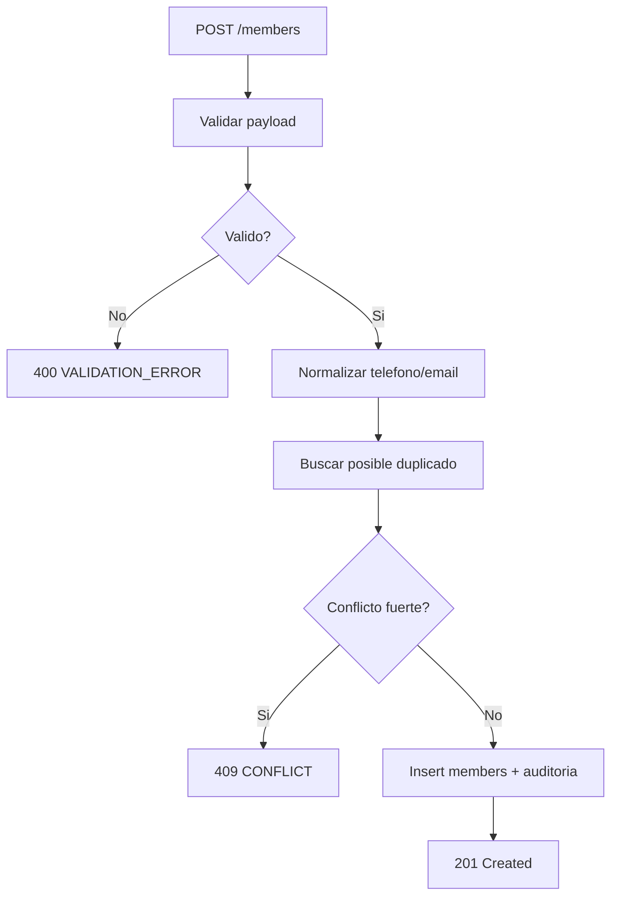

# Modulo Members (Backend)

> Implementacion de alta, consulta y edicion de miembros desde API REST.

---

## Endpoints

- `GET /api/v1/members`
- `GET /api/v1/members/:id`
- `POST /api/v1/members`
- `PATCH /api/v1/members/:id`

---

## Flujo de alta de miembro

---

## Validaciones minimas

| Campo | Regla |
|------|-------|
| `firstName` | requerido, min 2 |
| `paternalLastName` | requerido, min 2 |
| `phone` | opcional, si existe solo digitos |
| `birthDate` | no puede ser futura |

---

## Paginacion y filtros

`GET /members` debe soportar:

- `page`, `limit`
- `search` (nombre/telefono)
- `status` (`active`, `expired`, etc.)

---

## Errores comunes

| Caso | Codigo |
|------|--------|
| Payload invalido | `400 VALIDATION_ERROR` |
| Miembro no existe | `404 NOT_FOUND` |
| Duplicado detectado | `409 CONFLICT` |
| Rol sin permiso | `403 FORBIDDEN` |

---

## Checklist de implementacion

- [ ] DTOs request/response documentados
- [ ] Indices SQL para busqueda por nombre/telefono
- [ ] Soft delete (si aplica)
- [ ] Auditoria `createdBy/updatedBy`
- [ ] Pruebas CRUD + permisos
