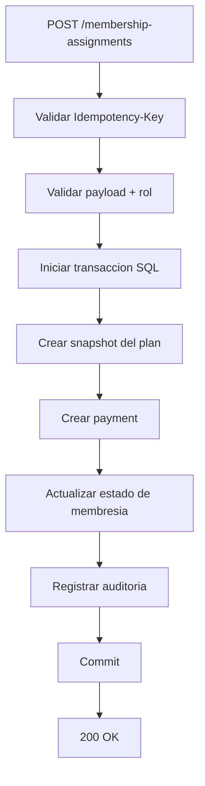
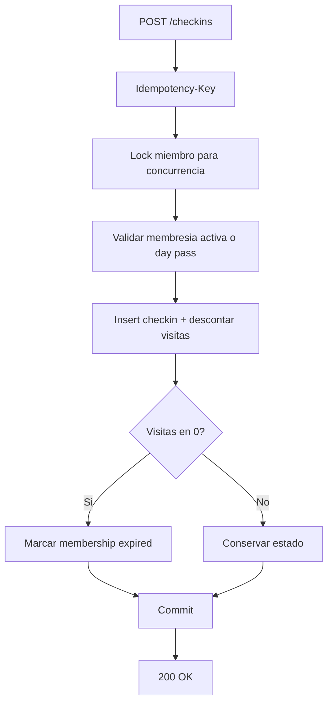

# Modulo Membresias, Pagos y Check-ins (Backend)

> Modulo transaccional critico del negocio.

---

## Endpoints

- `POST /api/v1/membership-assignments`
- `POST /api/v1/membership-assignments/:id/renew`
- `POST /api/v1/payments`
- `GET /api/v1/payments`
- `POST /api/v1/checkins`
- `GET /api/v1/checkins`

---

## Flujo: asignacion de membresia

---

## Flujo: check-in

---

## Reglas tecnicas obligatorias

1. Transaccion atomica para cada operacion critica.
2. Idempotencia por header para evitar doble cobro/check-in.
3. Concurrencia controlada (lock fila miembro en check-in/asignacion).
4. Eventos financieros inmutables (solo reversa, no delete).

---

## Errores comunes

| Caso | Codigo |
|------|--------|
| Sin idempotency key | `400 VALIDATION_ERROR` |
| Membresia invalida | `422 BUSINESS_RULE_VIOLATION` |
| Doble procesamiento key/payload distinto | `409 CONFLICT` |
| Sin permiso de rol | `403 FORBIDDEN` |

---

## Checklist de implementacion

- [ ] Tablas `membership_assignments`, `payments`, `check_ins`, `idempotency_keys`
- [ ] Transacciones con rollback probado
- [ ] Pruebas de concurrencia en check-in
- [ ] Pruebas de no-duplicacion por reintento HTTP
- [ ] Auditoria en todos los cambios de estado
