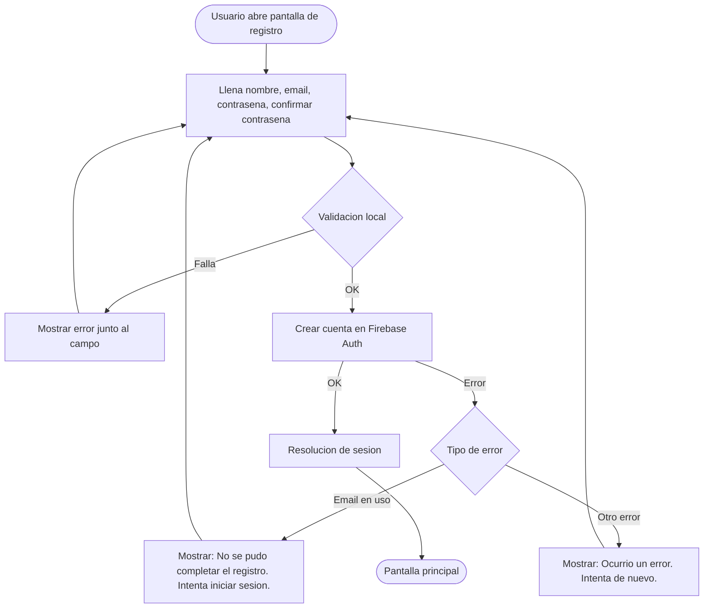
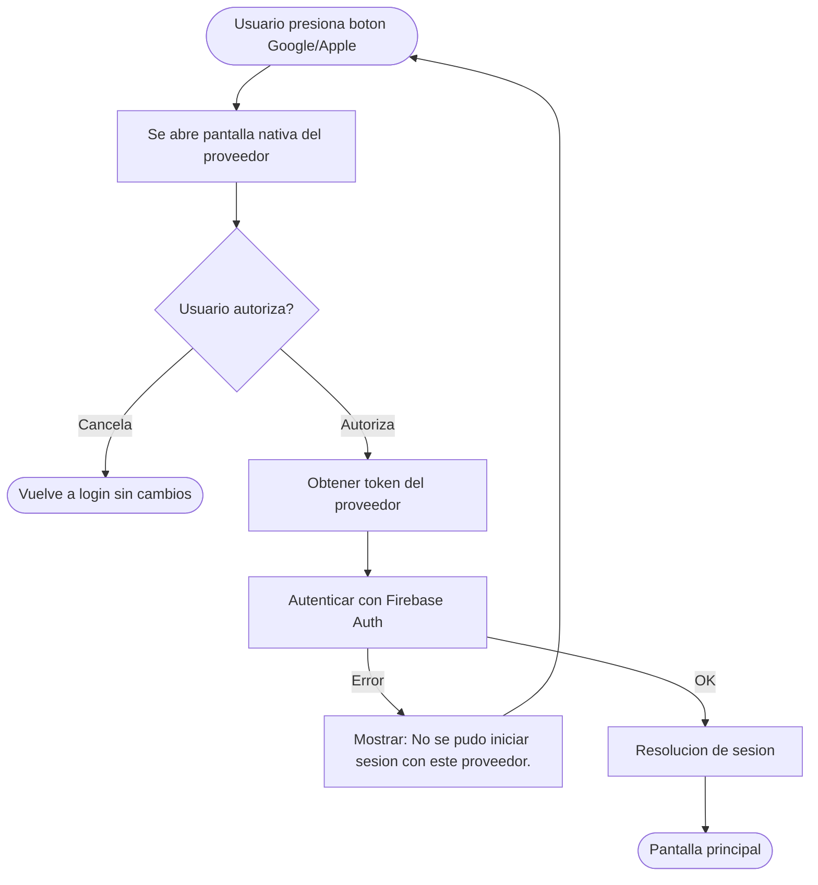
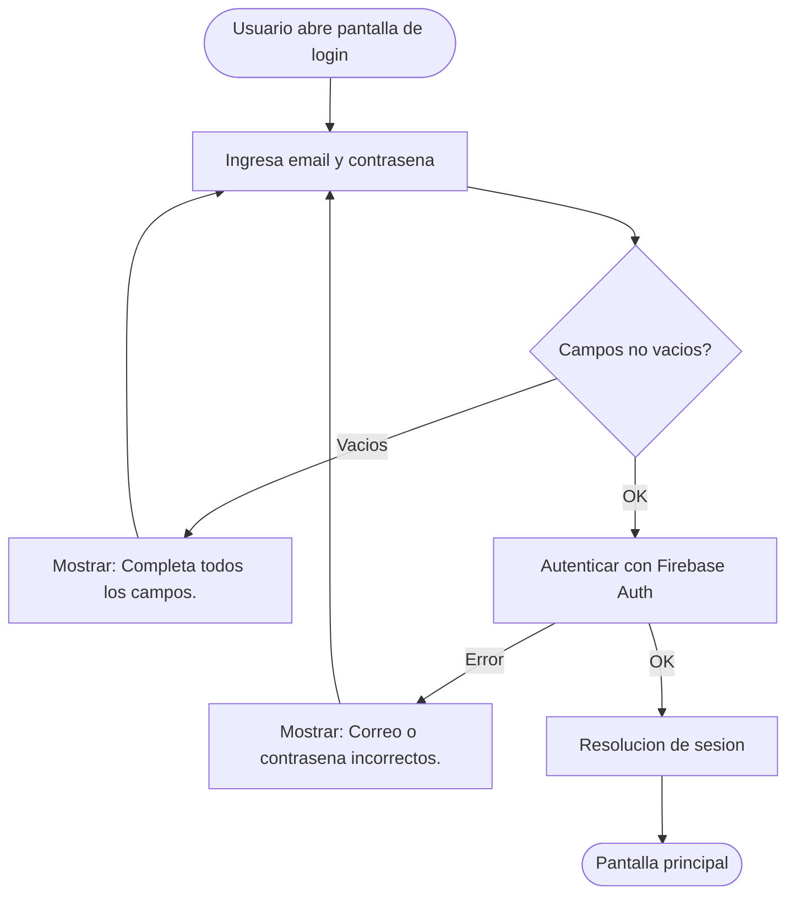
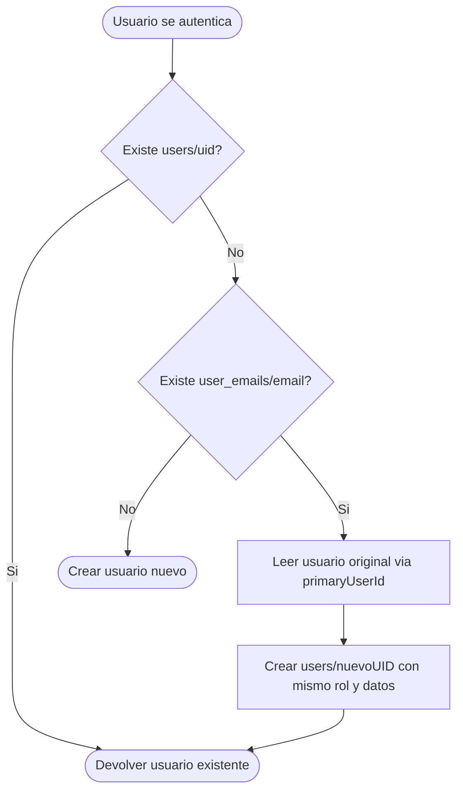
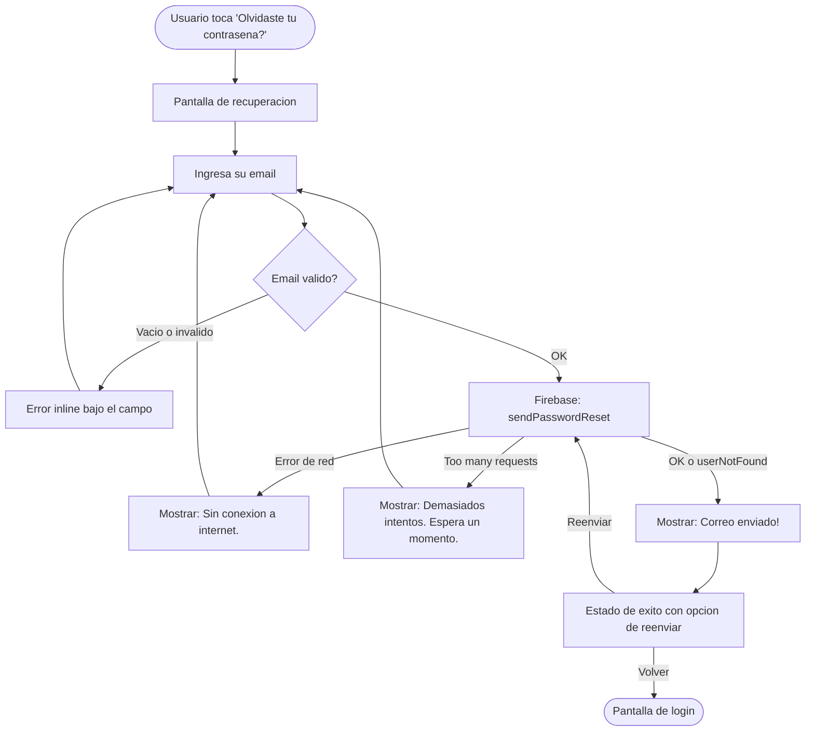

# Autenticacion

> Reglas de negocio para inicio de sesion y registro. Aplican en todas las plataformas.

---

## Proveedores de autenticacion

| Proveedor | Registro | Inicio de sesion |
|-----------|----------|------------------|
| Email y contrasena | Si | Si |
| Google | Si | Si |
| Apple | Si (solo iOS) | Si (solo iOS) |

---

## Flujo de registro (email y contrasena)

### Diagrama

### Flujo principal

1. El usuario ingresa: nombre completo, email, contrasena, confirmacion de contrasena
2. Validacion local (ver tabla abajo)
3. Se crea la cuenta en Firebase Auth
4. Se ejecuta la **resolucion de sesion** (ver `05-admin-setup.md`)
5. El usuario queda autenticado y se redirige a la pantalla principal

### Flujo alternativo: error de validacion local

Si alguna validacion falla, se muestra el error junto al campo correspondiente. El usuario corrige y vuelve a enviar.

### Flujo alternativo: error de Firebase Auth

Si Firebase Auth rechaza la creacion (email duplicado, red, etc.), se muestra un mensaje generico (ver seccion de errores).

### Validaciones de registro

| Campo | Regla | Mensaje de error |
|-------|-------|------------------|
| Nombre completo | No vacio, minimo 3 caracteres | "El nombre debe tener al menos 3 caracteres." |
| Email | Formato valido (regex) | "Ingresa un correo electronico valido." |
| Contrasena | Minimo 6 caracteres | "La contrasena debe tener al menos 6 caracteres." |
| Confirmar contrasena | Debe coincidir con contrasena | "Las contrasenas no coinciden." |

---

## Flujo de registro (Google / Apple)

### Diagrama

### Flujo principal

1. El usuario presiona el boton del proveedor (Google o Apple)
2. Se abre la pantalla nativa del proveedor
3. El usuario autoriza el acceso
4. Se obtiene el token del proveedor y se autentica con Firebase Auth
5. Se ejecuta la **resolucion de sesion**
6. El usuario queda autenticado

### Flujo alternativo: usuario cancela

Si el usuario cierra la pantalla del proveedor sin autorizar, se regresa a la pantalla de login sin mostrar error.

### Flujo alternativo: error de proveedor

Si el proveedor falla o Firebase rechaza el token, se muestra mensaje generico.

---

## Flujo de inicio de sesion (email y contrasena)

### Diagrama

### Flujo principal

1. El usuario ingresa email y contrasena
2. Validacion local: campos no vacios
3. Se autentica con Firebase Auth
4. Se ejecuta la **resolucion de sesion**
5. Se redirige a la pantalla principal

### Flujo alternativo: credenciales incorrectas

Mensaje generico sin revelar si el email existe o si es la contrasena.

---

## Flujo de inicio de sesion (Google / Apple)

Identico al flujo de registro con proveedor social. La resolucion de sesion determina si el usuario ya existe o es nuevo.

---

## Sincronizacion multi-proveedor

### Diagrama

### Flujo principal

Si un usuario se registra con email/contrasena y despues inicia sesion con Google (usando el mismo correo):

1. Firebase Auth genera un UID diferente por cada proveedor
2. La app detecta que el email ya existe en un indice interno (`user_emails`)
3. Se crea un nuevo documento de usuario con el nuevo UID, heredando el rol y los datos del usuario original
4. El usuario accede con los mismos permisos sin importar el proveedor

### Flujo alternativo: email no encontrado en indice

Se trata como usuario completamente nuevo (ver `05-admin-setup.md`).

---

## Mensajes de error

**Regla critica: nunca revelar si un email ya esta registrado.**

| Situacion | Mensaje al usuario | Mensaje INCORRECTO (no usar) |
|-----------|-------------------|------------------------------|
| Email no existe (login) | "Correo o contrasena incorrectos." | "No existe una cuenta con ese email." |
| Email ya registrado (registro) | "No se pudo completar el registro. Intenta iniciar sesion." | "Ya existe una cuenta con ese email." |
| Contrasena incorrecta | "Correo o contrasena incorrectos." | "Contrasena incorrecta." |
| Proveedor falla | "No se pudo iniciar sesion con este proveedor. Intenta de nuevo." | (error tecnico crudo) |
| Sin conexion | "Sin conexion a internet. Verifica tu red." | (timeout sin mensaje) |
| Error desconocido | "Ocurrio un error inesperado. Intenta de nuevo." | (excepcion no manejada) |

---

## Recuperacion de contrasena

### Diagrama

### Flujo principal

1. El usuario toca "Olvidaste tu contrasena?" en la pantalla de login
2. Se navega a la pantalla de recuperacion
3. El usuario ingresa su correo electronico
4. Validacion local: email no vacio y formato basico valido
5. Se llama a `Firebase Auth.sendPasswordReset(withEmail:)`
6. Se muestra estado de exito: "Revisa tu bandeja de entrada"
7. El usuario puede volver a login o reenviar el correo

### Flujo alternativo: email no registrado

Por seguridad, si el email no existe en Firebase Auth, se muestra el mismo mensaje de exito. **NUNCA** revelar si la cuenta existe.

### Flujo alternativo: error de red / rate limit

Se muestran mensajes especificos para estos errores porque no revelan informacion sobre la cuenta.

### Validaciones

| Campo | Regla | Mensaje de error |
|-------|-------|------------------|
| Email | No vacio | "Ingresa tu correo electronico." |
| Email | Formato basico (contiene @ y .) | "El formato del correo es invalido." |

### Reglas de seguridad

1. El mensaje de exito es identico sin importar si el email existe o no.
2. Solo se muestran errores de infraestructura (red, rate limit), nunca errores de usuario no encontrado.
3. El enlace de restablecimiento lo genera y envia Firebase; la app no maneja el cambio de contrasena directamente.
4. El usuario restablece su contrasena via el enlace en su navegador (pagina de Firebase Auth).

### Estados de la vista

| Estado | Que se muestra |
|--------|---------------|
| Input | Icono, titulo, descripcion, campo de email, boton enviar, link volver |
| Success | Icono verde, titulo "Correo enviado!", email del usuario, boton volver, boton reenviar |

---

## Cierre de sesion

1. Se cierra la sesion en Firebase Auth
2. Se limpia la informacion del usuario actual en memoria
3. Se redirige a la pantalla de login
