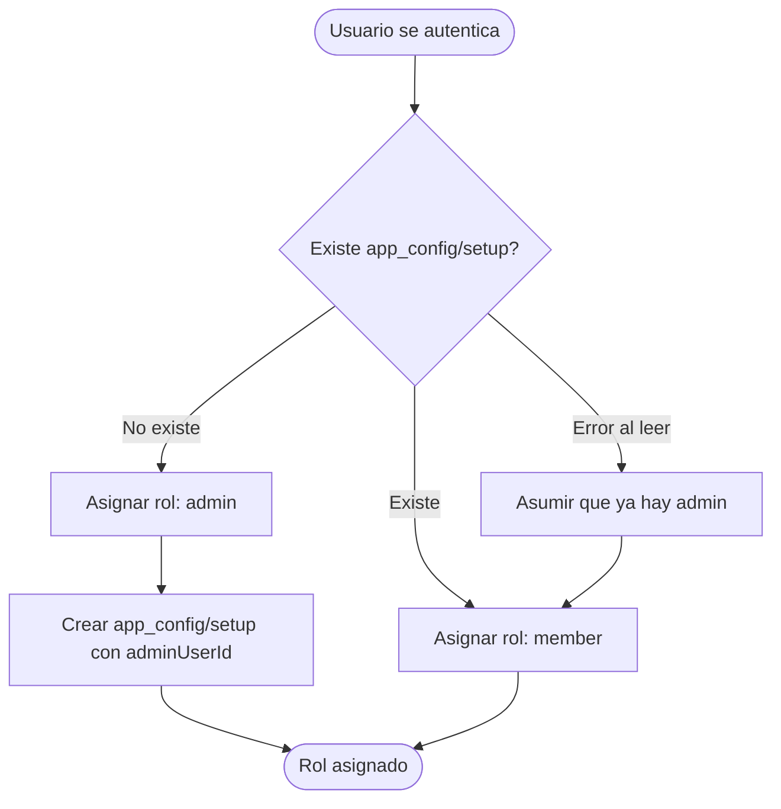
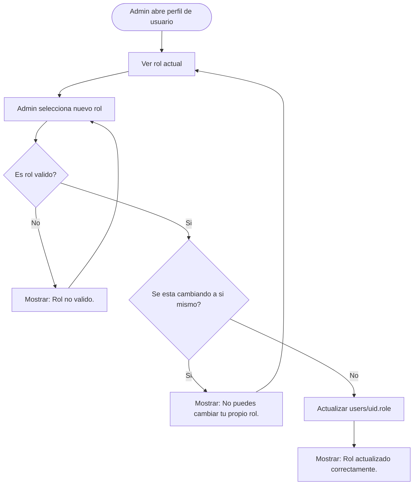

# Roles de usuario

> Define los roles disponibles en el sistema, sus permisos y como se asignan.

---

## Roles disponibles

| Rol | Valor en base de datos | Descripcion | Implementado |
|-----|------------------------|-------------|--------------|
| Admin | `admin` | Dueno o gestor del gimnasio. Acceso total. | Si |
| Recepcionista | `receptionist` | Personal de recepcion. Gestiona miembros y pagos. | Parcial |
| Entrenador | `trainer` | Entrenador. Gestiona rutinas. | No |
| Miembro | `member` | Cliente del gimnasio. Acceso basico. | Si |
| Invitado | `guest` | Visitante con acceso temporal. | No |
| Visitante | `visitor` | Sin cuenta. Solo lectura publica. | No |

> Actualmente solo `admin` y `member` estan implementados. Los demas son para fases futuras.

---

## Flujo de asignacion de rol

### Diagrama

### Flujo principal

1. El primer usuario registrado se convierte automaticamente en `admin`
2. Todos los demas usuarios se crean como `member` por defecto
3. Solo un admin puede cambiar el rol de otro usuario

### Flujo alternativo: error al verificar setup

Si hay un error de red o permisos al leer `app_config/setup`, el sistema asume que ya hay admin y asigna `member` (seguro por defecto).

### Flujo alternativo: admin cambia rol de otro usuario

La deteccion del primer usuario se hace verificando el documento `app_config/setup`. Si ese documento no existe, el siguiente usuario que se registre sera admin.

---

## Permisos por plataforma

| Plataforma | Roles principales | Proposito |
|------------|-------------------|-----------|
| Android | `member` | App del cliente |
| iOS | `admin`, `receptionist` | App del gestor |
| Web | Publico + todos los roles | Landing + autoservicio |

---

## Funcionalidad por rol (iOS)

### Admin y Recepcionista

| Tab | Funcionalidad |
|-----|---------------|
| Miembros | Ver, crear, editar, desactivar miembros |
| Membresias | Ver, crear, editar, desactivar planes |
| Ventas | (pendiente) Productos e inventario |
| Perfil | Ver datos propios, cerrar sesion |
| Configuracion | (pendiente) Gestion de usuarios y roles |

### Miembro

| Tab | Funcionalidad |
|-----|---------------|
| Perfil | Ver datos propios, cerrar sesion |

---

## Permisos por coleccion

### `users`

| Operacion | admin | receptionist | member |
|-----------|-------|--------------|--------|
| Leer su propio perfil | Si | Si | Si |
| Leer todos los perfiles | Si | Si | No |
| Editar su propio perfil | Si | Si | Si |
| Editar perfil de otro | Si | No | No |
| Cambiar rol de otro | Si | No | No |

### `members`

| Operacion | admin | receptionist | member |
|-----------|-------|--------------|--------|
| Ver lista de miembros | Si | Si | No |
| Crear miembro | Si | Si | No |
| Editar miembro | Si | Si | No |
| Desactivar miembro | Si | No | No |
| Asignar membresia | Si | Si | No |

### `membership_plans`

| Operacion | admin | receptionist | member |
|-----------|-------|--------------|--------|
| Ver planes activos | Si | Si | Si |
| Ver todos los planes | Si | No | No |
| Crear plan | Si | No | No |
| Editar plan | Si | No | No |
| Desactivar plan | Si | No | No |

---

## Mensajes de error

| Situacion | Mensaje al usuario |
|-----------|-------------------|
| Usuario sin permisos intenta acceder a seccion restringida | "No tienes permisos para acceder a esta seccion." |
| Usuario intenta cambiar rol sin ser admin | "Solo el administrador puede cambiar roles." |
| Admin intenta cambiar su propio rol | "No puedes cambiar tu propio rol." |
| Rol no reconocido en base de datos | "Error al cargar el perfil. Contacta al administrador." |

---

## Reglas de negocio

1. Solo puede haber un admin principal (el primer usuario registrado)
2. El admin puede asignar roles adicionales a otros usuarios
3. Un admin no puede cambiar su propio rol (para evitar quedarse sin admin)
4. Si no se puede determinar el rol, se asigna `member` por defecto (seguro)
5. Los permisos se verifican tanto en la UI (ocultar tabs/botones) como en las Security Rules de Firestore
6. El rol se guarda en `users/{uid}.role` como string
