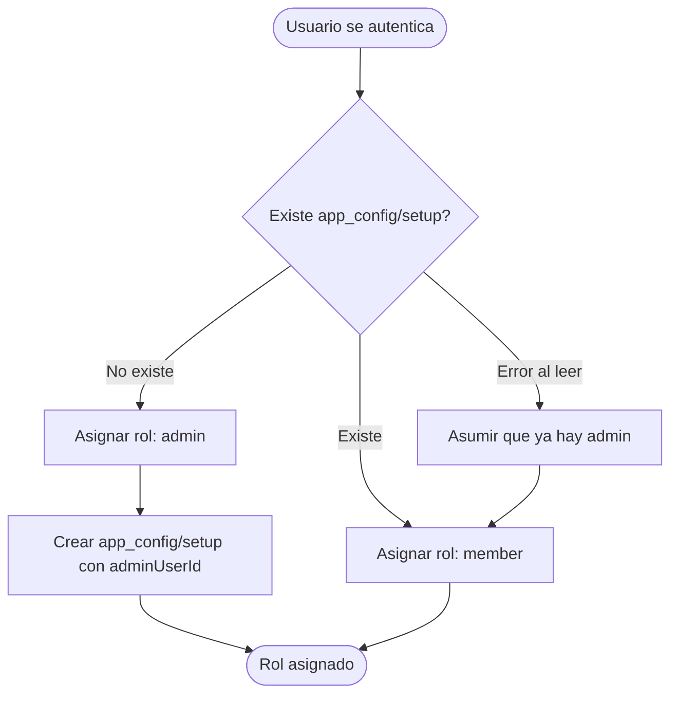
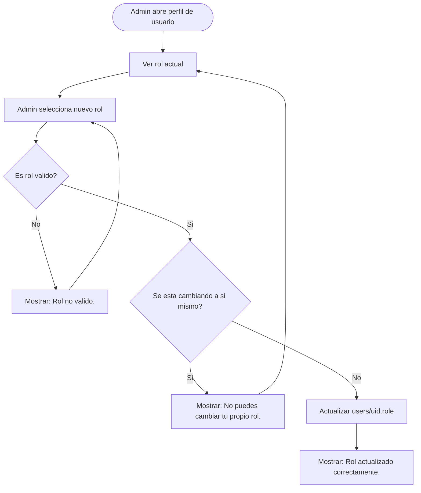

# Roles de usuario

> Define los roles disponibles en el sistema, sus permisos y como se asignan.

---

## Roles disponibles

| Rol | Valor en base de datos | Descripcion | Implementado |
|-----|------------------------|-------------|--------------|
| Admin | `admin` | Dueno o gestor del gimnasio. Acceso total. | Si |
| Recepcionista | `receptionist` | Personal de recepcion. Gestiona miembros y pagos. | Si |
| Entrenador | `trainer` | Entrenador. Gestiona rutinas. | Si |
| Miembro | `member` | Cliente del gimnasio. Acceso basico. | Si |
| Invitado | `guest` | Visitante con acceso temporal. | No |
| Visitante | `visitor` | Sin cuenta. Solo lectura publica. | No |

> Implementados: `admin`, `receptionist`, `trainer` y `member`. Los demas (`guest`, `visitor`) son para fases futuras.

---

## Flujo de asignacion de rol

### Diagrama

```mermaid
flowchart TD
    Auth([Usuario se autentica]) --> CheckSetup{Existe app_config/setup?}
    CheckSetup -->|No existe| AssignAdmin[Asignar rol: admin]
    AssignAdmin --> CreateSetup[Crear app_config/setup con adminUserId]
    CreateSetup --> Done([Rol asignado])
    CheckSetup -->|Existe| AssignMember[Asignar rol: member]
    AssignMember --> Done
    CheckSetup -->|Error al leer| SafeDefault[Asumir que ya hay admin]
    SafeDefault --> AssignMember
```

### Flujo principal

1. El primer usuario registrado se convierte automaticamente en `admin`
2. Todos los demas usuarios se crean como `member` por defecto
3. Solo un admin puede cambiar el rol de otro usuario

### Flujo alternativo: error al verificar setup

Si hay un error de red o permisos al leer `app_config/setup`, el sistema asume que ya hay admin y asigna `member` (seguro por defecto).

### Flujo alternativo: admin cambia rol de otro usuario

```mermaid
flowchart TD
    Start([Admin abre perfil de usuario]) --> CurrentRole[Ver rol actual]
    CurrentRole --> SelectRole[Admin selecciona nuevo rol]
    SelectRole --> Validate{Es rol valido?}
    Validate -->|No| ShowError["Mostrar: Rol no valido."]
    ShowError --> SelectRole
    Validate -->|Si| IsSelf{Se esta cambiando a si mismo?}
    IsSelf -->|Si| ShowSelfError["Mostrar: No puedes cambiar tu propio rol."]
    ShowSelfError --> CurrentRole
    IsSelf -->|No| SaveRole[Actualizar users/uid.role]
    SaveRole --> Success["Mostrar: Rol actualizado correctamente."]
```

La deteccion del primer usuario se hace verificando el documento `app_config/setup`. Si ese documento no existe, el siguiente usuario que se registre sera admin.

---

## Permisos por plataforma

| Plataforma | Roles principales | Proposito |
|------------|-------------------|-----------|
| Android | `member` | App del cliente |
| iOS | `admin`, `receptionist`, `trainer` | App del gestor |
| Web | Publico + todos los roles | Landing + autoservicio |

---

## Funcionalidad por rol (iOS)

La app iOS usa `TabView` con `.tabViewStyle(.sidebarAdaptable)`. En iPad se muestra como sidebar con secciones; en iPhone como tabs.

### Admin

| Seccion | Tab | Funcionalidad |
|---------|-----|---------------|
| Operacion | Miembros | CRUD miembros, check-in, renovacion rapida, acciones rapidas (QuickActionSheet), cobro de visita, desactivar miembros |
| Operacion | Clases | CRUD clases, recurrencia, ver asistencia, desactivar clases |
| Operacion | Membresias | CRUD planes (time_based, visit_based, mixed), activar/desactivar |
| Operacion | Inventario | CRUD productos, historial de precios, costo y precio publico, desactivar productos |
| Operacion | Reportes | Dashboard financiero completo (ingresos, egresos, utilidad, check-ins, membresias, inventario) |
| Operacion | Egresos | CRUD gastos operativos, resumen mensual, gastos recurrentes |
| Entrenamiento | Rutinas | CRUD rutinas semanales, asignar ejercicios |
| Entrenamiento | Ejercicios | CRUD catalogo de ejercicios |
| Cuenta | Perfil | Ver datos propios, cerrar sesion |
| Cuenta | Staff | Gestion de usuarios: cambiar roles, promover a staff, registrar staff, desactivar usuarios |

### Recepcionista

| Seccion | Tab | Funcionalidad |
|---------|-----|---------------|
| Operacion | Miembros | Crear y editar miembros, check-in, renovacion, acciones rapidas. **NO puede desactivar miembros.** |
| Operacion | Clases | Ver y crear clases. **NO puede desactivar clases.** |
| Operacion | Membresias | Ver planes activos (solo lectura, no puede crear/editar/desactivar) |
| Operacion | Inventario | Crear y editar productos, vender, ajustar stock. **NO puede desactivar productos.** |
| Cuenta | Perfil | Ver datos propios, cerrar sesion |

> **Restricciones del recepcionista**: No tiene acceso a Reportes, Egresos, Staff, Rutinas ni Ejercicios. No puede desactivar miembros, productos ni clases.

### Entrenador

| Seccion | Tab | Funcionalidad |
|---------|-----|---------------|
| Operacion | Miembros | Ver lista de miembros (lectura) |
| Operacion | Clases | Ver clases (solo lectura) |
| Entrenamiento | Rutinas | CRUD rutinas semanales, asignar ejercicios |
| Entrenamiento | Ejercicios | CRUD catalogo de ejercicios |
| Cuenta | Perfil | Ver datos propios, cerrar sesion |

### Miembro / Otros roles

| Seccion | Tab | Funcionalidad |
|---------|-----|---------------|
| Cuenta | Perfil | Ver datos propios, cerrar sesion |

---

## Permisos por coleccion

### `users`

| Operacion | admin | receptionist | trainer | member |
|-----------|-------|--------------|---------|--------|
| Leer su propio perfil | Si | Si | Si | Si |
| Leer todos los perfiles | Si | Si | No | No |
| Editar su propio perfil | Si | Si | Si | Si |
| Editar perfil de otro | Si | No | No | No |
| Cambiar rol de otro | Si | No | No | No |

### `members`

| Operacion | admin | receptionist | trainer | member |
|-----------|-------|--------------|---------|--------|
| Ver lista de miembros | Si | Si | Si (lectura) | No |
| Crear miembro | Si | Si | No | No |
| Editar miembro | Si | Si | No | No |
| Desactivar miembro | Si | No | No | No |
| Asignar membresia | Si | Si | No | No |

### `membership_plans`

| Operacion | admin | receptionist | trainer | member |
|-----------|-------|--------------|---------|--------|
| Ver planes activos | Si | Si | No | Si |
| Ver todos los planes | Si | No | No | No |
| Crear plan | Si | No | No | No |
| Editar plan | Si | No | No | No |
| Desactivar plan | Si | No | No | No |

### `products`

| Operacion | admin | receptionist | trainer | member |
|-----------|-------|--------------|---------|--------|
| Ver productos | Si | Si | No | No |
| Crear producto | Si | Si | No | No |
| Editar producto | Si | Si | No | No |
| Desactivar producto | Si | No | No | No |
| Vender producto | Si | Si | No | No |

### `payments`

| Operacion | admin | receptionist | trainer | member |
|-----------|-------|--------------|---------|--------|
| Crear pago (membresia, producto) | Si | Si | No | No |
| Ver pagos de un miembro | Si | Si | No | No |
| Ver todos los pagos | Si | No | No | No |

### `classes`

| Operacion | admin | receptionist | trainer | member |
|-----------|-------|--------------|---------|--------|
| Ver clases | Si | Si | Si | Si |
| Crear clase | Si | Si | No | No |
| Editar clase | Si | Si | No | No |
| Desactivar clase | Si | No | No | No |

### `check_ins`

| Operacion | admin | receptionist | trainer | member |
|-----------|-------|--------------|---------|--------|
| Registrar check-in | Si | Si | No | No |
| Ver check-ins de hoy | Si | Si | No | No |
| Ver asistencia de clase | Si | Si | No | No |

### `exercises`

| Operacion | admin | receptionist | trainer | member |
|-----------|-------|--------------|---------|--------|
| Ver catalogo | Si | No | Si | No |
| Crear ejercicio | Si | No | Si | No |
| Editar ejercicio | Si | No | Si | No |
| Eliminar ejercicio | Si | No | No | No |

### `routine_templates` / `daily_routines`

| Operacion | admin | receptionist | trainer | member |
|-----------|-------|--------------|---------|--------|
| Ver rutinas | Si | No | Si | No |
| Crear rutina | Si | No | Si | No |
| Editar rutina | Si | No | Si | No |
| Eliminar rutina | Si | No | No | No |

### `expenses`

| Operacion | admin | receptionist | trainer | member |
|-----------|-------|--------------|---------|--------|
| Ver egresos | Si | No | No | No |
| Crear egreso | Si | No | No | No |
| Editar egreso | Si | No | No | No |
| Eliminar egreso | Si | No | No | No |

### `reports` (datos calculados)

| Operacion | admin | receptionist | trainer | member |
|-----------|-------|--------------|---------|--------|
| Ver dashboard completo | Si | No | No | No |
| Ver metricas financieras | Si | No | No | No |
| Ver metricas de check-ins | Si | No | No | No |
| Ver estado de membresias | Si | No | No | No |

---

## Mensajes de error

| Situacion | Mensaje al usuario |
|-----------|-------------------|
| Usuario sin permisos intenta acceder a seccion restringida | "No tienes permisos para acceder a esta seccion." |
| Usuario intenta cambiar rol sin ser admin | "Solo el administrador puede cambiar roles." |
| Admin intenta cambiar su propio rol | "No puedes cambiar tu propio rol." |
| Rol no reconocido en base de datos | "Error al cargar el perfil. Contacta al administrador." |

---

## Reglas de negocio

1. Solo puede haber un admin principal (el primer usuario registrado)
2. El admin puede asignar roles adicionales a otros usuarios
3. Un admin no puede cambiar su propio rol (para evitar quedarse sin admin)
4. Si no se puede determinar el rol, se asigna `member` por defecto (seguro)
5. Los permisos se verifican tanto en la UI (ocultar tabs/botones) como en las Security Rules de Firestore
6. El rol se guarda en `users/{uid}.role` como string
7. La UI restringe acciones con `isAdmin` (desactivar) vs `isAdminOrReceptionist` (crear/editar) -- los ViewModels deben tener guards adicionales en funciones destructivas
8. El recepcionista NO tiene acceso a: Reportes, Egresos, Staff, Rutinas, Ejercicios
9. El entrenador tiene acceso operativo limitado: puede ver miembros y clases en lectura, y gestionar rutinas y ejercicios
