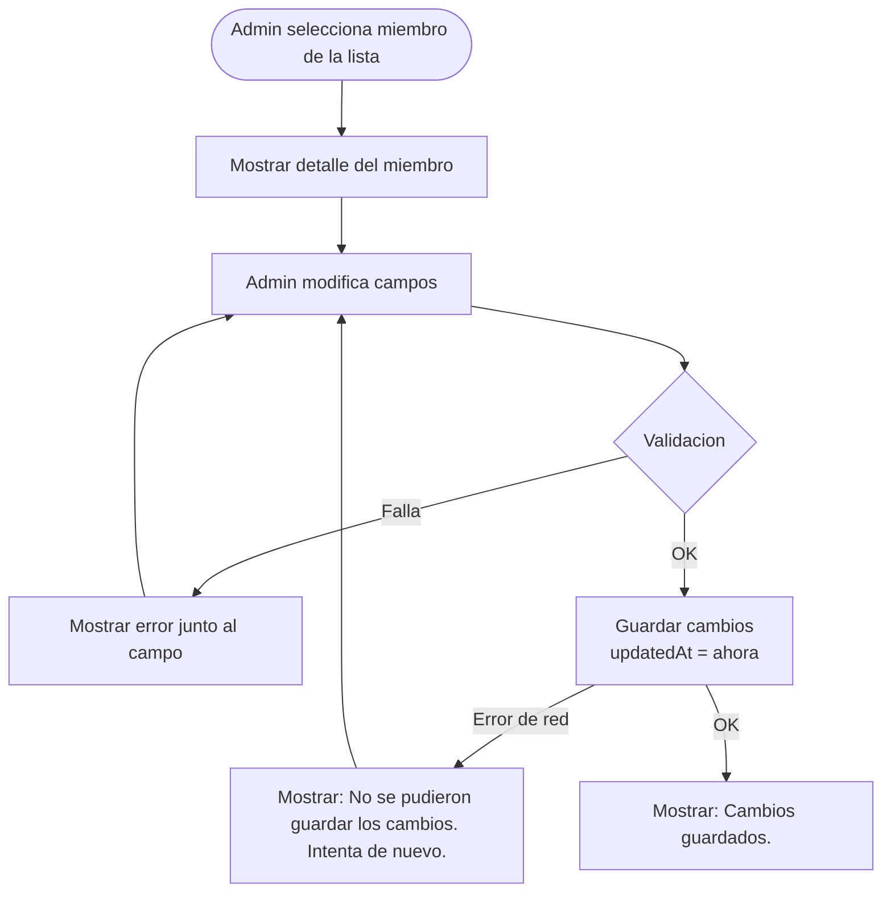

# Registro de Miembros del Gimnasio

> Un miembro es una persona inscrita en el gimnasio. Puede o no tener cuenta en la app.
> Existen dos caminos de alta: auto-registro desde la app, o registro manual por el admin.
> Ambos terminan en la coleccion `members`.

---

## Diferencia entre usuario y miembro

| Concepto | Usuario (`users`) | Miembro (`members`) |
|---|---|---|
| Que es | Persona con cuenta en la app | Persona inscrita en el gimnasio |
| Requiere cuenta Firebase Auth | Si | No |
| Quien lo crea | El propio usuario (registro) | El admin o el sistema (tras onboarding) |
| Ejemplo | Admin que usa la app | Cliente que va al gimnasio |
| Puede existir sin el otro | Si | Si |

Un admin es un usuario. Un cliente del gimnasio es un miembro. Pueden estar vinculados o no.

---

## Camino 1: Auto-registro desde la app

La persona descarga la app (Android/iOS) y se registra por si misma.

### Diagrama

### Flujo principal

1. Persona se registra (email/password, Google o Apple)
2. Firebase Auth crea `users/{uid}`
3. Onboarding (3-4 pasos):
   - Paso 1: Datos personales (nombre, apellidos, fecha nacimiento)
   - Paso 2: Contacto (telefono, telefono emergencia)
   - Paso 3: Salud (enfermedades, lesiones, otros)
   - Paso 4: Tutor (solo si es menor de edad)
4. Al completar onboarding se crea `members/{uuid}` vinculado

### Flujo alternativo: vinculacion con registro previo

Si el admin ya habia registrado a esa persona manualmente, se vincula en lugar de crear un duplicado:

1. En el onboarding, al capturar el telefono (paso 2)
2. Normalizar telefono: quitar espacios, guiones, prefijo de pais (solo digitos)
3. Query: `members WHERE phone == telefonoNormalizado AND linkedUserId == null`
4. Si hay match: vincular y omitir pasos ya llenados
5. Si no hay match: continuar con flujo normal

### Flujo alternativo: multiples matches por telefono

Si la busqueda devuelve mas de un miembro con el mismo telefono:

1. Mostrar lista de coincidencias (nombre + apellido)
2. El usuario selecciona cual es el suyo
3. Se vincula al seleccionado

Si ninguno es el correcto, se crea un miembro nuevo.

### Validaciones del onboarding

| Paso | Campo | Regla | Mensaje de error |
|------|-------|-------|------------------|
| 1 | Nombre | Requerido, min 2 caracteres | "El nombre es requerido." |
| 1 | Primer apellido | Requerido, min 2 caracteres | "El primer apellido es requerido." |
| 1 | Fecha nacimiento | Requerida, no en el futuro | "Selecciona una fecha de nacimiento valida." |
| 2 | Telefono | Requerido, min 10 digitos | "Ingresa un numero telefonico valido (min 10 digitos)." |
| 2 | Tel. emergencia | Requerido, min 10 digitos | "Ingresa un telefono de emergencia valido." |
| 3 | Enfermedades | Opcional | - |
| 3 | Lesiones | Opcional | - |
| 3 | Otros | Opcional | - |
| 4 | Nombre del tutor | Requerido si menor | "El nombre del tutor es requerido para menores de edad." |
| 4 | Telefono del tutor | Requerido si menor | "El telefono del tutor es requerido." |
| 4 | Relacion del tutor | Requerido si menor | "Selecciona la relacion con el tutor." |

---

## Camino 2: Registro manual por el admin

El admin da de alta a un miembro desde la app iOS sin que esa persona tenga cuenta.

### Diagrama

### Flujo principal

1. Admin abre Tab "Miembros" y presiona boton "+"
2. Llena formulario con datos del miembro
3. Se valida nombre y primer apellido (obligatorios)
4. Se verifica que no haya duplicados
5. Se crea `members/{uuid}` con `linkedUserId = null`
6. Opcionalmente se asigna un plan de membresia

### Flujo alternativo: posible duplicado

Si ya existe un miembro con el mismo nombre + apellido + telefono:

1. Mostrar advertencia: "Ya existe un miembro con datos similares: [nombre]. Deseas continuar?"
2. Si el admin confirma, se crea de todas formas
3. Si cancela, vuelve al formulario

### Flujo alternativo: menor de edad

Si la fecha de nacimiento indica que el miembro tiene menos de 18 anos:

1. El campo "Datos del tutor" se vuelve requerido
2. Si el admin no lo llena, mostrar: "Los datos del tutor son requeridos para menores de edad."

### Validaciones del formulario (admin)

| Campo | Regla | Mensaje de error |
|-------|-------|------------------|
| Nombre | Requerido, min 2 caracteres | "El nombre es requerido." |
| Primer apellido | Requerido, min 2 caracteres | "El primer apellido es requerido." |
| Segundo apellido | Opcional | - |
| Telefono | Opcional, si se llena: min 10 digitos | "El telefono debe tener al menos 10 digitos." |
| Tel. emergencia | Opcional, si se llena: min 10 digitos | "El telefono de emergencia debe tener al menos 10 digitos." |
| Fecha nacimiento | Opcional, si se llena: no en el futuro | "La fecha de nacimiento no puede ser en el futuro." |
| Datos del tutor | Requerido si menor de edad | "Los datos del tutor son requeridos para menores de edad." |
| Enfermedades | Opcional | - |
| Lesiones | Opcional | - |
| Otros | Opcional | - |

---

## Camino 3: Crear miembro desde usuario registrado (sin membresia)

Los usuarios que se registraron desde la app (iOS o Android) pero aun no tienen un Member vinculado
aparecen en la seccion "Usuarios registrados sin membresia" de la vista de Miembros.
El admin puede crear un Member a partir de estos usuarios con datos pre-llenados.

### Diagrama

### Flujo principal

1. Admin abre Tab "Miembros" y ve la seccion "Usuarios registrados sin membresia"
2. Toca al usuario o el boton azul de persona+ junto al nombre
3. Se abre el formulario de nuevo miembro pre-llenado:
   - `fullName` se separa automaticamente en `firstName`, `paternalLastName`, `maternalLastName`
   - `phone` se pre-llena desde el User
4. Admin revisa, corrige si es necesario, y completa datos faltantes (salud, emergencia, etc.)
5. Opcionalmente selecciona un plan de membresia
6. Al guardar:
   - Se crea `members/{uuid}` con `linkedUserId = user.id` y `registeredBy = "self"`
   - Se actualiza `users/{uid}` con `linkedMemberId = member.id`
   - Si se selecciono plan: se crea el pago y se asigna la membresia
7. El usuario desaparece de la seccion y aparece como miembro normal

### Division del nombre

El `fullName` del User es un string unico. Se divide automaticamente:

| fullName | firstName | paternalLastName | maternalLastName |
|---|---|---|---|
| "Juan" | "Juan" | "" | "" |
| "Juan Garcia" | "Juan" | "Garcia" | null |
| "Juan Garcia Lopez" | "Juan" | "Garcia" | "Lopez" |
| "Maria del Carmen Hernandez Ruiz" | "Maria" | "del" | "Carmen Hernandez Ruiz" |

**Nota**: La division automatica es una aproximacion. El admin puede corregir los campos antes de guardar.

### Acciones disponibles

| Accion | Donde | Gesto |
|---|---|---|
| Crear miembro | Boton azul persona+ | Tap |
| Crear miembro | Fila del usuario | Tap |
| Crear miembro | Swipe leading | Deslizar |
| Crear miembro y asignar plan | Menu contextual | Long press |

### Reglas

1. Solo admin y recepcionista pueden ver la seccion de usuarios sin membresia
2. Los datos del User se usan como base pero el admin puede modificarlos
3. La vinculacion User<->Member es bidireccional y se crea automaticamente al guardar
4. El `registeredBy` se marca como `"self"` porque el usuario ya existia antes
5. Una vez vinculado, el usuario desaparece de la seccion y se comporta como cualquier miembro

---

## Editar miembro

### Diagrama

### Flujo principal

1. Admin selecciona un miembro de la lista
2. Se muestran los datos actuales
3. Admin modifica los campos que necesite
4. Se valida y se guarda

### Flujo alternativo: miembro vinculado

Si el miembro tiene `linkedUserId != null`, el admin ve un indicador de que ese miembro tiene cuenta en la app. Los cambios del admin se reflejan en `members`, no en `users`.

---

## Desactivar miembro (soft delete)

### Diagrama

### Reglas

- El miembro se marca como `isActive = false`
- El documento permanece en la base de datos
- No aparece en la lista de miembros activos
- Se puede reactivar cambiando `isActive = true`

---

## Buscar miembros

### Flujo

1. Admin escribe texto en el campo de busqueda
2. Se filtran miembros activos por: nombre, primer apellido, segundo apellido, telefono
3. La busqueda es local (se descargan todos los activos y se filtran en la app)
4. No distingue mayusculas/minusculas

### Flujo alternativo: sin resultados

Mostrar: "No se encontraron miembros con ese criterio."

---

## Campos del miembro

### Datos personales (requeridos)

| Campo | Tipo | Ejemplo |
|---|---|---|
| `firstName` | String | "Juan" |
| `paternalLastName` | String | "Garcia" |
| `maternalLastName` | String? | "Lopez" |

### Datos de contacto

| Campo | Tipo | Ejemplo |
|---|---|---|
| `phone` | String? | "5512345678" |
| `emergencyPhone` | String? | "5587654321" |

### Datos de salud (opcionales)

| Campo | Tipo | Ejemplo |
|---|---|---|
| `diseases` | String? | "Diabetes" o "No" |
| `injuries` | String? | "Rodilla derecha" o "No" |
| `otherNotes` | String? | "Toma medicamentos" |

### Nacimiento y tutor

| Campo | Tipo | Ejemplo |
|---|---|---|
| `birthDate` | Date? | 2005-03-15 |
| `guardianInfo` | String? | "Veronica Hernandez - Mama - 5512345678" |

Si la fecha de nacimiento indica que el miembro tiene menos de 18 anos, se considera menor (`isMinor` es computed).

### Vinculacion y meta

| Campo | Tipo | Descripcion |
|---|---|---|
| `linkedUserId` | String? | FK a `users/{uid}` si tiene cuenta en la app |
| `registeredBy` | String | `"self"` si auto-registro, `"admin:{uid}"` si manual |
| `isActive` | Bool | Si el miembro esta activo |
| `registrationDate` | Date | Fecha de inscripcion |
| `createdAt` | Date | Fecha de creacion del documento |
| `updatedAt` | Date | Ultima actualizacion |

### Membresia (ver `07-membership-assignments.md`)

| Campo | Tipo | Descripcion |
|---|---|---|
| `membershipPlanId` | String? | FK al plan original |
| `membershipStatus` | String | `active`, `expired`, `suspended`, `cancelled`, `pending` |
| `membershipStartDate` | Date? | Inicio de la membresia |
| `membershipEndDate` | Date? | Fin de la membresia |
| `remainingVisits` | Int? | Visitas restantes |
| `membershipPlanSnapshot` | Map | Snapshot inmutable del plan |
| `familyGroupId` | String? | ID de grupo familiar |

---

## Normalizacion del telefono

El telefono es la clave de vinculacion entre registro manual y auto-registro.
Se debe normalizar antes de guardar y antes de buscar:

| Entrada | Normalizado |
|---|---|
| `55 1234 5678` | `5512345678` |
| `+52 55 1234 5678` | `525512345678` |
| `551-234-5678` | `5512345678` |
| `(55) 1234-5678` | `5512345678` |

Regla: quitar todo lo que no sea digito (`[^0-9]`).

---

## Mensajes de error generales

| Situacion | Mensaje al usuario |
|-----------|-------------------|
| Error de red al guardar | "No se pudieron guardar los cambios. Verifica tu conexion." |
| Error de red al cargar lista | "No se pudieron cargar los miembros. Intenta de nuevo." |
| Miembro no encontrado | "El miembro ya no existe o fue desactivado." |
| Permiso denegado | "No tienes permisos para realizar esta accion." |

---

## Vinculacion automatica al registrar User (SessionResolver)

Cuando un usuario se registra en la app (iOS o Android), el `SessionResolver` intenta vincularlo
automaticamente con un Member existente. Esto permite que los miembros registrados por el admin
puedan ver sus datos al crear una cuenta en la app.

### Diagrama

### Flujo de vinculacion

1. Despues de crear o resolver el `User`, el `SessionResolver` intenta vincular
2. Busca en `members` por telefono normalizado (`phone == telNormalizado AND linkedUserId == null`)
3. Si no hay match por telefono, busca por email si es posible
4. Si encuentra un `Member` sin vincular: actualiza `Member.linkedUserId = uid` y `User.linkedMemberId = member.id`
5. Si no encuentra match: no vincula, el User ve un mensaje de "acude a recepcion"

### Reglas de vinculacion

1. Solo se vincula si el `Member` no tiene `linkedUserId` (evitar vincular a un miembro ya vinculado)
2. La vinculacion es 1:1 — un User solo puede vincularse a un Member, y viceversa
3. Si hay multiples matches por telefono, se muestra lista para que el usuario seleccione
4. La vinculacion preserva todo el historial del Member (membresia, check-ins, pagos)

---

## Estados del miembro en la app

Cuando un usuario abre la app, lo que ve depende de su estado de vinculacion con un Member.

### Diagrama

### Detalle de estados

| Estado | Condicion | Lo que ve el miembro |
|--------|-----------|---------------------|
| Sin vinculacion | `User.linkedMemberId == null` | "Aun no estas registrado. Acude a recepcion." |
| Pendiente | `Member.membershipStatus == pending` | "Tu registro esta pendiente. Acude a recepcion." |
| Activo | `Member.membershipStatus == active` | Plan, dias restantes, historial de check-ins, pagos |
| Expirado | `Member.membershipStatus == expired` | "Tu membresia expiro. Renueva en recepcion." |
| Suspendido | `Member.membershipStatus == suspended` | "Tu membresia esta suspendida." |
| Cancelado | `Member.membershipStatus == cancelled` | "Tu membresia fue cancelada." |

### Datos visibles para el miembro activo

Cuando el miembro tiene membresia activa, la app muestra:

- **Plan actual**: nombre del plan (del snapshot)
- **Vigencia**: fecha de inicio y fin
- **Dias restantes**: calculado desde `membershipEndDate`
- **Check-ins del mes**: conteo de documentos en `check_ins` del mes actual
- **Ultimo check-in**: fecha y hora del check-in mas reciente
- **Historial de pagos**: lista de pagos ordenados por fecha (solo lectura)

---

## Reglas de negocio

1. Nombre y primer apellido son obligatorios
2. Los miembros nunca se eliminan fisicamente, solo se desactivan (soft delete)
3. Un miembro puede existir sin membresia asignada
4. Un miembro puede estar activo pero con membresia expirada
5. La busqueda no distingue mayusculas/minusculas
6. El telefono se normaliza a solo digitos antes de guardar
7. La vinculacion entre `users` y `members` es por `linkedUserId` / `linkedMemberId`
8. Si un miembro fue registrado manualmente y luego se vincula, conserva su historial de membresia
9. Un miembro solo puede vincularse a un usuario, y un usuario solo puede vincularse a un miembro
10. Al detectar posible duplicado, se advierte al admin pero se permite crear si confirma
11. El `SessionResolver` intenta vincular automaticamente al User con un Member existente por telefono o email
12. Un User sin Member vinculado ve un mensaje indicando que acuda a recepcion
13. El admin puede crear un Member desde un User registrado sin membresia, pre-llenando datos del User
14. Al crear un Member desde un User, la vinculacion bidireccional (`linkedUserId` / `linkedMemberId`) se establece automaticamente
