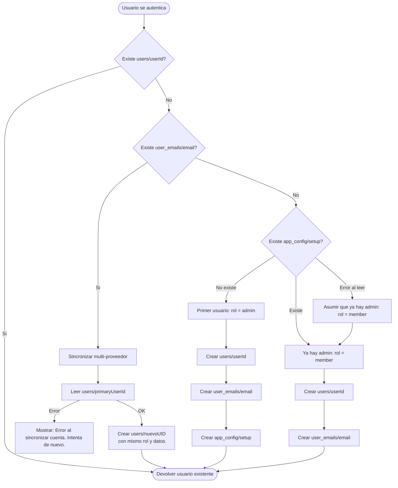
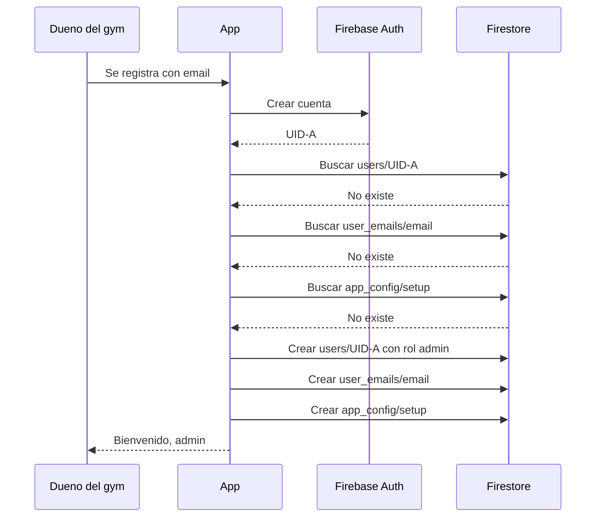

# Setup de administrador

> Reglas para la deteccion automatica del primer usuario y asignacion del rol de administrador.

---

## Problema

Cuando la app se instala por primera vez y no hay usuarios en la base de datos, necesitamos que el primer usuario que se registre sea automaticamente el administrador del gimnasio.

---

## Solucion: documento de configuracion

Se usa un documento individual en la base de datos: `app_config/setup`

| Campo | Tipo | Descripcion |
|-------|------|-------------|
| `adminUserId` | Texto | ID del usuario que fue asignado como admin |
| `createdAt` | Timestamp | Fecha en que se completo el setup |

---

## Flujo de resolucion de sesion

### Diagrama completo

### Flujo principal

Cada vez que un usuario se autentica (login o registro), se ejecuta:

1. **Buscar `users/{userId}`**
   - Si EXISTE: devolver usuario existente (ya tiene rol asignado)
   - Si NO existe: ir a paso 2

2. **Buscar en indice de email: `user_emails/{email}`**
   - Si EXISTE: sincronizar multi-proveedor
     - Leer usuario original (`users/{primaryUserId}`)
     - Crear nuevo documento `users/{nuevoUserId}` con el mismo rol y datos
   - Si NO existe: ir a paso 3

3. **Determinar rol para usuario nuevo**
   - Leer `app_config/setup`
   - Si el documento NO existe: este es el primer usuario -> rol = `admin`
   - Si el documento EXISTE: ya hay admin -> rol = `member`

4. **Crear usuario**
   - Crear documento `users/{userId}` con el rol determinado
   - Registrar email en indice: `user_emails/{email}`
   - Si es admin: crear documento `app_config/setup`

---

## Casos de uso

### Caso 1: Primer uso de la app

### Caso 2: Segundo usuario en adelante

1. Un cliente se registra
2. Ya existe `app_config/setup` -> se le asigna rol `member`

### Caso 3: Admin inicia sesion con otro proveedor

1. Admin se registro con email (UID-A)
2. Despues inicia sesion con Google (UID-B, mismo email)
3. Se detecta UID-A via indice de email
4. Se crea `users/{UID-B}` heredando el rol `admin`

---

## Flujos alternativos

### Error al leer `app_config/setup`

Si hay un error de red o permisos al verificar si ya hay admin:
- El sistema asume que ya hay admin (seguro por defecto)
- Se asigna rol `member`
- Mensaje de log interno (no visible al usuario)

### Error al leer usuario original en sync multi-proveedor

Si no se puede leer `users/{primaryUserId}`:
- Mostrar: "Error al sincronizar tu cuenta. Intenta de nuevo."
- No se crea documento nuevo
- El usuario puede reintentar

### Error al crear `app_config/setup`

Si se crea el admin pero falla la escritura de `app_config/setup`:
- El admin queda creado correctamente
- El proximo usuario podria tambien convertirse en admin (race condition)
- Mitigacion: verificar con getUserCount antes de asignar admin

---

## Mensajes de error

| Situacion | Mensaje al usuario |
|-----------|-------------------|
| Error de red en resolucion de sesion | "No se pudo completar el inicio de sesion. Verifica tu conexion." |
| Error al sincronizar multi-proveedor | "Error al sincronizar tu cuenta. Intenta de nuevo." |
| Error desconocido en setup | "Ocurrio un error inesperado. Intenta de nuevo." |

---

## Reglas de negocio

1. Solo puede haber un setup de admin (un solo documento `app_config/setup`)
2. El setup se marca como completado inmediatamente despues de crear el primer admin
3. Si hay un error al verificar el setup, el sistema asume que ya hay admin y asigna `member` (seguro por defecto)
4. El indice de email (`user_emails/{email}`) se crea al momento del registro para futuras sincronizaciones
5. La sincronizacion multi-proveedor hereda el rol y datos del usuario original
6. No se debe eliminar `app_config/setup` manualmente; hacerlo permitiria un segundo admin
