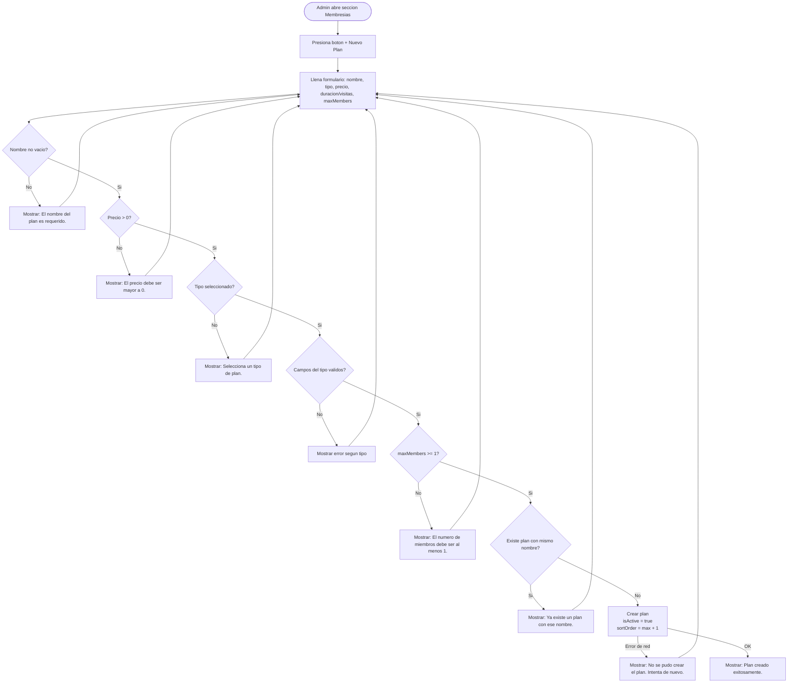
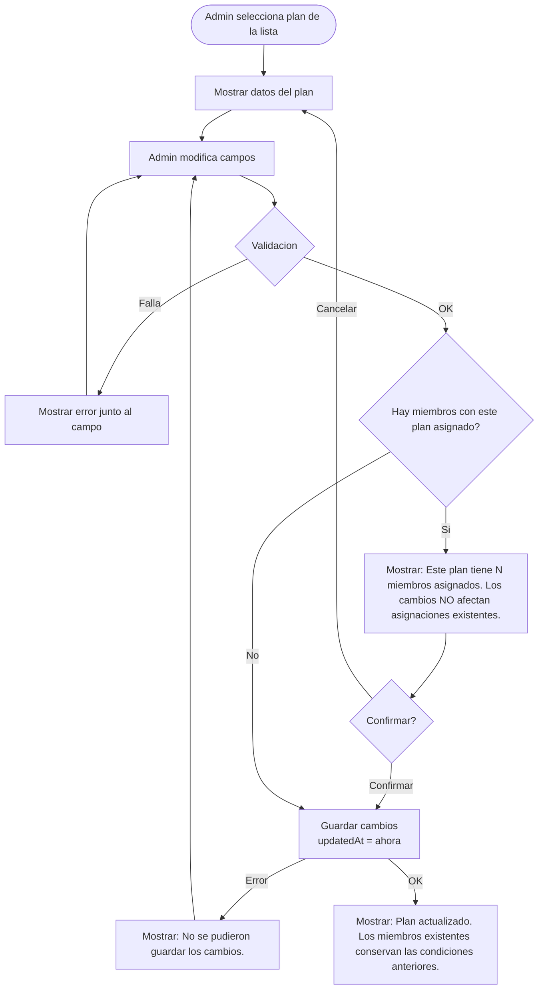
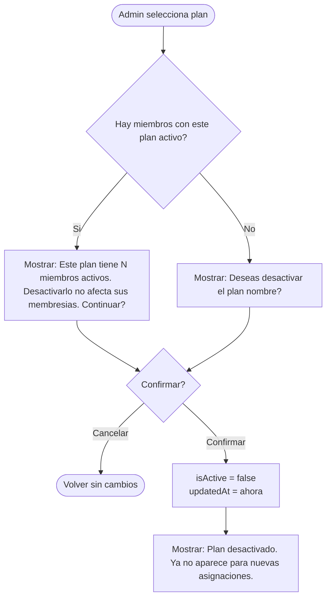
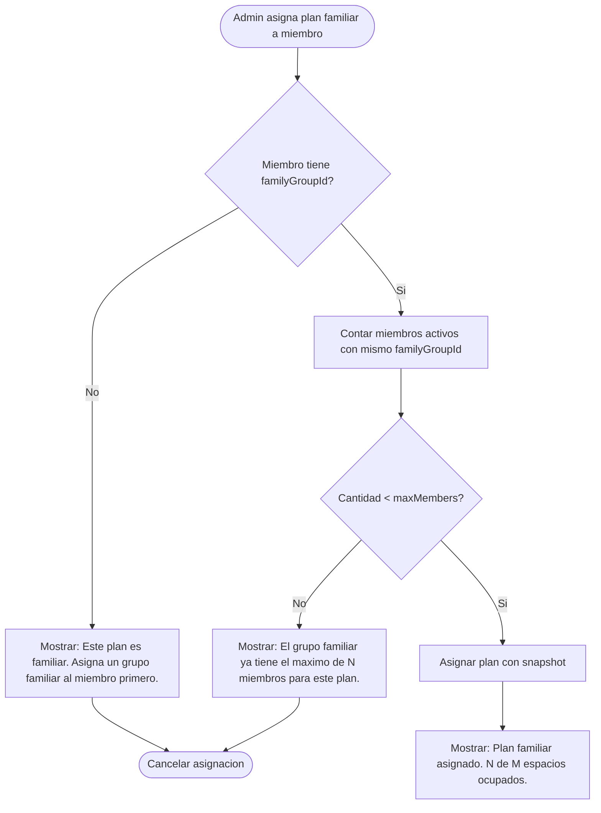

# Catalogo de Planes de Membresia

> Modulo para la configuracion de planes disponibles en el gimnasio.
> Solo el admin puede crear, editar y desactivar planes.
> Los cambios en un plan NO afectan las asignaciones existentes (ver `07-membership-assignments.md`).

---

## Tipos de plan

| type | Descripcion | Campos requeridos |
|---|---|---|
| `time_based` | Acceso ilimitado durante N dias | `durationInDays` |
| `visit_based` | N visitas sin limite de tiempo | `totalVisits` |
| `mixed` | N visitas dentro de un periodo de tiempo | `durationInDays` + `totalVisits` |

### Ejemplos

| Plan | type | durationInDays | totalVisits | maxMembers | Precio |
|---|---|---|---|---|---|
| Mensual | `time_based` | 30 | - | 1 | $350 |
| Semanal | `time_based` | 7 | - | 1 | $120 |
| Paquete 10 visitas | `visit_based` | - | 10 | 1 | $250 |
| 12 clases en 1 mes | `mixed` | 30 | 12 | 1 | $300 |
| Familiar mensual | `time_based` | 30 | - | 4 | $600 |
| Familiar 20 visitas | `visit_based` | - | 20 | 3 | $500 |

---

## Campos del plan

| Campo | Tipo | Requerido | Descripcion |
|---|---|---|---|
| `id` | String | Si | UUID generado |
| `name` | String | Si | Nombre visible (ej: "Mensualidad") |
| `type` | String | Si | `time_based`, `visit_based`, `mixed` |
| `price` | Double | Si | Precio del plan |
| `currency` | String | Si | Codigo ISO 4217 (default: `MXN`) |
| `durationInDays` | Int? | Condicional | Requerido si `time_based` o `mixed` |
| `totalVisits` | Int? | Condicional | Requerido si `visit_based` o `mixed` |
| `maxMembers` | Int | Si | 1 = individual, >1 = familiar (default: 1) |
| `description` | String? | No | Descripcion para el admin |
| `isActive` | Bool | Si | Si esta disponible para nuevas asignaciones |
| `sortOrder` | Int | Si | Orden de visualizacion (ascendente) |
| `createdAt` | Timestamp | Si | Fecha de creacion |
| `updatedAt` | Timestamp | Si | Ultima modificacion |

---

## Crear plan

### Diagrama

### Flujo principal

1. El admin define nombre, tipo, precio, duracion/visitas, maxMembers
2. Se valida cada campo
3. Se verifica que no exista otro plan con el mismo nombre
4. Se genera UUID automaticamente
5. `isActive = true` por defecto
6. `sortOrder` se asigna al final (max + 1)

### Validaciones

| Campo | Regla | Mensaje de error |
|-------|-------|------------------|
| `name` | Requerido, no vacio | "El nombre del plan es requerido." |
| `name` | Unico entre planes activos | "Ya existe un plan con ese nombre." |
| `price` | Requerido, > 0 | "El precio debe ser mayor a $0." |
| `type` | Requerido, valor valido | "Selecciona un tipo de plan." |
| `durationInDays` | > 0 si `time_based` o `mixed` | "La duracion debe ser al menos 1 dia." |
| `durationInDays` | null si `visit_based` | "Un plan por visitas no tiene duracion en dias." |
| `totalVisits` | > 0 si `visit_based` o `mixed` | "El numero de visitas debe ser al menos 1." |
| `totalVisits` | null si `time_based` | "Un plan por tiempo no tiene limite de visitas." |
| `maxMembers` | >= 1 | "El numero de miembros debe ser al menos 1." |
| `maxMembers` | <= 10 (limite sugerido) | "El maximo de miembros por plan es 10." |

---

## Editar plan

### Diagrama

### Flujo principal

1. El admin selecciona un plan
2. Modifica los campos que necesite
3. Se valida (mismas reglas que crear)
4. Se guarda con `updatedAt` actualizado

### Flujo alternativo: plan con asignaciones existentes

Si el plan tiene miembros asignados, se muestra advertencia informativa de que los cambios solo afectan nuevas asignaciones. El admin confirma antes de guardar.

---

## Desactivar plan (soft delete)

### Diagrama

### Flujo principal

1. Admin selecciona "Desactivar" en un plan
2. Se muestra confirmacion (con advertencia si tiene miembros)
3. Se marca `isActive = false`
4. El plan deja de aparecer para nuevas asignaciones
5. Los miembros que ya lo tienen NO se afectan

### Reactivar plan

1. Admin selecciona "Reactivar" en un plan inactivo
2. Se marca `isActive = true`
3. Vuelve a estar disponible

---

## Reglas de limite de miembros (`maxMembers`)

### Plan individual (`maxMembers = 1`)

| Regla | Detalle |
|-------|---------|
| Asignacion | Se asigna directamente a un miembro |
| Limite | Exactamente 1 miembro por asignacion |
| `familyGroupId` | No requerido |
| Check-in | Solo el miembro asignado |

### Plan familiar (`maxMembers > 1`)

| Regla | Detalle |
|-------|---------|
| Asignacion | Se asigna a un grupo familiar (`familyGroupId`) |
| Limite | Hasta `maxMembers` miembros con el mismo `familyGroupId` |
| Validacion al asignar | Contar miembros con ese `familyGroupId` activos |
| Check-in | Cualquier miembro del grupo |
| Visitas (`visit_based`) | Las visitas son compartidas entre todo el grupo |

### Diagrama: asignar plan familiar

### Errores de limite

| Situacion | Mensaje al usuario |
|-----------|-------------------|
| Plan familiar sin grupo asignado | "Este plan es familiar. Asigna un grupo familiar al miembro primero." |
| Grupo familiar lleno | "El grupo familiar ya tiene el maximo de N miembros para este plan." |
| Intentar cambiar maxMembers a menos de los miembros actuales | "No puedes reducir el limite a N. Actualmente hay M miembros asignados." |

---

## Mensajes de error generales

| Situacion | Mensaje al usuario |
|-----------|-------------------|
| Error de red al guardar | "No se pudo guardar el plan. Verifica tu conexion." |
| Error de red al cargar planes | "No se pudieron cargar los planes. Intenta de nuevo." |
| Plan no encontrado | "El plan ya no existe o fue desactivado." |
| Permiso denegado | "Solo el administrador puede gestionar planes." |

---

## Reglas de negocio

1. Solo el admin puede crear, editar, desactivar y reactivar planes
2. Los planes nunca se eliminan fisicamente de la base de datos (soft delete)
3. Desactivar un plan NO cancela las asignaciones existentes de ese plan
4. Un plan puede cambiar de precio sin afectar a los miembros que ya lo contrataron
5. Si `maxMembers > 1`, el plan es familiar y requiere `familyGroupId` al asignar
6. El numero de miembros en un grupo familiar no puede exceder `maxMembers` del plan
7. `maxMembers` no se puede reducir por debajo del numero actual de miembros asignados
8. Los planes se muestran ordenados por `sortOrder` ascendente
9. Solo los planes con `isActive = true` aparecen al momento de asignar una membresia
10. El `type` determina como se calcula el vencimiento y el check-in (ver `07-membership-assignments.md`)
11. No pueden existir dos planes activos con el mismo nombre
12. El limite sugerido de `maxMembers` es 10 (configurable en el futuro)
