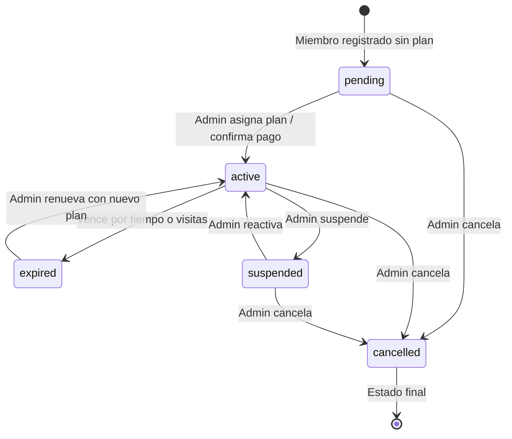
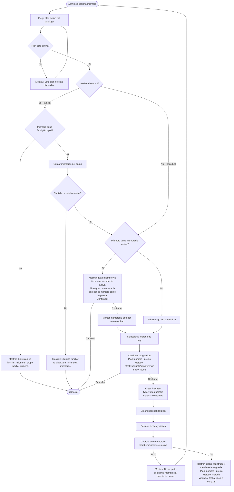
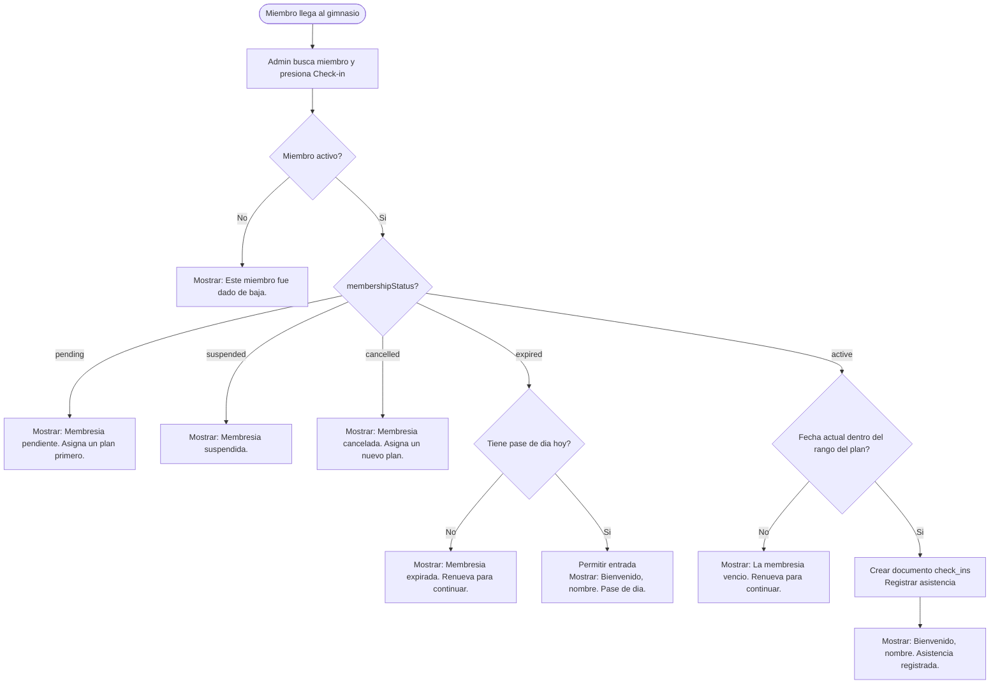
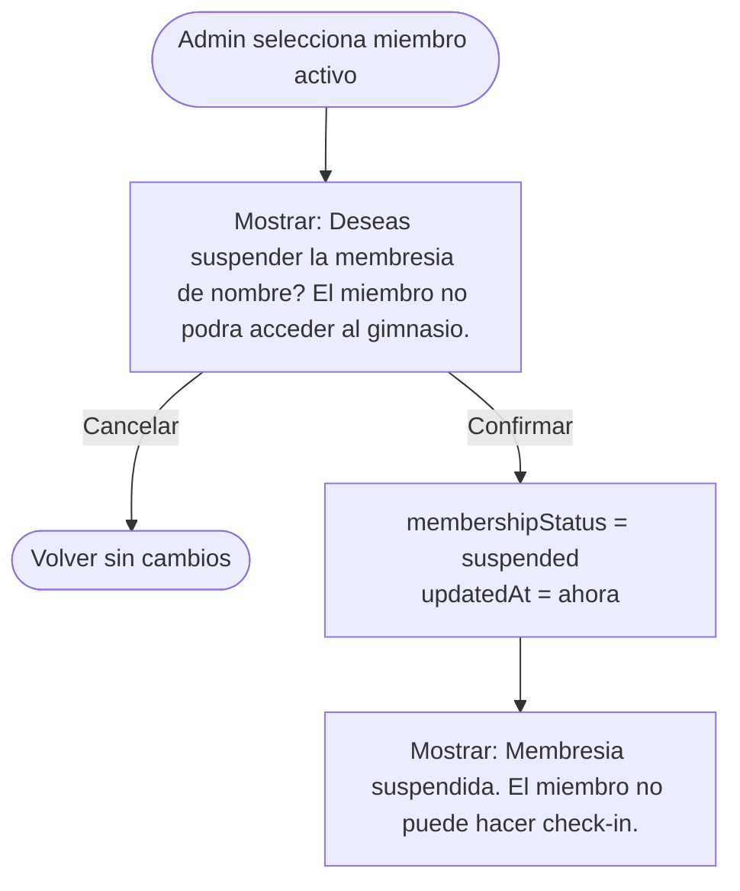
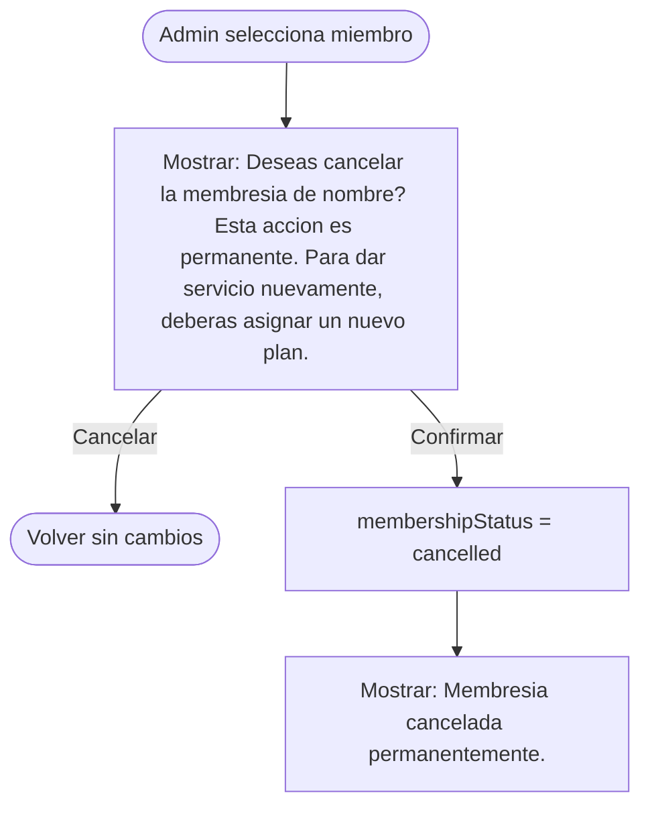

# Asignaciones de Membresia

> Cuando el admin asigna un plan a un miembro, se toma un SNAPSHOT del plan en ese momento.
> Los cambios futuros al plan no afectan asignaciones existentes.
> Para el catalogo de planes disponibles, ver `06-membership-plans.md`.

---

## Concepto: snapshot inmutable

Un plan es un **catalogo** que puede cambiar (el admin sube precios, renombra, etc.).
Una asignacion es una **compra**: se congela el estado del plan al momento de asignar.

| Concepto | Mutable? | Ejemplo |
|---|---|---|
| Plan (catalogo) | Si | "Mensual: $350, 30 dias" |
| Asignacion (snapshot) | No | "Juan compro Mensual a $350 el 15/Feb/2026" |

Si manana el admin cambia el plan Mensual a $400, Juan sigue con $350 porque eso fue lo que contrato.

---

## Campos de membresia en `members/{id}`

| Campo | Tipo | Descripcion |
|---|---|---|
| `membershipPlanId` | String? | FK al plan original (referencia, para reportes) |
| `membershipStatus` | String | `active`, `expired`, `suspended`, `cancelled`, `pending` |
| `membershipStartDate` | Timestamp? | Inicio del periodo actual |
| `membershipEndDate` | Timestamp? | Fin del periodo (null si `visit_based` puro) |
| `remainingVisits` | Int? | Visitas restantes (solo `visit_based` y `mixed`) |
| `membershipPlanSnapshot` | Map | Snapshot del plan al momento de asignar |

---

## Snapshot del plan (`membershipPlanSnapshot`)

| Campo | Tipo | Descripcion |
|---|---|---|
| `planName` | String | Nombre del plan al momento de asignar |
| `planType` | String | `time_based`, `visit_based`, `mixed` |
| `planPrice` | Double | Precio al momento de asignar |
| `planCurrency` | String | Moneda al momento de asignar |
| `durationInDays` | Int? | Duracion contratada |
| `totalVisits` | Int? | Total de visitas contratadas |
| `maxMembers` | Int | Maximo de miembros del plan |
| `assignedAt` | Timestamp | Fecha en que se asigno |
| `assignedBy` | String | UID del admin que hizo la asignacion |

---

## Estados de membresia

### Diagrama de transiciones

### Detalle de estados

| Estado | Descripcion | Transiciones posibles |
|---|---|---|
| `pending` | Registrado pero no activado (ej: falta pago) | -> `active`, -> `cancelled` |
| `active` | Vigente, el miembro tiene acceso | -> `expired`, -> `suspended`, -> `cancelled` |
| `expired` | Vencio por tiempo o se agotaron las visitas | -> `active` (renovacion) |
| `suspended` | Suspendida temporalmente por el admin | -> `active`, -> `cancelled` |
| `cancelled` | Cancelada definitivamente | (estado final) |

---

## Flujo: Asignacion de membresia (con pago)

> La asignacion de membresia siempre incluye el registro de un cobro.
> El admin selecciona plan, registra el metodo de pago, y al confirmar se crea
> el Payment y se activa la membresia en una sola operacion.
> Ver `08-payments.md` para mas detalles sobre pagos.

### Diagrama

### Flujo principal

1. Admin selecciona un miembro existente
2. Admin elige un plan activo del catalogo
3. Si es plan familiar: validar grupo y limite
4. Si ya tiene membresia activa: confirmar reemplazo
5. Admin elige fecha de inicio (default: hoy)
6. Admin selecciona metodo de pago (efectivo, tarjeta, transferencia)
7. Confirma la operacion
8. Se crea un `Payment` tipo `membership` con `status = completed`
9. Sistema crea snapshot del plan actual
10. Calcula fechas segun tipo:
    - `time_based`: `endDate = startDate + durationInDays`
    - `visit_based`: `endDate = null`, `remainingVisits = totalVisits`
    - `mixed`: ambos
11. `membershipStatus = "active"`
12. Se guarda en `members/{id}`

### Flujo alternativo: miembro ya tiene membresia activa (cambio de plan)

Escenario comun: miembro pago visita y ahora quiere mensualidad.

1. Mostrar advertencia con datos de la membresia actual
2. Si confirma: la membresia anterior se marca como `expired`
3. Se crea nuevo Payment con el monto del nuevo plan
4. Se crea nueva asignacion con snapshot fresco
5. El historial de pagos conserva ambos cobros

### Flujo alternativo: plan familiar sin grupo

1. Mostrar error indicando que necesita grupo familiar
2. Sugerir: "Asigna un grupo familiar desde el perfil del miembro."

### Validaciones

| Validacion | Mensaje de error |
|---|---|
| Plan no seleccionado | "Selecciona un plan de membresia." |
| Plan inactivo | "Este plan no esta disponible para asignacion." |
| Plan familiar sin grupo | "Este plan es familiar. Asigna un grupo familiar al miembro primero." |
| Grupo familiar lleno | "El grupo familiar ya alcanzo el limite de N miembros para este plan." |
| Fecha de inicio en el pasado | "La fecha de inicio no puede ser anterior a hoy." |
| Metodo de pago no seleccionado | "Selecciona un metodo de pago." |
| Error de red | "No se pudo asignar la membresia. Verifica tu conexion." |

---

## Flujo: Renovacion (con pago)

### Diagrama

### Flujo principal

1. Admin selecciona miembro con membresia expirada o por expirar
2. Elige plan (puede ser el mismo u otro)
3. Selecciona metodo de pago
4. Confirma la operacion
5. Se crea Payment tipo `membership` con `status = completed`
6. Se crea NUEVO snapshot con los valores actuales del plan
7. Nueva fecha de inicio y fin
8. `membershipStatus = "active"`

### Flujo alternativo: precio cambio desde la ultima asignacion

Si es el mismo plan pero el precio cambio, mostrar aviso al admin antes de confirmar.

> Nota: el snapshot anterior se sobreescribe. El historial de pagos conserva
> todos los cobros con sus snapshots, lo que sirve como historial de membresias.

---

## Flujo: Check-in (solo registro de asistencia)

> El check-in **solo registra asistencia**. NO descuenta visitas, NO modifica la membresia.
> Sirve para control de asistencias (cuantas veces visita el miembro) e ingresos por hora.
> Los dias no son acumulables — el check-in valida que la membresia este dentro del rango de fechas.

### Diagrama

### Flujo principal

1. Admin busca al miembro por nombre o telefono
2. Presiona boton de Check-in
3. Se valida que el miembro este activo (`isActive = true`)
4. Se valida el estado de la membresia (`membershipStatus`)
5. Si es `active`: se valida que la fecha actual este dentro del rango del plan (`membershipStartDate` a `membershipEndDate`)
6. Se crea un documento en `check_ins` con la fecha/hora de entrada
7. Se muestra mensaje de bienvenida

### Flujo alternativo: membresia expirada con pase de dia

Si el miembro tiene membresia expirada pero tiene un Payment tipo `day_pass` del dia actual:
1. Se permite el check-in
2. Se muestra: "Bienvenido, [nombre]. Pase de dia."

### Lo que el check-in NO hace

- **NO descuenta visitas** (`remainingVisits` no se modifica)
- **NO cambia el status** de la membresia (`membershipStatus` no se modifica)
- **NO modifica ningun campo** del documento del miembro
- Solo crea un documento nuevo en `check_ins`

### Mensajes de check-in

| Situacion | Mensaje |
|---|---|
| Entrada exitosa | "Bienvenido, [nombre]. Asistencia registrada." |
| Segunda visita del dia | "Bienvenido de nuevo, [nombre]. Visita #N del dia." |
| Pase de dia | "Bienvenido, [nombre]. Pase de dia." |
| Membresia expirada | "Membresia expirada. Renueva para continuar." |
| Membresia pendiente | "Membresia pendiente. Asigna un plan primero." |
| Membresia suspendida | "Membresia suspendida." |
| Membresia cancelada | "Membresia cancelada. Asigna un nuevo plan." |
| Miembro inactivo | "Este miembro fue dado de baja." |

---

## Flujo: Suspension

### Diagrama

### Flujo principal

1. Admin selecciona miembro con membresia activa
2. Confirma suspension
3. `membershipStatus = "suspended"`
4. El miembro no puede hacer check-in

### Reglas

- La suspension NO extiende la fecha de vencimiento
- El admin puede reactivar despues (status -> `active`)
- Si la membresia vence durante la suspension, queda como `expired` al reactivar

### Reactivar

---

## Flujo: Cancelacion

### Diagrama

### Flujo principal

1. Admin selecciona miembro
2. Confirma cancelacion (advertencia de permanencia)
3. `membershipStatus = "cancelled"`
4. Es un estado final, no se puede reactivar
5. Para dar servicio de nuevo, debe asignarse un nuevo plan

---

## Vencimiento automatico

- No hay proceso automatico de vencimiento por ahora
- El sistema verifica el estado al momento del check-in
- El admin puede ver "dias restantes" o "visitas restantes" en la lista de miembros
- Calculo: si `membershipEndDate < hoy` o `remainingVisits == 0`, se considera expirada

---

## Planes familiares

Cuando un plan tiene `maxMembers > 1`:

1. Al asignar, se requiere que el miembro tenga un `familyGroupId`
2. Se valida que el grupo no exceda `maxMembers`
3. Todos los miembros del grupo comparten el snapshot y las fechas de vigencia
4. El check-in de cualquier miembro del grupo se registra individualmente

### Errores de planes familiares

| Situacion | Mensaje |
|---|---|
| Asignar plan familiar sin grupo | "Este plan es familiar. Asigna un grupo familiar al miembro primero." |
| Grupo lleno | "El grupo familiar ya tiene el maximo de [N] miembros para este plan." |

---

## Mensajes de error generales

| Situacion | Mensaje |
|---|---|
| Error de red al asignar | "No se pudo asignar la membresia. Verifica tu conexion." |
| Error de red al hacer check-in | "No se pudo registrar el check-in. Intenta de nuevo." |
| Miembro no encontrado | "El miembro no existe o fue desactivado." |
| Plan no encontrado | "El plan seleccionado ya no existe." |
| Permiso denegado | "Solo el administrador puede gestionar membresias." |

---

## Reglas de negocio

1. Un miembro solo puede tener UNA membresia activa a la vez
2. Al asignar una nueva membresia, la anterior se marca como `expired` o `cancelled`
3. El snapshot es inmutable: si el plan cambia de precio, el miembro conserva lo contratado
4. `membershipPlanId` se mantiene como referencia al plan original (para reportes)
5. Si el plan es familiar (`maxMembers > 1`), todos los miembros del `familyGroupId` comparten el snapshot
6. Solo el admin puede asignar, renovar, suspender o cancelar membresias
7. El miembro no puede auto-asignarse una membresia desde la app
8. El precio del snapshot no se puede modificar despues de la asignacion
9. La renovacion crea un nuevo snapshot a precios actuales del catalogo
10. La cancelacion es permanente; para reactivar se necesita un nuevo plan
11. La suspension no extiende la fecha de vencimiento
12. Toda asignacion o renovacion genera un `Payment` tipo `membership` (ver `08-payments.md`)
13. El historial de pagos sirve como historial de membresias — cada Payment tipo `membership` conserva su snapshot
14. El check-in solo registra asistencia — NO descuenta visitas ni modifica la membresia
