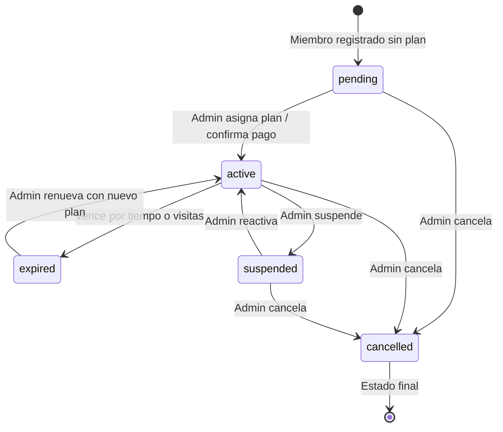
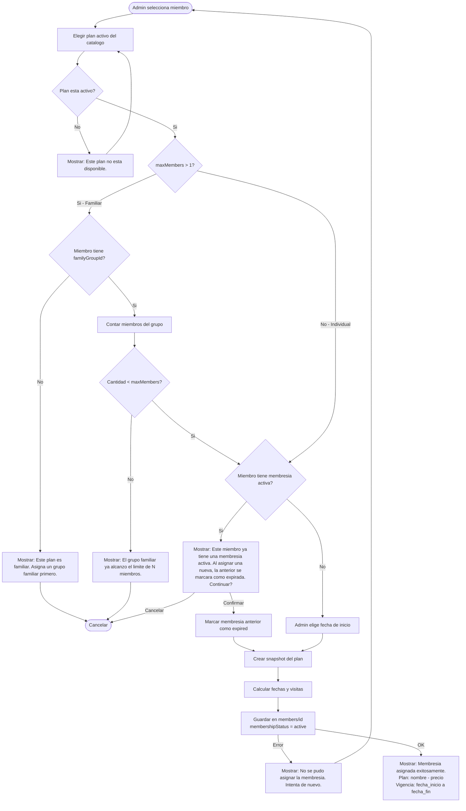
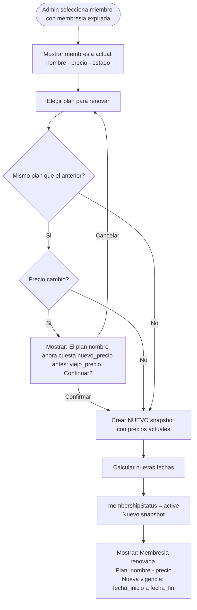
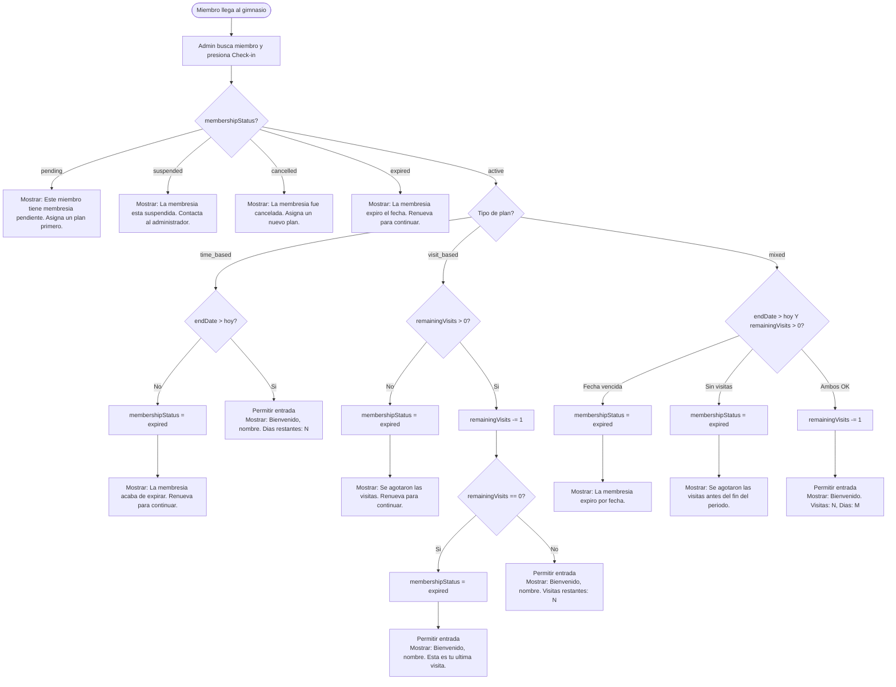

# Asignaciones de Membresia

> Cuando el admin asigna un plan a un miembro, se toma un SNAPSHOT del plan en ese momento.
> Los cambios futuros al plan no afectan asignaciones existentes.
> Para el catalogo de planes disponibles, ver `06-membership-plans.md`.

---

## Concepto: snapshot inmutable

Un plan es un **catalogo** que puede cambiar (el admin sube precios, renombra, etc.).
Una asignacion es una **compra**: se congela el estado del plan al momento de asignar.

| Concepto | Mutable? | Ejemplo |
|---|---|---|
| Plan (catalogo) | Si | "Mensual: $350, 30 dias" |
| Asignacion (snapshot) | No | "Juan compro Mensual a $350 el 15/Feb/2026" |

Si manana el admin cambia el plan Mensual a $400, Juan sigue con $350 porque eso fue lo que contrato.

---

## Campos de membresia en `members/{id}`

| Campo | Tipo | Descripcion |
|---|---|---|
| `membershipPlanId` | String? | FK al plan original (referencia, para reportes) |
| `membershipStatus` | String | `active`, `expired`, `suspended`, `cancelled`, `pending` |
| `membershipStartDate` | Timestamp? | Inicio del periodo actual |
| `membershipEndDate` | Timestamp? | Fin del periodo (null si `visit_based` puro) |
| `remainingVisits` | Int? | Visitas restantes (solo `visit_based` y `mixed`) |
| `membershipPlanSnapshot` | Map | Snapshot del plan al momento de asignar |

---

## Snapshot del plan (`membershipPlanSnapshot`)

| Campo | Tipo | Descripcion |
|---|---|---|
| `planName` | String | Nombre del plan al momento de asignar |
| `planType` | String | `time_based`, `visit_based`, `mixed` |
| `planPrice` | Double | Precio al momento de asignar |
| `planCurrency` | String | Moneda al momento de asignar |
| `durationInDays` | Int? | Duracion contratada |
| `totalVisits` | Int? | Total de visitas contratadas |
| `maxMembers` | Int | Maximo de miembros del plan |
| `assignedAt` | Timestamp | Fecha en que se asigno |
| `assignedBy` | String | UID del admin que hizo la asignacion |

---

## Estados de membresia

### Diagrama de transiciones

### Detalle de estados

| Estado | Descripcion | Transiciones posibles |
|---|---|---|
| `pending` | Registrado pero no activado (ej: falta pago) | -> `active`, -> `cancelled` |
| `active` | Vigente, el miembro tiene acceso | -> `expired`, -> `suspended`, -> `cancelled` |
| `expired` | Vencio por tiempo o se agotaron las visitas | -> `active` (renovacion) |
| `suspended` | Suspendida temporalmente por el admin | -> `active`, -> `cancelled` |
| `cancelled` | Cancelada definitivamente | (estado final) |

---

## Flujo: Asignacion de membresia

### Diagrama

### Flujo principal

1. Admin selecciona un miembro existente
2. Admin elige un plan activo del catalogo
3. Si es plan familiar: validar grupo y limite
4. Si ya tiene membresia activa: confirmar reemplazo
5. Admin elige fecha de inicio (default: hoy)
6. Sistema crea snapshot del plan actual
7. Calcula fechas segun tipo:
   - `time_based`: `endDate = startDate + durationInDays`
   - `visit_based`: `endDate = null`, `remainingVisits = totalVisits`
   - `mixed`: ambos
8. `membershipStatus = "active"`
9. Se guarda en `members/{id}`

### Flujo alternativo: miembro ya tiene membresia activa

1. Mostrar advertencia con datos de la membresia actual
2. Si confirma: la membresia anterior se marca como `expired`
3. Se crea nueva asignacion con snapshot fresco

### Flujo alternativo: plan familiar sin grupo

1. Mostrar error indicando que necesita grupo familiar
2. Sugerir: "Asigna un grupo familiar desde el perfil del miembro."

### Validaciones

| Validacion | Mensaje de error |
|---|---|
| Plan no seleccionado | "Selecciona un plan de membresia." |
| Plan inactivo | "Este plan no esta disponible para asignacion." |
| Plan familiar sin grupo | "Este plan es familiar. Asigna un grupo familiar al miembro primero." |
| Grupo familiar lleno | "El grupo familiar ya alcanzo el limite de N miembros para este plan." |
| Fecha de inicio en el pasado | "La fecha de inicio no puede ser anterior a hoy." |
| Error de red | "No se pudo asignar la membresia. Verifica tu conexion." |

---

## Flujo: Renovacion

### Diagrama

### Flujo principal

1. Admin selecciona miembro con membresia expirada o por expirar
2. Elige plan (puede ser el mismo u otro)
3. Se crea NUEVO snapshot con los valores actuales del plan
4. Nueva fecha de inicio y fin
5. `membershipStatus = "active"`

### Flujo alternativo: precio cambio desde la ultima asignacion

Si es el mismo plan pero el precio cambio, mostrar aviso al admin antes de confirmar.

> Nota: el snapshot anterior se sobreescribe. Si se necesita historial futuro,
> se crearia `members/{id}/membership_history`.

---

## Flujo: Check-in

### Diagrama

### Flujo principal (time_based)

1. Verificar que `membershipEndDate > hoy`
2. Si expirado: marcar como `expired`, rechazar
3. Si vigente: permitir entrada, mostrar dias restantes

### Flujo principal (visit_based)

1. Verificar que `remainingVisits > 0`
2. `remainingVisits -= 1`
3. Si `remainingVisits == 0`: marcar como `expired`
4. Permitir entrada, mostrar visitas restantes

### Flujo principal (mixed)

1. Verificar que `membershipEndDate > hoy` Y `remainingVisits > 0`
2. `remainingVisits -= 1`
3. Si cualquier condicion falla: marcar como `expired`
4. Permitir entrada, mostrar visitas y dias restantes

### Flujo alternativo: plan familiar (visit_based o mixed)

Las visitas son compartidas entre todos los miembros del grupo familiar. El decremento de `remainingVisits` afecta a todo el grupo.

### Mensajes de check-in

| Situacion | Mensaje |
|---|---|
| Entrada exitosa (time_based) | "Bienvenido, [nombre]. Tu membresia vence en [N] dias." |
| Entrada exitosa (visit_based) | "Bienvenido, [nombre]. Te quedan [N] visitas." |
| Entrada exitosa (mixed) | "Bienvenido, [nombre]. Visitas: [N], Dias: [M]." |
| Ultima visita | "Bienvenido, [nombre]. Esta es tu ultima visita. Renueva tu membresia." |
| Membresia expirada por fecha | "Tu membresia expiro el [fecha]. Renueva para continuar." |
| Membresia expirada por visitas | "Se agotaron tus visitas. Renueva para continuar." |
| Membresia pendiente | "Tu membresia esta pendiente de activacion." |
| Membresia suspendida | "Tu membresia esta suspendida. Contacta al administrador." |
| Membresia cancelada | "Tu membresia fue cancelada. Contacta al administrador." |
| Miembro no encontrado | "Miembro no registrado en el sistema." |
| Miembro inactivo | "Este miembro fue dado de baja." |

---

## Flujo: Suspension

### Diagrama

### Flujo principal

1. Admin selecciona miembro con membresia activa
2. Confirma suspension
3. `membershipStatus = "suspended"`
4. El miembro no puede hacer check-in

### Reglas

- La suspension NO extiende la fecha de vencimiento
- El admin puede reactivar despues (status -> `active`)
- Si la membresia vence durante la suspension, queda como `expired` al reactivar

### Reactivar

---

## Flujo: Cancelacion

### Diagrama

### Flujo principal

1. Admin selecciona miembro
2. Confirma cancelacion (advertencia de permanencia)
3. `membershipStatus = "cancelled"`
4. Es un estado final, no se puede reactivar
5. Para dar servicio de nuevo, debe asignarse un nuevo plan

---

## Vencimiento automatico

- No hay proceso automatico de vencimiento por ahora
- El sistema verifica el estado al momento del check-in
- El admin puede ver "dias restantes" o "visitas restantes" en la lista de miembros
- Calculo: si `membershipEndDate < hoy` o `remainingVisits == 0`, se considera expirada

---

## Planes familiares

Cuando un plan tiene `maxMembers > 1`:

1. Al asignar, se requiere que el miembro tenga un `familyGroupId`
2. Se valida que el grupo no exceda `maxMembers`
3. Todos los miembros del grupo comparten el snapshot
4. Las visitas (`visit_based` o `mixed`) son compartidas entre el grupo
5. El check-in de cualquier miembro decrementa las visitas del grupo

### Errores de planes familiares

| Situacion | Mensaje |
|---|---|
| Asignar plan familiar sin grupo | "Este plan es familiar. Asigna un grupo familiar al miembro primero." |
| Grupo lleno | "El grupo familiar ya tiene el maximo de [N] miembros para este plan." |
| Visitas del grupo agotadas | "El grupo familiar agoto todas las visitas. Renueva el plan." |

---

## Mensajes de error generales

| Situacion | Mensaje |
|---|---|
| Error de red al asignar | "No se pudo asignar la membresia. Verifica tu conexion." |
| Error de red al hacer check-in | "No se pudo registrar el check-in. Intenta de nuevo." |
| Miembro no encontrado | "El miembro no existe o fue desactivado." |
| Plan no encontrado | "El plan seleccionado ya no existe." |
| Permiso denegado | "Solo el administrador puede gestionar membresias." |

---

## Reglas de negocio

1. Un miembro solo puede tener UNA membresia activa a la vez
2. Al asignar una nueva membresia, la anterior se marca como `expired` o `cancelled`
3. El snapshot es inmutable: si el plan cambia de precio, el miembro conserva lo contratado
4. `membershipPlanId` se mantiene como referencia al plan original (para reportes)
5. Si el plan es familiar (`maxMembers > 1`), todos los miembros del `familyGroupId` comparten el snapshot
6. Solo el admin puede asignar, renovar, suspender o cancelar membresias
7. El miembro no puede auto-asignarse una membresia desde la app
8. El precio del snapshot no se puede modificar despues de la asignacion
9. La renovacion crea un nuevo snapshot a precios actuales del catalogo
10. La cancelacion es permanente; para reactivar se necesita un nuevo plan
11. La suspension no extiende la fecha de vencimiento
12. Las visitas de un plan familiar son compartidas entre todos los miembros del grupo
