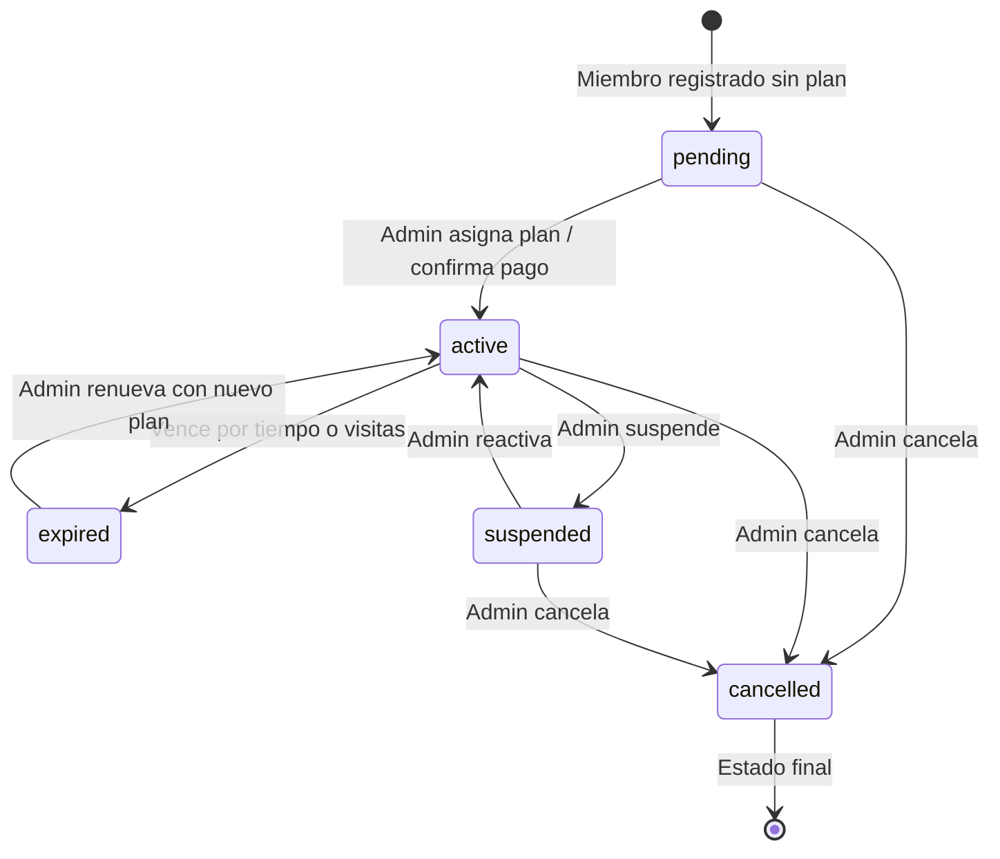
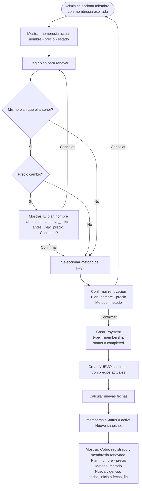
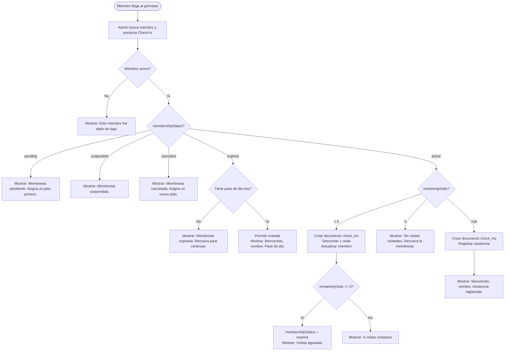
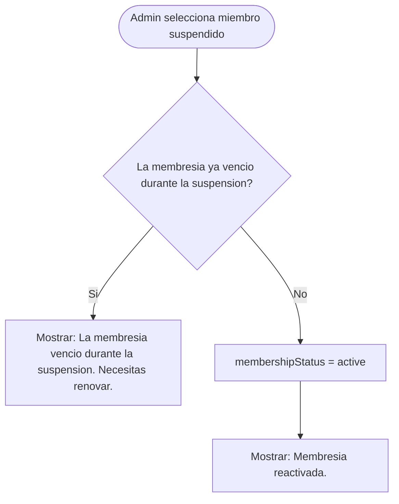
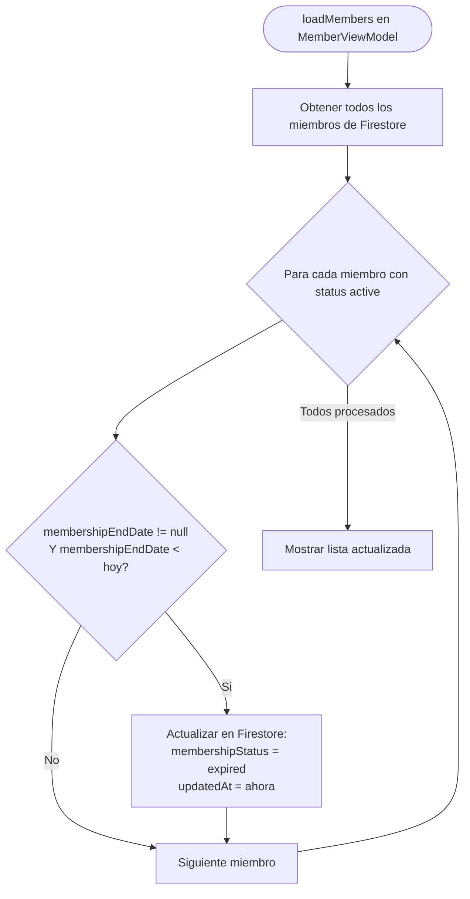

# Asignaciones de Membresia

> Cuando el admin asigna un plan a un miembro, se toma un SNAPSHOT del plan en ese momento.
> Los cambios futuros al plan no afectan asignaciones existentes.
> Para el catalogo de planes disponibles, ver `06-membership-plans.md`.

---

## Concepto: snapshot inmutable

Un plan es un **catalogo** que puede cambiar (el admin sube precios, renombra, etc.).
Una asignacion es una **compra**: se congela el estado del plan al momento de asignar.

| Concepto | Mutable? | Ejemplo |
|---|---|---|
| Plan (catalogo) | Si | "Mensual: $350, 30 dias" |
| Asignacion (snapshot) | No | "Juan compro Mensual a $350 el 15/Feb/2026" |

Si manana el admin cambia el plan Mensual a $400, Juan sigue con $350 porque eso fue lo que contrato.

---

## Campos de membresia en `members/{id}`

| Campo | Tipo | Descripcion |
|---|---|---|
| `membershipPlanId` | String? | FK al plan original (referencia, para reportes) |
| `membershipStatus` | String | `active`, `expired`, `suspended`, `cancelled`, `pending` |
| `membershipStartDate` | Timestamp? | Inicio del periodo actual |
| `membershipEndDate` | Timestamp? | Fin del periodo (null si `visit_based` puro) |
| `remainingVisits` | Int? | Visitas restantes (solo `visit_based` y `mixed`) |
| `membershipPlanSnapshot` | Map | Snapshot del plan al momento de asignar |

---

## Snapshot del plan (`membershipPlanSnapshot`)

| Campo | Tipo | Descripcion |
|---|---|---|
| `planName` | String | Nombre del plan al momento de asignar |
| `planType` | String | `time_based`, `visit_based`, `mixed` |
| `planPrice` | Double | Precio al momento de asignar |
| `planCurrency` | String | Moneda al momento de asignar |
| `durationInDays` | Int? | Duracion contratada |
| `totalVisits` | Int? | Total de visitas contratadas |
| `maxMembers` | Int | Maximo de miembros del plan |
| `assignedAt` | Timestamp | Fecha en que se asigno |
| `assignedBy` | String | UID del admin que hizo la asignacion |

---

## Estados de membresia

### Diagrama de transiciones

### Detalle de estados

| Estado | Descripcion | Transiciones posibles |
|---|---|---|
| `pending` | Registrado pero no activado (ej: falta pago) | -> `active`, -> `cancelled` |
| `active` | Vigente, el miembro tiene acceso | -> `expired`, -> `suspended`, -> `cancelled` |
| `expired` | Vencio por tiempo o se agotaron las visitas | -> `active` (renovacion) |
| `suspended` | Suspendida temporalmente por el admin | -> `active`, -> `cancelled` |
| `cancelled` | Cancelada definitivamente | (estado final) |

---

## Flujo: Asignacion de membresia (con pago)

> La asignacion de membresia siempre incluye el registro de un cobro.
> El admin selecciona plan, registra el metodo de pago, y al confirmar se crea
> el Payment y se activa la membresia en una sola operacion.
> Ver `08-payments.md` para mas detalles sobre pagos.

### Diagrama

### Flujo principal

1. Admin selecciona un miembro existente
2. Admin elige un plan activo del catalogo
3. Si es plan familiar: validar grupo y limite
4. Si ya tiene membresia activa: confirmar reemplazo
5. Admin elige fecha de inicio (default: hoy)
6. Admin selecciona metodo de pago (efectivo, tarjeta, transferencia)
7. Confirma la operacion
8. Se crea un `Payment` tipo `membership` con `status = completed`
9. Sistema crea snapshot del plan actual
10. Calcula fechas segun tipo:
    - `time_based`: ver **Aritmetica de fechas** abajo
    - `visit_based`: `endDate = null`, `remainingVisits = totalVisits`
    - `mixed`: ambos (fecha + visitas)
11. `membershipStatus = "active"`
12. Se guarda en `members/{id}`

### Flujo alternativo: miembro ya tiene membresia activa (cambio de plan)

Escenario comun: miembro pago visita y ahora quiere mensualidad.

1. Mostrar advertencia con datos de la membresia actual
2. Si confirma: la membresia anterior se marca como `expired`
3. Se crea nuevo Payment con el monto del nuevo plan
4. Se crea nueva asignacion con snapshot fresco
5. El historial de pagos conserva ambos cobros

### Flujo alternativo: plan familiar sin grupo

1. Mostrar error indicando que necesita grupo familiar
2. Sugerir: "Asigna un grupo familiar desde el perfil del miembro."

### Validaciones

| Validacion | Mensaje de error |
|---|---|
| Plan no seleccionado | "Selecciona un plan de membresia." |
| Plan inactivo | "Este plan no esta disponible para asignacion." |
| Plan familiar sin grupo | "Este plan es familiar. Asigna un grupo familiar al miembro primero." |
| Grupo familiar lleno | "El grupo familiar ya alcanzo el limite de N miembros para este plan." |
| Fecha de inicio en el pasado | "La fecha de inicio no puede ser anterior a hoy." |
| Metodo de pago no seleccionado | "Selecciona un metodo de pago." |
| Error de red | "No se pudo asignar la membresia. Verifica tu conexion." |

---

## Aritmetica de fechas de vencimiento

Para que los miembros paguen siempre el mismo dia del mes, los planes mensuales usan aritmetica de meses en vez de dias fijos.

### Regla

| Duracion del plan | Calculo de `endDate` | Ejemplo |
|---|---|---|
| < 28 dias (semanal, etc.) | `startDate + durationInDays` dias | 15 ene + 7 = 22 ene |
| >= 28 dias (mensual, etc.) | `startDate + N meses` de calendario | 15 ene + 1 mes = 15 feb |

### Mapeo de dias a meses

| `durationInDays` | Meses calculados | Resultado |
|---|---|---|
| 7 | N/A (usa dias) | +7 dias |
| 28-44 | 1 mes | Mismo dia, mes siguiente |
| 45-74 | 2 meses | Mismo dia, +2 meses |
| 75-104 | 3 meses | Mismo dia, +3 meses |

Formula: `meses = max(1, (durationInDays + 14) / 30)` solo si `durationInDays >= 28`

### Beneficio

- El miembro siempre paga el mismo dia del mes (ej: siempre el 15)
- Al renovar, el ciclo no se desfasa por diferencias de 28/30/31 dias entre meses

### Edge case: dia 31

Si el miembro se registra el 31 de enero y se suma 1 mes, el resultado es 28 de febrero (o 29 en bisiesto). Esto es el comportamiento correcto del calendario: "mismo dia o el mas cercano que exista en ese mes".

### Fines de semana

La membresia vence normalmente en su fecha de calendario. Si el vencimiento cae en sabado o domingo, el cobro de renovacion se hace el siguiente dia habil (lunes) cuando el admin atiende. No hay logica automatica de ajuste: es un comportamiento operativo del gym.

---

## Flujo: Renovacion (con pago)

### Diagrama

### Flujo principal

1. Admin selecciona miembro con membresia expirada o por expirar
2. Elige plan (puede ser el mismo u otro)
3. Selecciona metodo de pago
4. Confirma la operacion
5. Se crea Payment tipo `membership` con `status = completed`
6. Se crea NUEVO snapshot con los valores actuales del plan
7. Nueva fecha de inicio y fin
8. `membershipStatus = "active"`

### Flujo alternativo: precio cambio desde la ultima asignacion

Si es el mismo plan pero el precio cambio, mostrar aviso al admin antes de confirmar.

> Nota: el snapshot anterior se sobreescribe. El historial de pagos conserva
> todos los cobros con sus snapshots, lo que sirve como historial de membresias.

---

## Flujo: Check-in (registro de asistencia + descuento de visitas)

> El check-in registra asistencia y **descuenta visitas** para planes `visit_based` y `mixed`.
> Para planes `time_based`, solo registra asistencia sin modificar la membresia.
> Si las visitas llegan a 0, la membresia se marca como `expired`.

### Diagrama

### Flujo principal

1. Admin busca al miembro por nombre o telefono
2. Presiona boton de Check-in
3. Se valida que el miembro este activo (`isActive = true`)
4. Se valida el estado de la membresia (`membershipStatus == active`)
5. Si el plan tiene `remainingVisits`, se valida que sea > 0
6. Se crea un documento en `check_ins` con la fecha/hora de entrada
7. **Si `remainingVisits != nil`**: se descuenta 1 y se actualiza el miembro en Firestore
8. **Si `remainingVisits` llega a 0**: se marca `membershipStatus = expired`
9. Se muestra mensaje de bienvenida con visitas restantes (si aplica)

### Descuento de visitas por tipo de plan

| Tipo de plan | Tiene `remainingVisits` | Se descuenta en check-in | Se expira por visitas |
|---|:---:|:---:|:---:|
| `time_based` | No (`nil`) | No | No (solo por fecha) |
| `visit_based` | Si | **Si** | **Si** (cuando llega a 0) |
| `mixed` | Si | **Si** | **Si** (cuando llega a 0, o por fecha) |

### Flujo alternativo: membresia expirada con pase de dia

Si el miembro tiene membresia expirada pero tiene un Payment tipo `day_pass` del dia actual:
1. Se permite el check-in
2. Se muestra: "Bienvenido, [nombre]. Pase de dia."

> **Pendiente**: Validacion de pase de dia aun no implementada.

### Mensajes de check-in

| Situacion | Mensaje |
|---|---|
| Entrada exitosa (plan time_based) | "Bienvenido, [nombre]. Asistencia registrada." |
| Entrada exitosa (con visitas) | "Bienvenido, [nombre]. Asistencia registrada.\nX visita(s) restante(s)." |
| Ultima visita (agotada) | "Bienvenido, [nombre]. Asistencia registrada.\nVisitas agotadas. La membresia ha expirado." |
| Segunda visita del dia | "Bienvenido de nuevo, [nombre]. Visita #N del dia." |
| Sin visitas restantes | "Sin visitas restantes. Renueva la membresia." |
| Pase de dia | "Bienvenido, [nombre]. Pase de dia." |
| Membresia expirada | "Membresia expirada. Renueva para continuar." |
| Membresia pendiente | "Membresia pendiente. Asigna un plan primero." |
| Membresia suspendida | "Membresia suspendida." |
| Membresia cancelada | "Membresia cancelada. Asigna un nuevo plan." |
| Miembro inactivo | "Este miembro fue dado de baja." |

---

## Flujo: Suspension

### Diagrama

### Flujo principal

1. Admin selecciona miembro con membresia activa
2. Confirma suspension
3. `membershipStatus = "suspended"`
4. El miembro no puede hacer check-in

### Reglas

- La suspension NO extiende la fecha de vencimiento
- El admin puede reactivar despues (status -> `active`)
- Si la membresia vence durante la suspension, queda como `expired` al reactivar

### Reactivar

---

## Flujo: Cancelacion

### Diagrama

### Flujo principal

1. Admin selecciona miembro
2. Confirma cancelacion (advertencia de permanencia)
3. `membershipStatus = "cancelled"`
4. Es un estado final, no se puede reactivar
5. Para dar servicio de nuevo, debe asignarse un nuevo plan

---

## Vencimiento automatico

Las membresias se expiran automaticamente al cargar la lista de miembros en la app iOS. No hay Cloud Function ni cron job.

### Mecanismo (implementado)

### Reglas de expiracion automatica

1. Se ejecuta en `expireOverdueMembers()` cada vez que el admin abre la pantalla de miembros
2. Solo verifica `membershipEndDate` — el descuento de visitas se maneja en el check-in
3. Si no hay conexion, los miembros siguen mostrando su status anterior
4. No se notifica al miembro — solo se actualiza el campo en Firestore
5. Si la base crece significativamente (>500), considerar Cloud Function con Cloud Scheduler

### Dos mecanismos de expiracion

| Mecanismo | Cuando | Trigger |
|---|---|---|
| **Por fecha** | `membershipEndDate < hoy` | `loadMembers()` → `expireOverdueMembers()` |
| **Por visitas** | `remainingVisits == 0` | `performCheckIn()` en `CheckInViewModel` |

---

## Planes familiares

Cuando un plan tiene `maxMembers > 1`:

1. Al asignar, se requiere que el miembro tenga un `familyGroupId`
2. Se valida que el grupo no exceda `maxMembers`
3. Todos los miembros del grupo comparten el snapshot y las fechas de vigencia
4. El check-in de cualquier miembro del grupo se registra individualmente

### Errores de planes familiares

| Situacion | Mensaje |
|---|---|
| Asignar plan familiar sin grupo | "Este plan es familiar. Asigna un grupo familiar al miembro primero." |
| Grupo lleno | "El grupo familiar ya tiene el maximo de [N] miembros para este plan." |

---

## Mensajes de error generales

| Situacion | Mensaje |
|---|---|
| Error de red al asignar | "No se pudo asignar la membresia. Verifica tu conexion." |
| Error de red al hacer check-in | "No se pudo registrar el check-in. Intenta de nuevo." |
| Miembro no encontrado | "El miembro no existe o fue desactivado." |
| Plan no encontrado | "El plan seleccionado ya no existe." |
| Permiso denegado | "Solo el administrador puede gestionar membresias." |

---

## Expiracion automatica de membresias

Las membresias no se expiran automaticamente en Firestore (no hay cron job ni Cloud Function).
En su lugar, la expiracion se maneja **al cargar la lista de miembros** en la app iOS.

### Mecanismo

### Flujo

1. Al ejecutar `loadMembers()`, despues de obtener todos los miembros de Firestore
2. Para cada miembro con `membershipStatus == active`:
   - Si `membershipEndDate != nil` y `membershipEndDate < hoy`: marcar como `expired` en Firestore
3. Recargar la lista con los cambios aplicados

### Reglas

1. Solo se verifica `membershipEndDate` — el descuento de visitas se maneja en el check-in
2. La expiracion se ejecuta cada vez que el admin abre la pantalla de miembros
3. Si no hay conexion, los miembros siguen mostrando su status anterior (se expiraran al reconectar)
4. Se usa `TaskGroup` para eficiencia si hay multiples miembros a expirar
5. No se notifica al miembro — solo se actualiza el campo en Firestore

### Alternativa futura

Si la base de miembros crece significativamente (>500), considerar una Cloud Function con Cloud Scheduler que corra diariamente para expirar membresias.

---

## Acciones rapidas (QuickActionSheet)

El admin puede realizar acciones rapidas desde la lista de miembros al tocar una fila. Esto simplifica el flujo mas comun: registrar visitas y asignar planes.

### Opciones disponibles

| Accion | Descripcion | Cuando disponible |
|---|---|---|
| **Renovar plan** | Renueva con plan anterior pre-seleccionado | Expirado, suspendido, o por vencer (<=3 dias) |
| **Registrar visita** | Check-in con cobro automatico | Siempre |
| **Registrar plan** | Asignar plan con cobro | Siempre |
| Vender producto | Cobro de producto/servicio | Siempre |
| Editar datos personales | Abrir formulario completo | Siempre |
| Historial de pagos | Ver cobros del miembro | Siempre |

### Renovacion rapida

Cuando un miembro tiene plan previo y esta expirado, suspendido o por vencer (<=3 dias), se muestra un boton prominente "Renovar plan" que:

1. Pre-selecciona el plan anterior del miembro en el selector
2. Si la membresia aun no vencio (renovacion anticipada), la fecha de inicio es el dia despues del vencimiento
3. Si ya vencio, la fecha de inicio es hoy
4. El plan anterior se marca con badge "Anterior" en la lista de planes
5. El admin puede cambiar a otro plan si lo desea

Tambien disponible como swipe action (naranja) y context menu en la lista de miembros.

### Logica de "Registrar visita" segun estado

| Estado del miembro | Resultado |
|---|---|
| Activo con plan vigente | Check-in directo, sin cobro adicional |
| Primera visita (sin snapshot) | Visita gratis + check-in |
| Expirado/suspendido/cancelado | Mostrar formulario de cobro (1-3 visitas) |

### Primera visita gratis

- Aplica solo si `membershipPlanSnapshot == nil` (nunca tuvo plan)
- Se asigna snapshot con precio $0
- Se registra check-in automatico
- En la siguiente visita se cobra normalmente

### Compra de multiples visitas

- El admin puede cobrar 1, 2 o 3 visitas a la vez
- 4+ dias se manejan como plan semanal
- El check-in automatico consume 1 visita del paquete
- Las visitas restantes se usan en check-ins futuros

Ver `08-payments.md` para detalles de cobros.

---

## Reglas de negocio

1. Un miembro solo puede tener UNA membresia activa a la vez
2. Al asignar una nueva membresia, la anterior se marca como `expired` o `cancelled`
3. El snapshot es inmutable: si el plan cambia de precio, el miembro conserva lo contratado
4. `membershipPlanId` se mantiene como referencia al plan original (para reportes)
5. Si el plan es familiar (`maxMembers > 1`), todos los miembros del `familyGroupId` comparten el snapshot
6. Solo el admin puede asignar, renovar, suspender o cancelar membresias
7. El miembro no puede auto-asignarse una membresia desde la app
8. El precio del snapshot no se puede modificar despues de la asignacion
9. La renovacion crea un nuevo snapshot a precios actuales del catalogo (se permite renovar el MISMO plan)
10. La cancelacion es permanente; para reactivar se necesita un nuevo plan
11. La suspension no extiende la fecha de vencimiento
12. Toda asignacion o renovacion genera un `Payment` tipo `membership` (ver `08-payments.md`)
13. El historial de pagos sirve como historial de membresias — cada Payment tipo `membership` conserva su snapshot
14. El check-in registra asistencia y descuenta `remainingVisits` para planes `visit_based` y `mixed`. Si las visitas llegan a 0, la membresia pasa a `expired`
15. Las membresias se expiran automaticamente al cargar la lista de miembros (verificacion de `membershipEndDate`)
16. La primera visita de un miembro nuevo (sin snapshot previo) es gratuita
17. Se pueden comprar de 1 a 3 visitas de una vez con check-in automatico incluido
18. El QuickActionSheet permite acciones rapidas sin necesidad de abrir el formulario completo de edicion
19. La renovacion rapida pre-selecciona el plan anterior y calcula la fecha de inicio inteligentemente (dia despues del vencimiento si aun no expiro, o hoy si ya expiro)
20. La opcion de renovar esta disponible cuando el miembro tiene plan previo y su status es `expired`, `suspended`, o `active` con <=3 dias restantes
