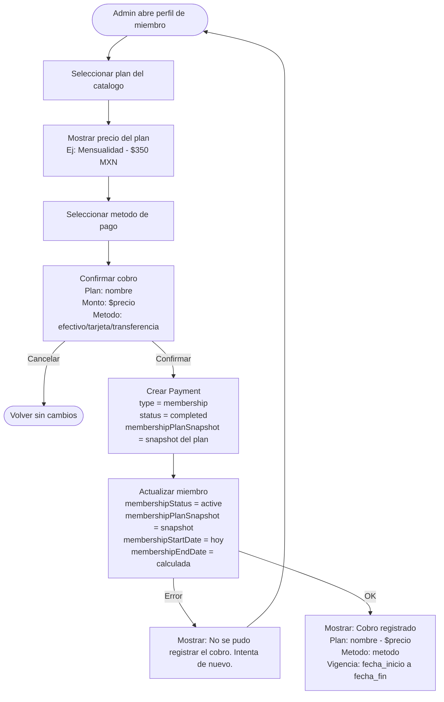
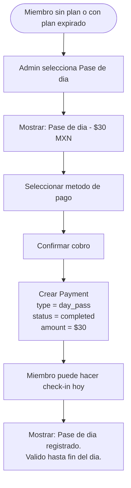

# Pagos y Cobros

> Todo cobro en el gimnasio se registra como un `Payment` vinculado a un miembro.
> El admin/recepcionista registra el cobro desde la app iOS.
> No hay integracion de pago online por ahora — los cobros son en ventanilla (efectivo, tarjeta, transferencia).

---

## Tipos de pago

| Tipo | Valor en Firestore | Descripcion | Ejemplo |
|------|-------------------|-------------|---------|
| Membresia | `membership` | Asignacion o renovacion de un plan de membresia | "Mensualidad $350" |
| Pase de dia | `day_pass` | Acceso por un dia sin plan activo | "Visita $30" |
| Producto | `product` | Venta de producto fisico | "Botella de agua $20" |
| Servicio | `service` | Cobro por servicio adicional | "Clase personalizada $200" |

---

## Metodos de pago

| Metodo | Valor en Firestore | Descripcion |
|--------|-------------------|-------------|
| Efectivo | `cash` | Pago en efectivo en recepcion |
| Tarjeta | `card` | Pago con tarjeta (terminal fisica) |
| Transferencia | `transfer` | Transferencia bancaria o SPEI |

> No se soportan pagos online (Stripe, Apple Pay, Google Pay) en esta version.
> Estos metodos existen en el modelo de datos para uso futuro.

---

## Flujo: Cobro de membresia

Este es el flujo principal. Cuando el admin asigna un plan a un miembro, se registra el cobro al mismo tiempo.

### Diagrama

### Flujo principal

1. Admin abre el perfil de un miembro
2. Selecciona un plan activo del catalogo
3. El sistema muestra el precio del plan
4. Admin selecciona el metodo de pago (efectivo, tarjeta, transferencia)
5. Confirma el cobro
6. Se crea un documento `Payment` con `type = membership` y `status = completed`
7. Se actualiza el miembro con la nueva membresia (snapshot, fechas, status)
8. Se muestra confirmacion con los datos del cobro

### Flujo alternativo: miembro ya tiene membresia activa

Si el miembro ya tiene un plan activo y se quiere cambiar:

1. Mostrar advertencia: "Este miembro ya tiene una membresia activa (nombre_plan). Al asignar una nueva, la anterior se marcara como expirada."
2. Si confirma: la membresia anterior se marca como `expired`, se crea nueva con nuevo snapshot y nuevo Payment
3. Si cancela: volver sin cambios

---

## Flujo: Cambio de plan

Escenario comun: un miembro paga una visita y despues decide pagar la mensualidad.

### Diagrama

### Flujo principal

1. Miembro tiene un plan activo (ej: Visita $30)
2. Admin abre perfil y selecciona nuevo plan (ej: Mensualidad $350)
3. Sistema advierte que hay plan activo y pide confirmacion
4. Al confirmar: plan anterior -> `expired`, se crea nuevo Payment, se asigna nuevo plan
5. El historial de pagos conserva ambos cobros (visita + mensualidad)

---

## Flujo: Pase de dia

Para miembros que no tienen plan activo y quieren acceder por un dia.

### Diagrama

### Reglas del pase de dia

1. El pase de dia es un Payment tipo `day_pass`
2. **No modifica la membresia** del miembro (no cambia status ni snapshot)
3. Permite hacer check-in ese dia aunque el miembro no tenga plan activo
4. Al validar check-in, se verifica si existe un `day_pass` del dia actual para ese miembro
5. El monto lo define el admin al registrar (puede variar)

---

## Flujo: Cobro de producto o servicio

Para ventas de productos (agua, suplementos) o servicios (clase personalizada).

### Flujo principal

1. Admin selecciona miembro
2. Elige tipo: Producto o Servicio
3. Ingresa descripcion y monto
4. Selecciona metodo de pago
5. Se crea Payment con `type = product` o `type = service`

> Este flujo es mas simple porque no modifica la membresia del miembro.

---

## Historial de pagos

### Vista del admin

El admin puede ver el historial completo de pagos de un miembro:

| Fecha | Concepto | Monto | Metodo | Estado |
|-------|----------|-------|--------|--------|
| 15/Feb/2026 | Mensualidad | $350 | Efectivo | Completado |
| 01/Feb/2026 | Visita | $30 | Efectivo | Completado |
| 15/Ene/2026 | Botella de agua | $20 | Tarjeta | Completado |

### Vista del miembro (en la app)

Si el miembro tiene cuenta en la app y esta vinculado, puede ver su propio historial de pagos en modo lectura.

---

## Validaciones

| Validacion | Mensaje de error |
|---|---|
| Monto menor o igual a 0 | "El monto debe ser mayor a $0." |
| Metodo de pago no seleccionado | "Selecciona un metodo de pago." |
| Plan no seleccionado (para tipo membership) | "Selecciona un plan de membresia." |
| Plan inactivo | "Este plan no esta disponible." |
| Error de red | "No se pudo registrar el cobro. Verifica tu conexion." |

---

## Reglas de negocio

1. Todo cobro esta vinculado a un `memberId` — no existen cobros sin miembro
2. El `userId` es opcional — solo se llena si el miembro tiene cuenta en la app
3. Un pago tipo `membership` **siempre** incluye `membershipPlanSnapshot` con los datos del plan
4. Un pago `completed` **no se puede modificar** — para corregir, se crea un pago con status `refunded`
5. El pago tipo `day_pass` permite check-in ese dia sin necesidad de plan activo
6. El `registeredBy` identifica al admin/recepcionista que hizo el cobro (auditoria)
7. Los pagos nunca se eliminan — son historicos inmutables
8. El monto del Payment para tipo `membership` debe coincidir con el precio del plan en el snapshot
9. Al renovar, se crea un nuevo Payment — no se modifica el anterior
10. El historial de pagos se ordena por `createdAt` descendente (mas reciente primero)

---

## Permisos por rol

| Accion | admin | receptionist | trainer | member |
|--------|-------|-------------|---------|--------|
| Registrar cobro | Si | Si | No | No |
| Ver historial (todos) | Si | Si | No | No |
| Ver historial propio | Si | Si | No | Si |
| Registrar reembolso | Si | No | No | No |
