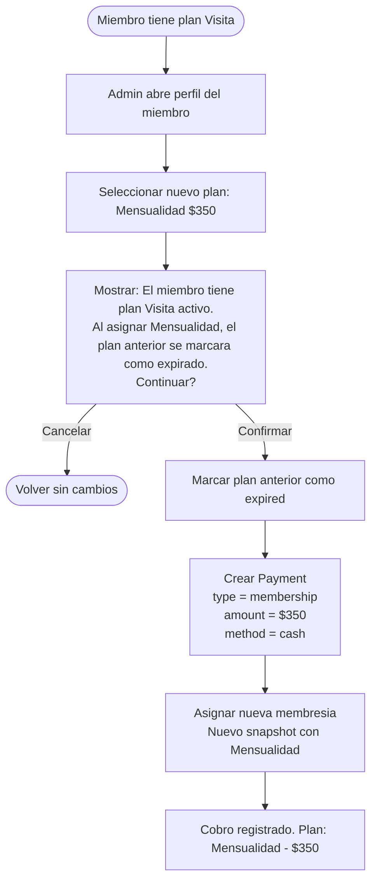
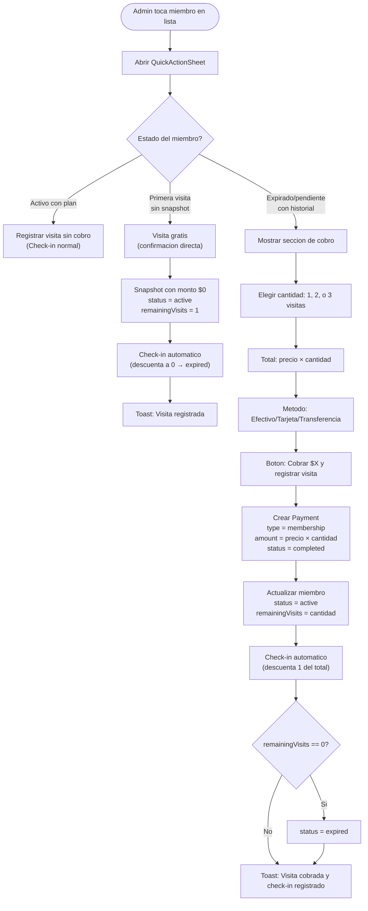

# Pagos y Cobros

> Todo cobro en el gimnasio se registra como un `Payment` vinculado a un miembro.
> El admin/recepcionista registra el cobro desde la app iOS.
> No hay integracion de pago online por ahora — los cobros son en ventanilla (efectivo, tarjeta, transferencia).

---

## Tipos de pago

| Tipo | Valor en Firestore | Descripcion | Ejemplo |
|------|-------------------|-------------|---------|
| Membresia | `membership` | Asignacion o renovacion de un plan de membresia | "Mensualidad $350" |
| Pase de dia | `day_pass` | Acceso por un dia sin plan activo | "Visita $30" |
| Producto | `product` | Venta de producto fisico | "Botella de agua $20" |
| Servicio | `service` | Cobro por servicio adicional | "Clase personalizada $200" |

---

## Metodos de pago

| Metodo | Valor en Firestore | Descripcion |
|--------|-------------------|-------------|
| Efectivo | `cash` | Pago en efectivo en recepcion |
| Tarjeta | `card` | Pago con tarjeta (terminal fisica) |
| Transferencia | `transfer` | Transferencia bancaria o SPEI |

> No se soportan pagos online (Stripe, Apple Pay, Google Pay) en esta version.
> Estos metodos existen en el modelo de datos para uso futuro.

---

## Flujo: Cobro de membresia

Este es el flujo principal. Cuando el admin asigna un plan a un miembro, se registra el cobro al mismo tiempo.

### Diagrama


### Flujo principal

1. Admin abre el perfil de un miembro
2. Selecciona un plan activo del catalogo
3. El sistema muestra el precio del plan
4. Admin selecciona el metodo de pago (efectivo, tarjeta, transferencia)
5. Confirma el cobro
6. Se crea un documento `Payment` con `type = membership` y `status = completed`
7. Se actualiza el miembro con la nueva membresia (snapshot, fechas, status)
8. Se muestra confirmacion con los datos del cobro

### Flujo alternativo: miembro ya tiene membresia activa

Si el miembro ya tiene un plan activo y se quiere cambiar:

1. Mostrar advertencia: "Este miembro ya tiene una membresia activa (nombre_plan). Al asignar una nueva, la anterior se marcara como expirada."
2. Si confirma: la membresia anterior se marca como `expired`, se crea nueva con nuevo snapshot y nuevo Payment
3. Si cancela: volver sin cambios

---

## Flujo: Cambio de plan

Escenario comun: un miembro paga una visita y despues decide pagar la mensualidad.

### Diagrama



### Flujo principal

1. Miembro tiene un plan activo (ej: Visita $30)
2. Admin abre perfil y selecciona nuevo plan (ej: Mensualidad $350)
3. Sistema advierte que hay plan activo y pide confirmacion
4. Al confirmar: plan anterior -> `expired`, se crea nuevo Payment, se asigna nuevo plan
5. El historial de pagos conserva ambos cobros (visita + mensualidad)

---

## Flujo: Pase de dia

Para miembros que no tienen plan activo y quieren acceder por un dia.

### Diagrama


### Reglas del pase de dia

1. El pase de dia es un Payment tipo `day_pass`
2. **No modifica la membresia** del miembro (no cambia status ni snapshot)
3. Permite hacer check-in ese dia aunque el miembro no tenga plan activo
4. Al validar check-in, se verifica si existe un `day_pass` del dia actual para ese miembro
5. El monto lo define el admin al registrar (puede variar)

---

## Flujo: Cobro rapido de visita

Para miembros que llegan al gimnasio sin plan activo. El admin puede cobrar y registrar el check-in en una sola operacion desde el QuickActionSheet.

### Diagrama



### Reglas del cobro rapido

1. El precio por visita se toma del plan `visit_based` con `totalVisits == 1` del catalogo (plan "Visita")
2. Se pueden comprar de 1 a 3 visitas a la vez
3. Si son 4+ dias, el admin deberia registrar un plan semanal en su lugar
4. El check-in se registra automaticamente con la primera visita del paquete
5. Si se compra 1 visita: queda con `remainingVisits = 0` despues del check-in (expired inmediatamente)
6. Si se compran 2: queda con `remainingVisits = 1` (puede volver manana)
7. Si se compran 3: queda con `remainingVisits = 2`

### Primera visita gratis

Un miembro se considera "primera visita" cuando `membershipPlanSnapshot == nil` (nunca tuvo plan asignado).

| Condicion | Resultado |
|---|---|
| `membershipPlanSnapshot == nil` | Primera visita: gratis, sin cobro |
| `membershipPlanSnapshot != nil` y expirado | Cobro requerido |
| `membershipStatus == active` | Check-in normal, sin cobro |

Reglas:
1. Solo aplica si el miembro **nunca** tuvo un plan (snapshot nulo)
2. Se crea un snapshot con `planPrice = 0` y `planName = "Visita"` (o nombre del visitPlan)
3. Se asigna `remainingVisits = 1` y se registra check-in inmediato
4. La membresia queda como `expired` despues del check-in (1 visita consumida)
5. En la siguiente visita, se cobrara normalmente

---

## Flujo: Cobro de producto o servicio (Punto de Venta)

Para ventas de productos (agua, suplementos) o servicios (clase personalizada). Se presenta como un sheet "Nueva Venta" con carrito.

### Diagrama

```mermaid
flowchart TD
    Start([Admin abre SaleSheet]) --> SelectMember["Buscar y seleccionar miembro"]
    SelectMember --> Browse["Navegar catalogo de productos"]
    Browse --> AddToCart["Agregar producto(s) al carrito\n(+/- para ajustar cantidad)"]
    AddToCart --> MoreProducts{"Agregar mas?"}
    MoreProducts -->|Si| Browse
    MoreProducts -->|No| SelectMethod["Seleccionar metodo de pago\n(efectivo/tarjeta/transferencia)"]
    SelectMethod --> Confirm["Cobrar $Total"]
    Confirm --> ConfirmAlert["Alert: Confirmar venta\nN articulos por $Total\na NombreMiembro"]
    ConfirmAlert -->|Cancelar| Browse
    ConfirmAlert -->|Cobrar| ProcessSale["Por cada item del carrito:"]
    ProcessSale --> CreatePayment["1. Crear Payment\ntype = product/service\namount = subtotal\ndescription = Nombre xN"]
    CreatePayment --> ReduceStock{"Es producto fisico?"}
    ReduceStock -->|Si| UpdateStock["2. Reducir stock\nnewStock = stock - quantity"]
    ReduceStock -->|No (servicio)| NextItem
    UpdateStock --> NextItem{"Mas items?"}
    NextItem -->|Si| CreatePayment
    NextItem -->|No| Success["Toast: Venta registrada\nN articulos por $Total"]
    ProcessSale -->|Error| ShowError["Toast: Error al procesar venta"]
```

### Puntos de entrada

| Punto de entrada | Contexto | Comportamiento |
|-----------------|----------|----------------|
| **Tab Inventario** - toolbar carrito | Sin pre-seleccion | Abre SaleSheet vacio |
| **Tab Inventario** - context menu "Vender" | Producto pre-seleccionado | Abre SaleSheet con producto en carrito |
| **Tab Inventario** - boton "Nueva venta" en lista | Sin pre-seleccion | Abre SaleSheet vacio |
| **QuickActionSheet** - "Vender producto" | Miembro pre-seleccionado | Abre SaleSheet con miembro ya asignado |

### Flujo principal

1. Admin abre SaleSheet (desde inventario o QuickActionSheet)
2. Selecciona un miembro buscando por nombre o telefono
3. Navega el catalogo de productos (con filtro por categoria y busqueda)
4. Agrega productos al carrito con cantidad (+/- botones)
5. Selecciona metodo de pago (efectivo, tarjeta, transferencia)
6. Confirma el cobro
7. Por cada item del carrito se crea un Payment individual:
   - `type = .product` para productos fisicos
   - `type = .service` para servicios
   - `description = "NombreProducto xCantidad"`
   - `amount = precio * cantidad`
8. Si es producto fisico, se reduce el stock automaticamente
9. Se muestra confirmacion y el sheet se cierra

### Carrito

- Cada producto se agrega con cantidad 1 (incrementable con +/-)
- Productos fisicos: cantidad maxima = stock disponible
- Servicios: cantidad maxima = 10
- Se muestra subtotal por item y total general
- El carrito se puede vaciar completamente

### Reglas del cobro de producto

1. Todo cobro requiere un miembro seleccionado
2. Se crea UN Payment por cada producto diferente en el carrito
3. El stock se reduce automaticamente para productos fisicos
4. Los servicios no afectan stock
5. El Payment se crea con `status = completed` y `completedAt = Date()`
6. No se permite vender productos agotados (stock = 0)
7. No se permite vender productos inactivos

---

## Historial de pagos

### Vista del admin

El admin puede ver el historial completo de pagos de un miembro:

| Fecha | Concepto | Monto | Metodo | Estado |
|-------|----------|-------|--------|--------|
| 15/Feb/2026 | Mensualidad | $350 | Efectivo | Completado |
| 01/Feb/2026 | Visita | $30 | Efectivo | Completado |
| 15/Ene/2026 | Botella de agua | $20 | Tarjeta | Completado |

### Vista del miembro (en la app)

Si el miembro tiene cuenta en la app y esta vinculado, puede ver su propio historial de pagos en modo lectura.

---

## Validaciones

| Validacion | Mensaje de error |
|---|---|
| Monto menor o igual a 0 | "El monto debe ser mayor a $0." |
| Metodo de pago no seleccionado | "Selecciona un metodo de pago." |
| Plan no seleccionado (para tipo membership) | "Selecciona un plan de membresia." |
| Plan inactivo | "Este plan no esta disponible." |
| Error de red | "No se pudo registrar el cobro. Verifica tu conexion." |

---

## Reglas de negocio

1. Todo cobro esta vinculado a un `memberId` — no existen cobros sin miembro
2. El `userId` es opcional — solo se llena si el miembro tiene cuenta en la app
3. Un pago tipo `membership` **siempre** incluye `membershipPlanSnapshot` con los datos del plan
4. Un pago `completed` **no se puede modificar** — para corregir, se crea un pago con status `refunded`
5. El pago tipo `day_pass` permite check-in ese dia sin necesidad de plan activo
6. El `registeredBy` identifica al admin/recepcionista que hizo el cobro (auditoria)
7. Los pagos nunca se eliminan — son historicos inmutables
8. El monto del Payment para tipo `membership` debe coincidir con el precio del plan en el snapshot (excepto visita gratis donde amount = 0)
9. Al renovar, se crea un nuevo Payment — no se modifica el anterior
10. El historial de pagos se ordena por `createdAt` descendente (mas reciente primero)
11. La primera visita de un miembro nuevo (sin snapshot previo) es gratuita — se crea Payment con amount = 0
12. El cobro rapido de visita puede incluir de 1 a 3 visitas en una sola transaccion
13. El cobro rapido incluye check-in automatico (primera visita del paquete se consume inmediatamente)
14. Existen tres puntos de entrada para cobros: MemberFormView (completo), QuickActionSheet (visita rapida), PlanSelectionSheet (plan simplificado)
15. Para cobros de producto/servicio, se crea un Payment por cada item del carrito (no un solo Payment agrupado)
16. El cobro de producto reduce el stock automaticamente para productos fisicos
17. Existen cuatro puntos de entrada para venta de productos: toolbar carrito (Inventario), context menu "Vender" (Inventario), boton "Nueva venta" (Inventario), "Vender producto" (QuickActionSheet)

---

## Permisos por rol

| Accion | admin | receptionist | trainer | member |
|--------|-------|-------------|---------|--------|
| Registrar cobro | Si | Si | No | No |
| Ver historial (todos) | Si | Si | No | No |
| Ver historial propio | Si | Si | No | Si |
| Registrar reembolso | Si | No | No | No |
