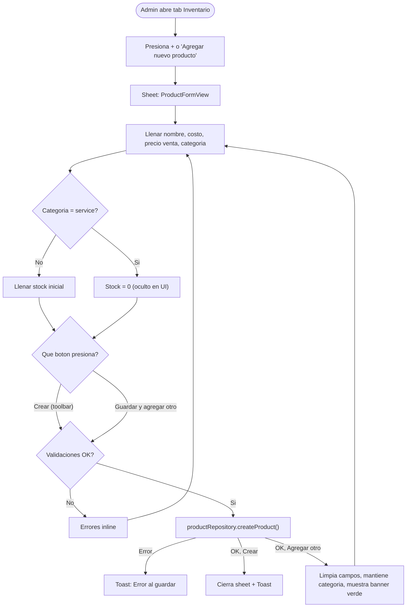
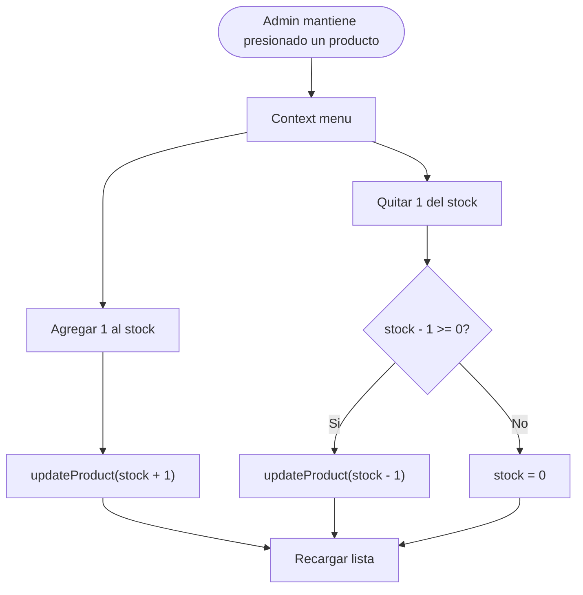

# Inventario y Catalogo de Productos

> El admin gestiona un catalogo de productos y servicios del gimnasio.
> Los productos tienen stock trackeable. Los servicios no manejan stock.
> La venta de productos crea Payment tipo `product`/`service` y reduce stock automaticamente.
> Para cobros, ver `08-payments.md`.

---

## Tipos de items

| Tipo | Categoria | Stock | Ejemplo |
|------|-----------|-------|---------|
| Producto fisico | `beverages`, `food`, `supplements`, `equipment`, `apparel`, `accessories`, `other` | Si | Agua $20, Proteina $350 |
| Servicio | `service` | No | Clase personal $200, Asesoria $150 |

Ambos se almacenan en la misma coleccion `products` y se diferencian por el campo `category`.

---

## Categorias

| Categoria | Valor Firestore | Icono | Ejemplo |
|-----------|----------------|-------|---------|
| Bebidas | `beverages` | cup.and.saucer.fill | Agua, jugos, shakes |
| Alimentos | `food` | fork.knife | Barras, snacks |
| Suplementos | `supplements` | pill.fill | Proteina, creatina |
| Equipamiento | `equipment` | dumbbell.fill | Mancuernas, bandas |
| Ropa | `apparel` | tshirt.fill | Playeras, shorts |
| Accesorios | `accessories` | bag.fill | Guantes, wraps, cinturones |
| Servicios | `service` | person.fill.questionmark | Clase personal, asesoria |
| Otros | `other` | square.grid.2x2.fill | Candados, toallas |

---

## Flujo: Crear producto

### Guardar y agregar otro

Al presionar "Guardar y agregar otro":
1. El producto se guarda en Firestore
2. Los campos del formulario se limpian
3. La categoria seleccionada se mantiene (para carga masiva de la misma categoria)
4. Un banner verde confirma: "NombreProducto guardado"
5. El sheet permanece abierto para capturar el siguiente producto
6. Solo disponible en modo creacion (no al editar)

---

## Flujo: Ajustar stock

Solo disponible para productos (no servicios). El admin puede ajustar stock desde el context menu.

---

## Precio de costo y margen

Cada producto tiene dos precios:
- **Costo** (`costPrice`): lo que el gimnasio pago por el producto
- **Venta** (`price`): precio al publico

Metricas calculadas automaticamente:
- **Ganancia por unidad**: `price - costPrice`
- **Margen %**: `(price - costPrice) / price * 100`

El margen se muestra en la lista de productos (solo admin/recepcionista) y en el formulario al editar/crear.

---

## Historial de precios

Cada vez que se edita un producto y cambia el `price` o `costPrice`, el sistema automaticamente:
1. Guarda los valores **anteriores** en `priceHistory` junto con la fecha y el UID del admin
2. Actualiza el producto con los nuevos valores

El historial es **inmutable**: nunca se editan ni eliminan entradas.

Se muestra en el formulario de edicion como una seccion "Historial de precios" (ultimos 10 cambios, orden mas reciente primero).

---

## Validaciones

| Campo | Regla | Mensaje |
|-------|-------|---------|
| Nombre | Requerido, no vacio | "El nombre es requerido" |
| Costo | >= 0 (si se ingresa) | "Ingresa un costo valido" |
| Precio venta | Mayor a 0 | "Ingresa un precio de venta valido mayor a 0" |
| Stock | >= 0 (solo productos) | "Ingresa una cantidad valida" |

---

## Permisos por rol

| Accion | admin | receptionist | trainer | member |
|--------|:-----:|:------------:|:-------:|:------:|
| Ver catalogo | Si | Si | No | No |
| Crear producto | Si | Si | No | No |
| Editar producto | Si | Si | No | No |
| Desactivar producto | Si | Si | No | No |
| Reactivar producto | Si | No | No | No |
| Ajustar stock | Si | Si | No | No |

---

## Reglas de negocio

1. Productos y servicios viven en la misma coleccion `products`
2. La diferencia es `category = "service"` — no tiene stock
3. El stock nunca puede ser negativo (minimo 0)
4. Los productos desactivados (`isActive = false`) no se muestran a roles no-admin
5. Soft delete: nunca se eliminan documentos
6. El precio siempre es en MXN (por ahora)
7. El SKU es opcional y para uso interno del admin
8. Las imagenes de producto son una funcionalidad futura
9. Todo producto tiene `costPrice` (costo) y `price` (venta al publico)
10. Al cambiar precio o costo, se genera automaticamente una entrada en `priceHistory`
11. El historial de precios es inmutable y se almacena como array de maps en Firestore
12. "Guardar y agregar otro" solo esta disponible en modo creacion
13. Tap en un producto abre el formulario de edicion directamente

---

## Implementado

1. **Venta con cobro integrado**: SaleSheet con carrito, seleccion de miembro, Payment tipo `product`/`service` + reduccion automatica de stock. Ver `08-payments.md` para detalles del flujo.

---

## Pendiente (no implementado)

1. **Movimientos de inventario**: historial de entradas, salidas y ajustes (modelo `Inventory` ya existe en InventoryCore)
2. **Alertas de stock bajo**: notificar cuando stock < umbral configurable
3. **Imagenes de producto**: subir y mostrar fotos de productos
4. **Reporte de inventario**: valor total del inventario, productos mas vendidos
