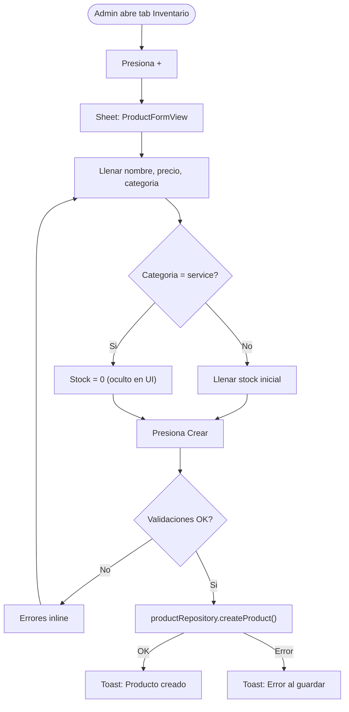

# Inventario y Catalogo de Productos

> El admin gestiona un catalogo de productos y servicios del gimnasio.
> Los productos tienen stock trackeable. Los servicios no manejan stock.
> La venta con cobro integrado (crear Payment + reducir stock) es una fase futura.
> Para cobros, ver `08-payments.md`.

---

## Tipos de items

| Tipo | Categoria | Stock | Ejemplo |
|------|-----------|-------|---------|
| Producto fisico | `beverages`, `food`, `supplements`, `equipment`, `apparel`, `accessories`, `other` | Si | Agua $20, Proteina $350 |
| Servicio | `service` | No | Clase personal $200, Asesoria $150 |

Ambos se almacenan en la misma coleccion `products` y se diferencian por el campo `category`.

---

## Categorias

| Categoria | Valor Firestore | Icono | Ejemplo |
|-----------|----------------|-------|---------|
| Bebidas | `beverages` | cup.and.saucer.fill | Agua, jugos, shakes |
| Alimentos | `food` | fork.knife | Barras, snacks |
| Suplementos | `supplements` | pill.fill | Proteina, creatina |
| Equipamiento | `equipment` | dumbbell.fill | Mancuernas, bandas |
| Ropa | `apparel` | tshirt.fill | Playeras, shorts |
| Accesorios | `accessories` | bag.fill | Guantes, wraps, cinturones |
| Servicios | `service` | person.fill.questionmark | Clase personal, asesoria |
| Otros | `other` | square.grid.2x2.fill | Candados, toallas |

---

## Flujo: Crear producto

---

## Flujo: Ajustar stock

Solo disponible para productos (no servicios). El admin puede ajustar stock desde el context menu.

---

## Validaciones

| Campo | Regla | Mensaje |
|-------|-------|---------|
| Nombre | Requerido, no vacio | "El nombre es requerido" |
| Precio | Mayor a 0 | "Ingresa un precio valido mayor a 0" |
| Stock | >= 0 (solo productos) | "Ingresa una cantidad valida" |

---

## Permisos por rol

| Accion | admin | receptionist | trainer | member |
|--------|:-----:|:------------:|:-------:|:------:|
| Ver catalogo | Si | Si | No | No |
| Crear producto | Si | Si | No | No |
| Editar producto | Si | Si | No | No |
| Desactivar producto | Si | Si | No | No |
| Reactivar producto | Si | No | No | No |
| Ajustar stock | Si | Si | No | No |

---

## Reglas de negocio

1. Productos y servicios viven en la misma coleccion `products`
2. La diferencia es `category = "service"` — no tiene stock
3. El stock nunca puede ser negativo (minimo 0)
4. Los productos desactivados (`isActive = false`) no se muestran a roles no-admin
5. Soft delete: nunca se eliminan documentos
6. El precio siempre es en MXN (por ahora)
7. El SKU es opcional y para uso interno del admin
8. Las imagenes de producto son una funcionalidad futura

---

## Pendiente (no implementado)

1. **Venta con cobro integrado**: al vender, crear Payment tipo `product`/`service` + reducir stock automaticamente
2. **Movimientos de inventario**: historial de entradas, salidas y ajustes (modelo `Inventory` ya existe en InventoryCore)
3. **Alertas de stock bajo**: notificar cuando stock < umbral configurable
4. **Imagenes de producto**: subir y mostrar fotos de productos
5. **Reporte de inventario**: valor total del inventario, productos mas vendidos
