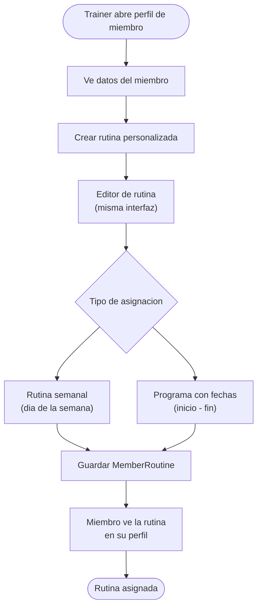

# Reglas de negocio: Rutinas y Ejercicios

> Sistema de planificacion de entrenamientos para el gimnasio.
> Permite a entrenadores crear catalogos de ejercicios, armar bloques tematicos,
> disenar plantillas reutilizables y asignar rutinas diarias a las clases.
> Ver `schema.md` para estructura de datos y `10-classes.md` para reglas de clases.

---

## Conceptos

### Jerarquia de entidades

| Entidad | Descripcion |
|---------|-------------|
| **ExerciseCatalog** | Biblioteca de ejercicios del gym. Es la definicion del ejercicio (nombre, tipo, grupo muscular), NO una instancia con series/reps. Coleccion: `exercises` |
| **ExerciseBlock** | Agrupacion tematica de ejercicios (ej: "Calentamiento", "Tecnica de boxeo"). Contiene ejercicios instanciados con su configuracion. Embebido como Map dentro de templates/rutinas |
| **BlockExercise** | Ejercicio instanciado dentro de un bloque, con configuracion especifica (rounds, series, reps, peso, tiempo). Embebido como Map dentro del bloque |
| **RoutineTemplate** | Plantilla reutilizable compuesta de bloques. El trainer la crea una vez y la aplica a multiples dias. Coleccion: `routine_templates` |
| **DailyRoutine** | Rutina asignada a un dia y opcionalmente a una clase (GymClass). Es lo que el miembro ve como "rutina de hoy". Coleccion: `daily_routines` |
| **MemberRoutine** | (Backlog - Fase 3) Rutina personalizada asignada a un miembro especifico |
| **Equipment** | (Backlog - Fase 4) Inventario de equipo del gym |

### Diferencia entre catalogo e instancia

El **catalogo** define QUE ejercicio es ("Burpees", tipo: acondicionamiento, grupo muscular: full body).
La **instancia** define COMO se ejecuta en una rutina especifica ("Burpees, 3 series x 15 reps").

Un mismo ejercicio del catalogo puede aparecer multiples veces en diferentes bloques con configuraciones distintas.

---

## Fase 1 — Catalogo de ejercicios y bloques

### Tipos de ejercicio (ExerciseType)

| Valor | Nombre | Descripcion |
|-------|--------|-------------|
| `boxing` | Boxeo | Trabajo en costal, sombra, sparring, combinaciones |
| `cardio` | Cardio | Saltar cuerda, correr, bicicleta |
| `strength` | Fuerza | Pesas, maquinas, peso corporal con resistencia |
| `flexibility` | Flexibilidad | Estiramientos, movilidad articular |
| `conditioning` | Acondicionamiento | Circuitos, HIIT, burpees, ejercicios funcionales |

### Grupos musculares (MuscleGroup)

| Valor | Nombre |
|-------|--------|
| `chest` | Pecho |
| `back` | Espalda |
| `legs` | Piernas |
| `shoulders` | Hombros |
| `arms` | Brazos |
| `core` | Core / Abdomen |
| `cardio` | Cardiovascular |
| `full_body` | Cuerpo completo |

### Tipos de medicion (MeasurementType)

Determina que campos son relevantes para configurar el ejercicio en un bloque:

| Valor | Campos relevantes | Ejemplo |
|-------|-------------------|---------|
| `rounds` | rounds, roundDurationSeconds, restBetweenRoundsSeconds | Jab-Cross en costal: 3 rounds x 180 seg, 60 seg descanso |
| `series_reps` | sets, repetitions, weight (opcional) | Sentadillas: 3 x 15, 20 kg |
| `time` | durationSeconds | Plancha: 45 segundos |

### Campos del catalogo de ejercicios

| Campo | Tipo | Requerido | Descripcion |
|-------|------|-----------|-------------|
| `id` | String | Si | UUID generado |
| `name` | String | Si | Nombre del ejercicio |
| `type` | String | Si | `boxing`, `cardio`, `strength`, `flexibility`, `conditioning` |
| `muscleGroup` | String | Si | `chest`, `back`, `legs`, `shoulders`, `arms`, `core`, `cardio`, `full_body` |
| `defaultMeasurementType` | String | Si | `rounds`, `series_reps`, `time` — tipo de medicion por defecto |
| `description` | String | No | Descripcion o instrucciones del ejercicio |
| `imageURL` | String | No | URL de imagen ilustrativa (futuro) |
| `isActive` | Boolean | Si | Soft delete (default: true) |
| `createdBy` | String | Si | UID del admin/trainer que creo el ejercicio |
| `createdAt` | Timestamp | Si | Fecha de creacion |
| `updatedAt` | Timestamp | Si | Fecha de actualizacion |

### Validaciones del catalogo

| Campo | Regla | Mensaje de error |
|-------|-------|------------------|
| `name` | No vacio, max 100 caracteres | "El nombre del ejercicio es requerido" |
| `name` | Unico dentro del catalogo activo | "Ya existe un ejercicio con este nombre" |
| `type` | Uno de los valores de ExerciseType | "Tipo de ejercicio invalido" |
| `muscleGroup` | Uno de los valores de MuscleGroup | "Grupo muscular invalido" |
| `defaultMeasurementType` | Uno de los valores de MeasurementType | "Tipo de medicion invalido" |

### Tipos de bloque (BlockType)

| Valor | Nombre | Icono sugerido | Descripcion |
|-------|--------|----------------|-------------|
| `warmup` | Calentamiento | fuego | Preparacion fisica antes del entrenamiento principal |
| `technique` | Tecnica | guantes de boxeo | Trabajo tecnico (combinaciones, sombra, costal) |
| `strength` | Fuerza | pesa | Trabajo de fuerza con pesas o peso corporal |
| `conditioning` | Acondicionamiento | rayo | Circuitos, HIIT, trabajo funcional |
| `cooldown` | Vuelta a la calma | copo de nieve | Estiramientos, caminata suave, relajacion |
| `custom` | Personalizado | estrella | Bloque libre definido por el trainer |

### Estructura de un bloque (embebido)

| Campo | Tipo | Requerido | Descripcion |
|-------|------|-----------|-------------|
| `blockType` | String | Si | Uno de los valores de BlockType |
| `blockName` | String | Si | Nombre del bloque (puede ser el default del tipo o custom) |
| `order` | Int | Si | Posicion del bloque en la rutina (0-based) |
| `estimatedMinutes` | Int | No | Duracion estimada del bloque |
| `exercises` | Array\<Map\> | Si | Lista de ejercicios instanciados |

### Estructura de un ejercicio instanciado (BlockExercise, embebido)

| Campo | Tipo | Requerido | Descripcion |
|-------|------|-----------|-------------|
| `exerciseId` | String | Si | FK a `exercises/{id}` (referencia debil) |
| `exerciseName` | String | Si | Nombre del ejercicio (copiado del catalogo para independencia) |
| `measurementType` | String | Si | `rounds`, `series_reps`, `time` |
| `rounds` | Int | Condicional | Numero de rounds (si measurementType = rounds) |
| `roundDurationSeconds` | Int | Condicional | Duracion de cada round en segundos (si rounds) |
| `restBetweenRoundsSeconds` | Int | No | Descanso entre rounds en segundos |
| `sets` | Int | Condicional | Numero de series (si measurementType = series_reps) |
| `repetitions` | Int | Condicional | Repeticiones por serie (si series_reps) |
| `weight` | Double | No | Peso en kg (si series_reps, opcional) |
| `durationSeconds` | Int | Condicional | Duracion total en segundos (si measurementType = time) |
| `notes` | String | No | Notas del trainer (ej: "enfocarse en distancia") |
| `order` | Int | Si | Posicion del ejercicio dentro del bloque (0-based) |

### Validaciones de ejercicios instanciados

| measurementType | Campos requeridos | Validacion |
|-----------------|-------------------|------------|
| `rounds` | rounds, roundDurationSeconds | rounds > 0, roundDurationSeconds > 0 |
| `series_reps` | sets, repetitions | sets > 0, repetitions > 0, weight >= 0 si presente |
| `time` | durationSeconds | durationSeconds > 0 |

---

## Fase 2 — Rutinas diarias y plantillas

### RoutineTemplate (plantilla reutilizable)

El trainer crea plantillas que puede aplicar a multiples dias. Una plantilla es una coleccion de bloques con ejercicios preconfigurados.

#### Campos

| Campo | Tipo | Requerido | Descripcion |
|-------|------|-----------|-------------|
| `id` | String | Si | UUID generado |
| `name` | String | Si | Nombre de la plantilla (ej: "Boxeo + Cardio") |
| `description` | String | No | Descripcion de la plantilla |
| `blocks` | Array\<Map\> | Si | Bloques de la plantilla (ver estructura de bloque arriba) |
| `estimatedDurationMinutes` | Int | Si | Duracion total estimada (suma de bloques) |
| `timesUsed` | Int | Si | Veces que se ha aplicado a un dia (default: 0) |
| `isFavorite` | Boolean | Si | Marcada como favorita por el trainer (default: false) |
| `createdBy` | String | Si | UID del trainer/admin que la creo |
| `gymId` | String | Si | Siempre `"sajarubox"` |
| `isActive` | Boolean | Si | Soft delete (default: true) |
| `createdAt` | Timestamp | Si | Fecha de creacion |
| `updatedAt` | Timestamp | Si | Fecha de actualizacion |

#### Validaciones

| Campo | Regla | Mensaje de error |
|-------|-------|------------------|
| `name` | No vacio, max 100 caracteres | "El nombre de la plantilla es requerido" |
| `blocks` | Al menos 1 bloque | "La plantilla debe tener al menos un bloque" |
| Cada bloque | Al menos 1 ejercicio | "Cada bloque debe tener al menos un ejercicio" |

### DailyRoutine (rutina del dia)

La rutina asignada a un dia especifico. Puede estar vinculada a una clase (GymClass) o ser independiente. Es lo que el miembro ve como "la rutina de hoy".

#### Campos

| Campo | Tipo | Requerido | Descripcion |
|-------|------|-----------|-------------|
| `id` | String | Si | UUID generado |
| `date` | Timestamp | Si | Fecha del dia (sin hora, normalizada a 00:00) |
| `classId` | String | No | FK a `classes/{id}` si esta vinculada a una clase |
| `templateId` | String | No | FK a `routine_templates/{id}` si se creo desde plantilla |
| `name` | String | Si | Nombre de la rutina (ej: "Boxeo + Cardio") |
| `blocks` | Array\<Map\> | Si | Bloques de la rutina (misma estructura, copiados al crear) |
| `estimatedDurationMinutes` | Int | Si | Duracion total estimada |
| `assignedBy` | String | Si | UID del trainer/admin que asigno la rutina |
| `gymId` | String | Si | Siempre `"sajarubox"` |
| `createdAt` | Timestamp | Si | Fecha de creacion |
| `updatedAt` | Timestamp | Si | Fecha de actualizacion |

#### Validaciones

| Campo | Regla | Mensaje de error |
|-------|-------|------------------|
| `name` | No vacio | "El nombre de la rutina es requerido" |
| `date` | Fecha valida | "Fecha invalida" |
| `blocks` | Al menos 1 bloque | "La rutina debe tener al menos un bloque" |
| `date` + `classId` | No duplicar: misma fecha + misma clase | "Ya existe una rutina para esta clase en este dia" |
| `date` (sin classId) | No duplicar: misma fecha sin clase | "Ya existe una rutina general para este dia" |

### Flujo del trainer: planificar la semana

### Flujo principal: crear rutina desde plantilla

1. Trainer abre la vista "Mi Semana"
2. Toca un dia vacio (sin rutina asignada)
3. Selecciona "Usar plantilla"
4. Ve la lista de plantillas (favoritas primero, luego todas ordenadas por uso)
5. Selecciona una plantilla
6. Se carga el editor con los bloques de la plantilla pre-llenados
7. Puede modificar la rutina (agregar/quitar bloques, cambiar ejercicios, ajustar config)
8. Guarda la rutina
9. Se crea un documento `daily_routines` con los bloques copiados (independientes de la plantilla)
10. Se incrementa `timesUsed` de la plantilla

### Flujo alternativo: copiar de otro dia

1. Trainer selecciona "Copiar de otro dia"
2. Ve un calendario con los dias que tienen rutina (marcados)
3. Selecciona el dia fuente
4. Se carga el editor con los bloques copiados del dia fuente
5. Puede modificar antes de guardar
6. Al guardar, se crea un nuevo `daily_routines` (sin vinculo al dia fuente)

### Flujo alternativo: crear desde cero

1. Trainer selecciona "Crear desde cero"
2. Se abre el editor vacio
3. Agrega bloques con "+ Agregar bloque"
4. Dentro de cada bloque, agrega ejercicios del catalogo
5. Configura cada ejercicio (rounds/series/tiempo)
6. Guarda la rutina
7. Opcionalmente la guarda como plantilla para reutilizar

### Editor de rutina

El editor es la pantalla central del sistema:

1. **Nombre de la rutina** en la parte superior (editable)
2. **Duracion estimada** auto-calculada en tiempo real
3. **Lista de bloques** ordenables por drag-and-drop
4. Cada bloque se puede **expandir/colapsar**
5. Dentro de cada bloque, ejercicios ordenables por drag-and-drop
6. Al agregar un ejercicio, se busca en el catalogo (busqueda + filtros por tipo)
7. Al seleccionar un ejercicio, se configura (bottom sheet con rounds/series/tiempo segun measurementType)
8. Boton "Guardar como plantilla" al final

### Flujo del miembro: ver rutina del dia

1. Miembro abre la app
2. Ve la rutina del dia actual (si existe) — solo lectura
3. Ve los bloques expandidos con todos los ejercicios y su configuracion
4. Si no hay rutina para hoy, ve un estado vacio con mensaje

---

## Fase 3 — Rutinas personalizadas por miembro (backlog)

> Esta fase se implementara despues de las fases 1 y 2.

### MemberRoutine

Rutina personalizada asignada por un trainer a un miembro especifico. Permite planes de entrenamiento individualizados.

| Campo | Tipo | Requerido | Descripcion |
|-------|------|-----------|-------------|
| `id` | String | Si | UUID generado |
| `memberId` | String | Si | FK a `members/{id}` |
| `trainerId` | String | Si | UID del trainer que creo la rutina |
| `name` | String | Si | Nombre de la rutina |
| `description` | String | No | Descripcion o notas del trainer |
| `blocks` | Array\<Map\> | Si | Misma estructura de bloques |
| `isWeekly` | Boolean | Si | Si es una rutina semanal recurrente |
| `dayOfWeek` | Int | Condicional | Dia de la semana (0=Domingo, 6=Sabado) si isWeekly |
| `startDate` | Timestamp | No | Fecha de inicio del programa |
| `endDate` | Timestamp | No | Fecha de fin del programa |
| `gymId` | String | Si | Siempre `"sajarubox"` |
| `isActive` | Boolean | Si | Soft delete (default: true) |
| `createdAt` | Timestamp | Si | Fecha de creacion |
| `updatedAt` | Timestamp | Si | Fecha de actualizacion |

### ProgressLog

Registro del progreso del miembro en una rutina. Permite al trainer y al miembro ver evolucion.

| Campo | Tipo | Requerido | Descripcion |
|-------|------|-----------|-------------|
| `id` | String | Si | UUID generado |
| `memberId` | String | Si | FK a `members/{id}` |
| `memberRoutineId` | String | Si | FK a `member_routines/{id}` |
| `exerciseId` | String | Si | FK a `exercises/{id}` |
| `date` | Timestamp | Si | Fecha del registro |
| `setsCompleted` | Int | No | Series completadas |
| `repsCompleted` | Int | No | Repeticiones completadas |
| `weightUsed` | Double | No | Peso utilizado (kg) |
| `durationSeconds` | Int | No | Duracion (para ejercicios de tiempo) |
| `notes` | String | No | Notas del miembro o trainer |
| `createdAt` | Timestamp | Si | Fecha de creacion |

### Flujo: asignar rutina personalizada

---

## Fase 4 — Equipo y planificacion automatica (backlog)

> Esta fase se implementara solo si hay demanda. No es prioritaria para un gym con trainers que ya saben que poner.

### Equipment

Inventario de equipo del gym. Permite documentar que equipo tienen disponible.

| Campo | Tipo | Requerido | Descripcion |
|-------|------|-----------|-------------|
| `id` | String | Si | UUID generado |
| `name` | String | Si | Nombre del equipo (ej: "Costal de boxeo") |
| `category` | String | Si | `boxing`, `weights`, `cardio`, `functional`, `other` |
| `quantity` | Int | Si | Cantidad disponible |
| `description` | String | No | Descripcion o notas |
| `isActive` | Boolean | Si | Soft delete (default: true) |
| `createdAt` | Timestamp | Si | Fecha de creacion |
| `updatedAt` | Timestamp | Si | Fecha de actualizacion |

### ExerciseEquipment (relacion N:M)

Se almacena como array `equipmentIds` dentro del documento de `exercises`:

| Campo | Tipo | Descripcion |
|-------|------|-------------|
| `equipmentIds` | Array\<String\> | Lista de IDs de equipment requerido (campo opcional en `exercises`) |

### Funcionalidades de auto-planificacion

1. **Auto-sugerencia**: al crear un bloque, el sistema sugiere ejercicios basados en equipo disponible y tipo de bloque
2. **Validacion de equipo**: al agregar un ejercicio que requiere equipo no registrado, mostrar advertencia
3. **Generacion de rutina**: dado un objetivo (fuerza, cardio, flexibilidad) y duracion, generar una rutina automatica con los ejercicios disponibles

> Estas funcionalidades requieren evaluacion de complejidad y prioridad antes de implementarse.

---

## Permisos

| Accion | admin | receptionist | trainer | member |
|--------|:-----:|:------------:|:-------:|:------:|
| Ver catalogo de ejercicios | Si | Si | Si | Si |
| Crear/editar ejercicio en catalogo | Si | No | Si | No |
| Desactivar ejercicio | Si | No | Si | No |
| Ver plantillas | Si | No | Si | No |
| Crear/editar plantilla | Si | No | Si | No |
| Eliminar plantilla | Si | No | Si | No |
| Asignar rutina diaria | Si | No | Si | No |
| Editar rutina diaria | Si | No | Si | No |
| Ver rutina del dia | Si | Si | Si | Si |
| Crear rutina personalizada | Si | No | Si | No |
| Ver su rutina personalizada | No | No | No | Si |
| Ver rutinas de todos los miembros | Si | No | Si | No |

---

## Reglas de negocio generales

1. Los bloques y ejercicios instanciados se almacenan **embebidos** (Map/Array) dentro de templates y daily_routines, NO como colecciones separadas. Esto evita N+1 queries y mantiene cada rutina auto-contenida
2. El `exerciseId` dentro de un bloque es una **referencia debil** al catalogo. Si el ejercicio se elimina del catalogo, la instancia en la rutina sigue funcionando porque tiene `exerciseName` copiado
3. Al crear una DailyRoutine desde una plantilla, los bloques se **copian** (deep copy). Cambios posteriores a la plantilla NO afectan rutinas ya creadas
4. Al crear una DailyRoutine copiando de otro dia, los bloques se copian y el `templateId` queda null
5. La duracion estimada se calcula automaticamente sumando los tiempos de todos los ejercicios de todos los bloques
6. Soft delete para todas las entidades: `isActive = false`, nunca eliminar documentos
7. `gymId` siempre es `"sajarubox"` (preparado para multi-gym futuro)
8. Un trainer solo puede ver y editar plantillas y rutinas que el creo. Un admin puede ver y editar todas
9. El miembro ve la rutina del dia actual en modo solo lectura. No puede modificarla
10. Las plantillas se ordenan por: favoritas primero, luego por `timesUsed` descendente

---

## Mensajes de error

| Situacion | Mensaje al usuario |
|-----------|--------------------|
| Nombre de ejercicio vacio | "El nombre del ejercicio es requerido" |
| Ejercicio duplicado en catalogo | "Ya existe un ejercicio con este nombre" |
| Nombre de plantilla vacio | "El nombre de la plantilla es requerido" |
| Plantilla sin bloques | "La plantilla debe tener al menos un bloque" |
| Bloque sin ejercicios | "Cada bloque debe tener al menos un ejercicio" |
| Nombre de rutina vacio | "El nombre de la rutina es requerido" |
| Rutina duplicada para dia+clase | "Ya existe una rutina para esta clase en este dia" |
| Rutina duplicada para dia sin clase | "Ya existe una rutina general para este dia" |
| Rounds invalidos | "El numero de rounds debe ser mayor a 0" |
| Series invalidas | "El numero de series debe ser mayor a 0" |
| Repeticiones invalidas | "Las repeticiones deben ser mayor a 0" |
| Duracion invalida | "La duracion debe ser mayor a 0 segundos" |
| Permiso denegado | "No tienes permisos para realizar esta accion" |
| Ejercicio no encontrado | "Ejercicio no encontrado en el catalogo" |
| Plantilla no encontrada | "Plantilla no encontrada" |
