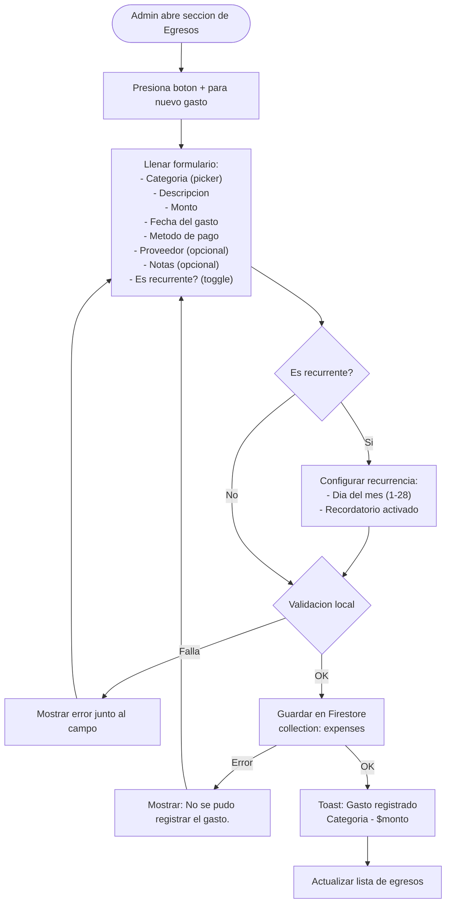
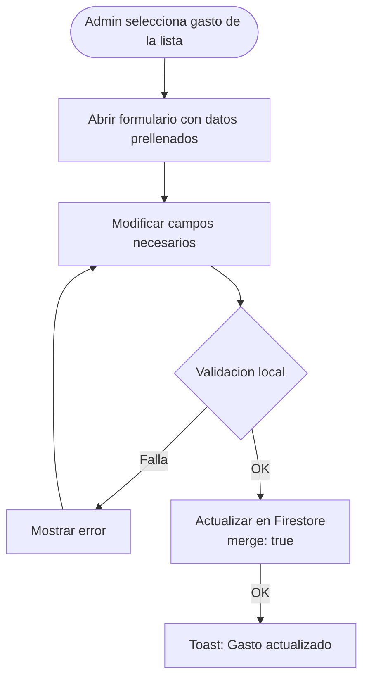
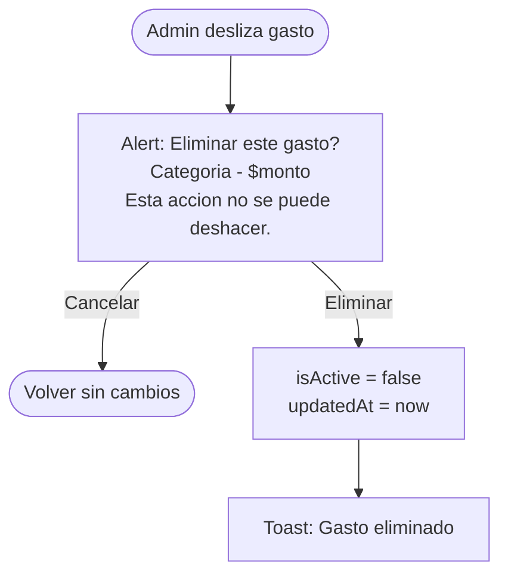

# Egresos y Gastos Operativos

> Todo gasto del gimnasio se registra como un `Expense`.
> El admin registra los egresos desde la app iOS para tener visibilidad financiera real.
> Los egresos son independientes de los pagos (ingresos) y se combinan en el dashboard de reportes.

---

## Categorias de gasto

| Categoria | Valor en Firestore | Descripcion | Ejemplo |
|-----------|-------------------|-------------|---------|
| Renta | `rent` | Alquiler del local | "Renta mensual $8,000" |
| Servicios | `utilities` | Luz, agua, gas, internet, telefono | "CFE febrero $2,500" |
| Nomina | `payroll` | Sueldos y salarios del staff | "Sueldo trainer febrero $6,000" |
| Equipo | `equipment` | Compra de equipo de gimnasio | "Costal de boxeo $1,200" |
| Insumos | `supplies` | Limpieza, consumibles, papeleria | "Productos de limpieza $350" |
| Mantenimiento | `maintenance` | Reparaciones y mantenimiento | "Reparacion de pera de boxeo $500" |
| Marketing | `marketing` | Publicidad y promocion | "Volantes y lonas $800" |
| Seguros | `insurance` | Polizas de seguro | "Seguro de responsabilidad civil $3,000" |
| Impuestos | `taxes` | Impuestos y contribuciones | "ISR trimestral $4,500" |
| Otro | `other` | Gastos que no encajan en las categorias anteriores | "Imprevistos $200" |

---

## Flujo: Registrar un gasto

### Diagrama

### Flujo principal

1. Admin abre la seccion de Egresos (tab en sidebar)
2. Presiona el boton "+" para registrar un nuevo gasto
3. Llena el formulario con la informacion del gasto
4. Si es recurrente, configura el dia del mes y activa recordatorio
5. Confirma y se guarda en Firestore
6. Se muestra confirmacion y se actualiza la lista

---

## Flujo: Editar un gasto

### Diagrama

### Reglas de edicion

1. Solo se pueden editar gastos del mes actual o futuro
2. Gastos de meses anteriores son de solo lectura (historico inmutable)
3. Para corregir un gasto historico, se crea uno nuevo con nota explicativa

---

## Flujo: Eliminar un gasto

Regla: Soft delete (nunca se eliminan documentos).

---

## Gastos recurrentes

Los gastos recurrentes son una ayuda al admin para recordarle registrar gastos mensuales fijos. **No se generan automaticamente.**

### Comportamiento

1. Al marcar un gasto como recurrente, se guarda `isRecurring = true` y `recurringDay = dia`
2. En el dashboard, se muestra un aviso: "Tienes N gastos recurrentes pendientes de registrar este mes"
3. El admin puede duplicar el gasto del mes anterior con un tap ("Registrar este mes")
4. Al duplicar, se crea un nuevo documento con la fecha del mes actual y el mismo monto (editable antes de confirmar)
5. Cada gasto recurrente registrado es un documento independiente (no se reutiliza)

### Deteccion de pendientes

Un gasto recurrente se considera "pendiente" si:
- `isRecurring = true` en el gasto original
- No existe un gasto con la misma `category` + `vendorName` en el mes actual

### Ejemplo

| Mes | Gasto | Monto | Estado |
|-----|-------|-------|--------|
| Enero 2026 | Renta - Inmobiliaria ABC | $8,000 | Registrado |
| Febrero 2026 | (no registrado aun) | — | Pendiente (aviso en dashboard) |
| Febrero 2026 | Admin toca "Registrar" | $8,000 (editable) | Se crea nuevo documento |

---

## Vista de egresos

### Lista principal

La vista muestra los gastos del mes actual por defecto, agrupados por categoria:

| Seccion | Contenido |
|---------|-----------|
| Resumen del mes | Total de egresos, desglose por categoria (grafico) |
| Gastos recurrentes pendientes | Lista de gastos recurrentes no registrados este mes |
| Lista de gastos | Todos los gastos del mes, ordenados por fecha descendente |

### Filtros

- **Periodo**: Mes actual (default), mes anterior, rango personalizado
- **Categoria**: Filtro por categoria de gasto
- **Busqueda**: Por descripcion o proveedor

### Detalle de gasto

Al tocar un gasto se muestra:
- Categoria (con icono y color)
- Descripcion
- Monto
- Fecha
- Metodo de pago
- Proveedor (si existe)
- Notas (si existen)
- Es recurrente (badge)
- Registrado por (nombre del admin)

---

## Validaciones

| Campo | Regla | Mensaje de error |
|-------|-------|------------------|
| Categoria | Obligatoria | "Selecciona una categoria." |
| Descripcion | No vacia, max 200 chars | "La descripcion es obligatoria." |
| Monto | Mayor a 0 | "El monto debe ser mayor a $0." |
| Fecha | No futura a mas de 7 dias | "La fecha no puede ser mayor a 7 dias en el futuro." |
| Metodo de pago | Obligatorio | "Selecciona un metodo de pago." |
| Dia recurrente | Entre 1 y 28 | "El dia debe estar entre 1 y 28." |

> El dia recurrente se limita a 28 para evitar problemas con meses cortos (febrero).

---

## Integracion con reportes

Los egresos alimentan directamente el dashboard de reportes:

| Metrica | Calculo anterior | Calculo nuevo |
|---------|-----------------|---------------|
| Egreso global | Solo COGS (costo de productos vendidos) | COGS + suma de todos los `expenses` |
| Egreso del periodo | Solo COGS del periodo | COGS del periodo + `expenses` del periodo |
| Utilidad | Ingresos - COGS | Ingresos - (COGS + expenses) |
| Margen | (Utilidad / Ingresos) * 100 | Igual pero con utilidad corregida |

### Desglose en dashboard

El dashboard muestra:
1. **Ingreso total** (all-time): Suma de payments completados
2. **Egreso total** (all-time): COGS + expenses
3. **Utilidad real**: Ingreso total - Egreso total
4. **Desglose de egresos del periodo**: Grafico por categoria

---

## Reglas de negocio

1. Todo egreso es registrado manualmente por el admin — no hay generacion automatica
2. Los egresos son independientes de los pagos (colecciones separadas)
3. Un egreso no esta vinculado a un miembro (a diferencia de un pago)
4. `registeredBy` identifica al admin que registro el gasto (auditoria)
5. Los gastos nunca se eliminan fisicamente — soft delete con `isActive = false`
6. Los gastos de meses anteriores son inmutables (solo lectura)
7. Los gastos recurrentes son recordatorios, no auto-generados
8. El dia recurrente se limita a 1-28 para evitar inconsistencias con meses cortos
9. Al duplicar un gasto recurrente, se crea un documento nuevo e independiente
10. Los montos siempre se muestran con `TextAmount` y `currencyCode: "MXN"`
11. Los egresos se combinan con el COGS en el dashboard para mostrar la utilidad real

---

## Permisos por rol

| Accion | admin | receptionist | trainer | member |
|--------|-------|-------------|---------|--------|
| Registrar gasto | Si | No | No | No |
| Ver lista de gastos | Si | No | No | No |
| Editar gasto (mes actual) | Si | No | No | No |
| Eliminar gasto | Si | No | No | No |

> Solo el admin puede gestionar egresos. Los egresos contienen informacion financiera sensible del negocio.
