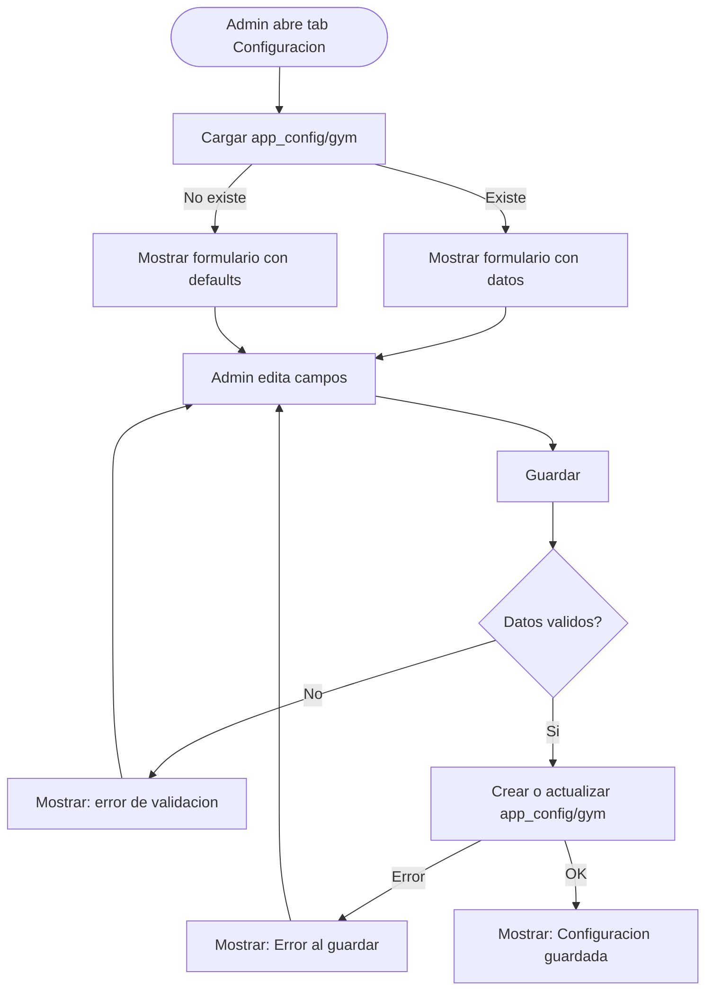

# Configuracion del Gimnasio

> Permite al admin configurar los datos generales del gimnasio: nombre, horarios, contacto, y preferencias operativas.
> Esta informacion se muestra en la app y se usa para validaciones (ej: horarios de check-in).

---

## Coleccion

Usa el documento existente `app_config/gym` (singleton). No se crea una coleccion nueva.

| Documento | Descripcion |
|-----------|-------------|
| `app_config/setup` | Existe: datos del primer admin |
| `app_config/gym` | **Nuevo**: datos del gimnasio |

---

## Esquema: `app_config/gym`

| Campo | Tipo | Requerido | Descripcion |
|-------|------|-----------|-------------|
| `gymName` | String | Si | Nombre del gimnasio (default: "SajaruBox") |
| `phone` | String | No | Telefono de contacto |
| `email` | String | No | Email de contacto |
| `address` | String | No | Direccion fisica |
| `logoURL` | String | No | URL del logotipo (futuro) |
| `dayPassPrice` | Double | Si | Precio del pase de dia (default: 30.0) |
| `currency` | String | Si | Moneda ISO 4217 (default: "MXN") |
| `openTime` | String | No | Hora de apertura (formato HH:mm, ej: "06:00") |
| `closeTime` | String | No | Hora de cierre (formato HH:mm, ej: "22:00") |
| `operatingDays` | Array\<Int\> | No | Dias de operacion (1=Lunes..7=Domingo). Default: [1,2,3,4,5,6] |
| `maxCapacity` | Int | No | Capacidad maxima del gym (personas simultaneas) |
| `welcomeMessage` | String | No | Mensaje de bienvenida para miembros |
| `socialMedia` | Map | No | Redes sociales (ver estructura abajo) |
| `updatedAt` | Timestamp | Si | Fecha de ultima actualizacion |
| `updatedBy` | String | Si | UID del admin que actualizo |

### Estructura de `socialMedia` (Map)

| Campo | Tipo | Descripcion |
|-------|------|-------------|
| `instagram` | String | Handle de Instagram (sin @) |
| `facebook` | String | URL o nombre de pagina |
| `whatsapp` | String | Numero de WhatsApp |

---

## Flujo: Editar configuracion

### Flujo principal

1. Admin abre la pantalla de Configuracion
2. Se carga el documento `app_config/gym` de Firestore
3. Si no existe, se muestran valores por defecto (gymName = "SajaruBox", dayPassPrice = 30, etc.)
4. Admin edita los campos que desee
5. Al guardar, se valida y se hace upsert (setData con merge)
6. Se muestra confirmacion

---

## Validaciones

| Campo | Regla | Mensaje de error |
|-------|-------|------------------|
| `gymName` | No vacio | "El nombre del gimnasio es obligatorio." |
| `dayPassPrice` | Mayor a 0 | "El precio del pase de dia debe ser mayor a $0." |
| `openTime` | Formato HH:mm valido | "Hora de apertura invalida." |
| `closeTime` | Formato HH:mm valido y despues de openTime | "Hora de cierre invalida." |
| `maxCapacity` | Mayor a 0 si se proporciona | "La capacidad debe ser mayor a 0." |
| `phone` | Solo digitos si se proporciona | "Telefono invalido." |

---

## Uso en la app

| Donde se usa | Campo | Para que |
|---|---|---|
| QuickActionSheet (cobro de visita) | `dayPassPrice` | Precio default del pase de dia |
| Reportes | `gymName` | Encabezado del dashboard |
| Perfil del miembro (futuro) | `welcomeMessage` | Mensaje en la app del miembro |
| Check-in (futuro) | `openTime`, `closeTime` | Validar que el check-in sea en horario |

---

## Permisos

| Operacion | admin | receptionist | trainer | member |
|-----------|-------|--------------|---------|--------|
| Ver configuracion | Si | No | No | No |
| Editar configuracion | Si | No | No | No |

Solo el admin puede ver y editar la configuracion del gimnasio.

---

## Reglas de negocio

1. Solo existe UN documento de configuracion (`app_config/gym`) — es un singleton
2. Si el documento no existe, la app usa valores por defecto
3. Solo el admin puede acceder a la pantalla de configuracion
4. `dayPassPrice` se usa como precio sugerido — el admin puede cambiarlo al cobrar
5. Los campos opcionales (phone, email, address, etc.) se guardan como `nil` si estan vacios
6. `operatingDays` usa ISO 8601 (1=Lunes, 7=Domingo)
7. La configuracion NO se cachea localmente — siempre se lee de Firestore
8. `updatedBy` identifica al admin que hizo el ultimo cambio (auditoria)
