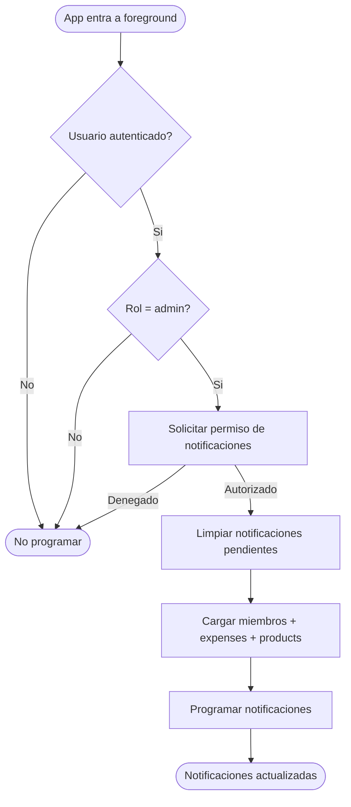

# Notificaciones Locales

> El sistema de notificaciones avisa al admin sobre eventos importantes del gimnasio.
> En esta fase, las notificaciones son **locales** (no push). Se programan desde la app iOS
> usando UserNotifications framework.

---

## Tipos de notificacion

| Tipo | Trigger | Mensaje | Prioridad |
|------|---------|---------|-----------|
| Membresia por vencer | 3 dias antes de `membershipEndDate` | "{nombre} - su membresia vence en 3 dias" | Alta |
| Membresia vencida | Dia de `membershipEndDate` | "{nombre} - su membresia vencio hoy" | Alta |
| Gasto recurrente pendiente | Dia `recurringDay` del mes | "Gasto recurrente pendiente: {descripcion}" | Media |
| Stock bajo | Al detectar stock <= 3 | "{producto} tiene solo {stock} unidades" | Media |

---

## Flujo: Programar notificaciones



### Flujo principal

1. La app detecta que entro a foreground (`scenePhase == .active`)
2. Verifica que el usuario esta autenticado y es admin
3. Solicita permiso de notificaciones (solo la primera vez)
4. Limpia TODAS las notificaciones pendientes anteriores
5. Carga datos frescos de Firestore (miembros activos, expenses recurrentes, productos)
6. Programa notificaciones nuevas basadas en los datos actuales
7. Maximo de 64 notificaciones locales (limite de iOS)

---

## Logica de programacion

### Membresias por vencer

```
Para cada miembro con membershipStatus == active:
  Si membershipEndDate != nil:
    Si membershipEndDate - 3 dias > hoy:
      Programar notificacion para (membershipEndDate - 3 dias) a las 09:00
    Si membershipEndDate > hoy:
      Programar notificacion para membershipEndDate a las 09:00
```

### Gastos recurrentes

```
Para cada expense con isRecurring == true:
  Si recurringDay > dia_actual_del_mes:
    Programar notificacion para dia recurringDay del mes actual a las 08:00
  Si no:
    Programar notificacion para dia recurringDay del proximo mes a las 08:00
```

### Stock bajo

```
Para cada producto con isActive == true y stock <= 3 y !isService:
  Programar notificacion inmediata (trigger en 1 segundo)
```

---

## Implementacion

### NotificationService

```
NotificationService:
  - requestPermission() -> Bool
  - scheduleAll(members, expenses, products)
  - clearAll()
  - scheduleMembershipExpiring(member, daysBeforeExpiry)
  - scheduleRecurringExpense(expense)
  - scheduleLowStock(product)
```

### Identificadores de notificacion

Formato: `{tipo}-{id}`

- `membership-expiring-{memberId}`
- `membership-expired-{memberId}`
- `expense-recurring-{expenseId}`
- `low-stock-{productId}`

Esto permite limpiar notificaciones especificas si se necesita.

---

## Integracion en la app

| Punto de integracion | Accion |
|---|---|
| `SajaruBoxApp.onChange(scenePhase)` | Cuando `scenePhase == .active`, ejecutar `NotificationService.scheduleAll()` |
| `AppDelegate` | Registrar `UNUserNotificationCenter.delegate` |
| `HomeView.onAppear` | Trigger alternativo para programar notificaciones |

---

## Permisos

| Accion | admin | receptionist | trainer | member |
|--------|-------|--------------|---------|--------|
| Recibir notificaciones | Si | No | No | No |

Solo el admin recibe notificaciones. Si en el futuro se quiere expandir a receptionist, se agrega el check de rol.

---

## Reglas de negocio

1. Las notificaciones son **locales** — no requieren servidor push ni Firebase Cloud Messaging
2. Se reprograman CADA VEZ que la app entra a foreground (datos frescos)
3. Se limpian TODAS las pendientes antes de reprogramar (evita duplicados)
4. Maximo 64 notificaciones (limite de iOS) — se priorizan membresias > gastos > stock
5. Las notificaciones de membresia se programan a las 09:00 del dia correspondiente
6. Las notificaciones de gastos recurrentes se programan a las 08:00
7. Si el usuario no autoriza notificaciones, el sistema no insiste (respeta la decision)
8. No se envian notificaciones de membresias ya vencidas (solo futuras)
9. El servicio es stateless — no persiste estado, siempre recalcula desde Firestore
