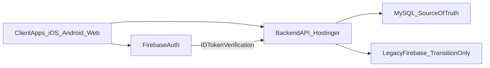

# Plataforma Backend Oficial

> Regla de arquitectura para todas las plataformas del ecosistema SajaruBox.
> El backend operativo oficial corre en Node.js + MySQL en Hostinger.

---

## Decision oficial

SajaruBox adopta backend centralizado:

- API REST en Node.js (`api.sajarubox.com`)
- Base de datos operativa en MySQL
- Firebase Authentication como proveedor de identidad
- Firestore/Storage en modo legado transitorio

---

## Objetivos de negocio

1. Controlar costos y topes de consumo mensual
2. Centralizar reglas operativas en servidor
3. Unificar comportamiento entre iOS, Android y Web
4. Reducir lock-in de proveedor de datos operativos

---

## Responsabilidades por capa

| Capa | Responsabilidad |
|------|-----------------|
| Cliente (iOS/Android/Web) | UI, captura de datos, envio de token |
| Firebase Auth | Registro/login y emision de ID token |
| Backend Node.js | Validaciones, reglas de negocio, autorizacion, auditoria |
| MySQL | Fuente de verdad de datos operativos |
| Firestore (transicion) | Compatibilidad temporal durante migracion |

---

## Flujo de alto nivel

---

## Precedencia de documentacion

Para evitar ambiguedad entre documentos legacy y nuevos:

1. `knowledge/business-rules/16-18` tienen precedencia sobre reglas legacy de persistencia.
2. `knowledge/backend-implementation/0X-*` define implementacion oficial backend.
3. Si un documento legacy contradice esta capa backend, se considera desactualizado para nuevas implementaciones.

---

## Reglas criticas

1. La fuente de verdad de escrituras operativas nuevas es MySQL.
2. Ningun cliente puede ejecutar reglas de negocio criticas sin pasar por API.
3. Seguridad real se valida en backend, no en UI.
4. Cambios sensibles (rol, cobro, asignacion, check-in, inventario) requieren autorizacion por rol en servidor.
5. Contratos API se versionan (`/api/v1`) y cambios incompatibles van a `v2`.

---

## Estado de transicion permitido

Durante migracion:

- Se permite lectura en Firestore solo para modulos aun no migrados.
- Se permite replica temporal backend -> Firestore para compatibilidad de apps legacy.
- No se permite nueva logica de negocio exclusiva en Firestore.

---

## Criterios de cumplimiento

Se considera cumplida la regla cuando:

1. Existe API backend operativa para auth bridge y dominios core.
2. MySQL almacena todas las escrituras operativas activas.
3. Clientes consumen API para operaciones de negocio.
4. Firestore queda como legado o read-model temporal documentado.
