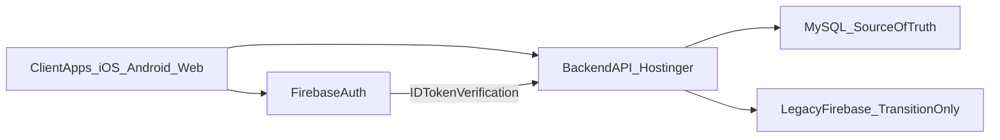

# Plataforma Backend Oficial

> Regla de arquitectura para todas las plataformas del ecosistema SajaruBox.
> El backend operativo se mueve a Node.js + MySQL en Hostinger.

---

## Decision oficial

SajaruBox adopta una arquitectura de backend centralizado:

- API REST en Node.js (Hostinger)
- Base de datos operativa en MySQL
- Firebase Authentication se mantiene como proveedor de identidad
- Firestore/Storage quedan en modo legado o transicion

---

## Objetivos de negocio

1. Controlar topes de consumo y costo mensual
2. Centralizar reglas operativas en un backend propio
3. Unificar comportamiento entre iOS, Android y Web
4. Reducir dependencia del vendor para datos de negocio

---

## Responsabilidades por capa

| Capa | Responsabilidad |
|------|-----------------|
| Cliente (iOS/Android/Web) | UI, captura de datos, envio de token de auth |
| Firebase Auth | Registro/login y emision de ID token |
| Backend Node.js | Reglas de negocio, validaciones, autorizacion por rol, auditoria |
| MySQL | Fuente de verdad de datos operativos |

---

## Flujo de alto nivel

---

## Regla critica de fuente de verdad

- Para nuevos modulos y nuevas escrituras operativas, la fuente de verdad es MySQL.
- Firestore no debe recibir nuevas dependencias funcionales salvo compatibilidad temporal.
- La app cliente no debe contener reglas de negocio que dependan exclusivamente de Firestore.

---

## Regla de API

- Todas las capacidades operativas se exponen via API versionada: `/api/v1/...`
- Los clientes no consumen tablas ni proveedores directamente.
- Los contratos API deben ser estables y retrocompatibles por version.

---

## Regla de permisos

- La autorizacion por rol se decide en backend.
- El cliente puede ocultar opciones por UX, pero la seguridad real vive en API.
- Cualquier accion sensible (cambio de rol, cobro, edicion de inventario, check-in) valida rol en servidor.

---

## Criterios de cumplimiento

Se considera cumplida la regla cuando:

1. Existe API backend operativa para auth bridge + dominio principal.
2. MySQL almacena los datos de negocio activos.
3. La documentacion MCP refleja la nueva arquitectura como oficial.
