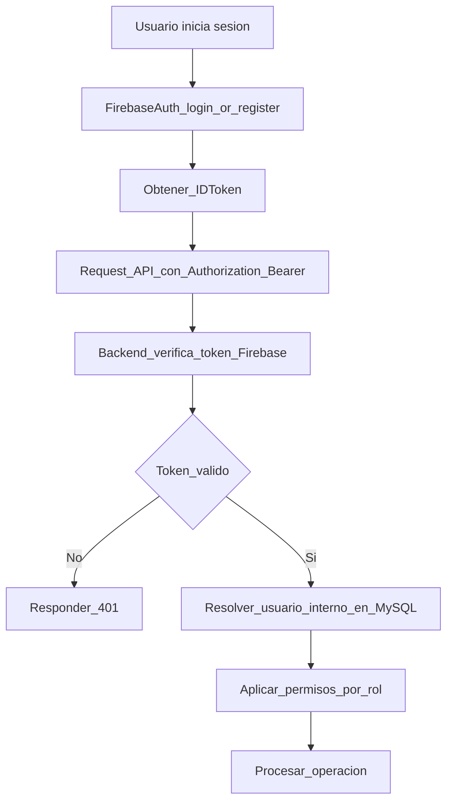

# Bridge de Autenticacion (Firebase Auth + Backend)

> Regla oficial de autenticacion para arquitectura hibrida.
> Firebase Auth identifica al usuario; el backend autoriza operaciones.

---

## Decision

- Se mantiene Firebase Authentication para login/registro.
- El backend valida el ID token de Firebase en cada request protegida.
- El backend resuelve el usuario interno, rol y permisos desde MySQL.

---

## Flujo canonico

---

## Contrato de seguridad

1. El cliente envia `Authorization: Bearer <firebase_id_token>`.
2. El backend valida firma, expiracion, issuer y audience del token.
3. El backend mapea `firebaseUid` a usuario interno.
4. Si no existe usuario interno, ejecuta politica de aprovisionamiento (crear o rechazar segun modulo).
5. El backend decide autorizacion final por rol.

---

## Mapeo de identidad

| Campo | Origen | Uso |
|------|--------|-----|
| firebaseUid | Firebase token (`sub`) | Vinculo primario de identidad |
| email | Firebase token | Correlacion y contacto |
| role | MySQL users.role | Autorizacion de negocio |
| linkedMemberId | MySQL | Vinculacion user-member |

---

## Reglas de error

- `401 Unauthorized`: token invalido, expirado o ausente.
- `403 Forbidden`: token valido pero sin permisos de rol.
- `409 Conflict`: conflicto de identidad/vinculacion.

Mensajes al cliente deben ser seguros y no revelar informacion sensible.

---

## Regla de sesiones

- El backend puede operar en modo stateless validando token por request.
- Si se agrega refresh token propio, debe documentarse como capa adicional, sin reemplazar validacion Firebase.

---

## Reglas de migracion

1. Durante migracion, Firebase Auth sigue siendo unica fuente de credenciales.
2. No se migran passwords a MySQL.
3. El cutover de datos no debe romper login existente.
4. Cualquier cambio en claims/roles debe mantener compatibilidad con apps activas.
