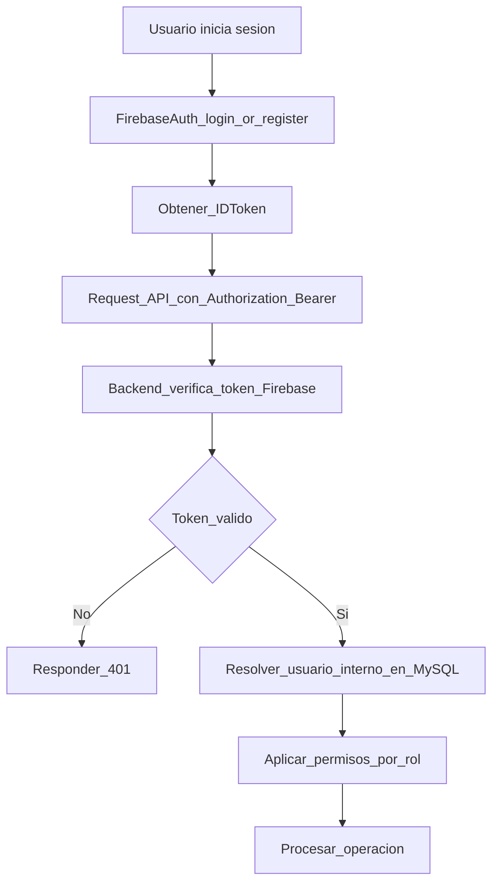

# Bridge de Autenticacion (Firebase Auth + Backend)

> Regla oficial de autenticacion para arquitectura hibrida.
> Firebase Auth identifica al usuario; backend autoriza operaciones.

---

## Decision

- Firebase Authentication permanece para login/registro.
- Backend valida ID token Firebase en cada request protegida.
- Backend resuelve usuario interno, rol y permisos desde MySQL.

---

## Flujo canonico

---

## Contrato de seguridad

1. Cliente envia `Authorization: Bearer <firebase_id_token>`.
2. Backend valida firma, expiracion, `issuer`, `audience`, `sub`.
3. Backend mapea `firebaseUid` a usuario interno.
4. Si no existe usuario interno, aplica politica de aprovisionamiento.
5. Backend decide autorizacion final por rol.

---

## Politica de aprovisionamiento (obligatoria)

| Endpoint/Modulo | Si usuario interno no existe | Resultado |
|-----------------|------------------------------|-----------|
| `POST /api/v1/auth/verify-token` | Crear usuario con rol default `member` | `200` |
| `GET /api/v1/auth/me` | Crear usuario con rol default `member` | `200` |
| Endpoints administrativos (`members`, `payments`, `membership-*`, `inventory`, `reports`) | No crear automaticamente | `403` o `409` segun conflicto |
| Endpoints de autoservicio member | Crear solo si politica de onboarding lo permite | `200`/`409` |

Regla: el aprovisionamiento automatico solo aplica en endpoints de identidad/autoservicio controlado.

---

## Mapeo de identidad

| Campo | Origen | Uso |
|------|--------|-----|
| firebaseUid | Token Firebase (`sub`) | Vinculo primario |
| email | Token Firebase | Correlacion y contacto |
| role | MySQL `users.role` | Autorizacion de negocio |
| linkedMemberId | MySQL | Vinculacion user-member |

---

## Orden de middlewares

1. `requestId`
2. parse y saneo de headers
3. `authGuard` (verificacion token Firebase)
4. `userResolver` (mapea `firebaseUid` -> usuario interno)
5. `rbacGuard`
6. handler de negocio

---

## Reglas de error

- `401 UNAUTHORIZED`: token invalido, expirado o ausente.
- `403 FORBIDDEN`: token valido sin permisos de rol.
- `409 CONFLICT`: conflicto de identidad/vinculacion.

Mensajes al cliente deben ser seguros y sin fuga de informacion sensible.

---

## Regla de sesiones

- Backend opera stateless validando token por request.
- Cache de verificacion de llave publica solo en servidor.
- Si se agrega refresh token propio, no reemplaza validacion Firebase.

---

## Reglas de migracion

1. Firebase Auth sigue como unica fuente de credenciales.
2. No migrar ni replicar passwords en MySQL.
3. Cutover de datos no debe romper login existente.
4. Cambios en claims/roles deben mantener compatibilidad con apps activas.
