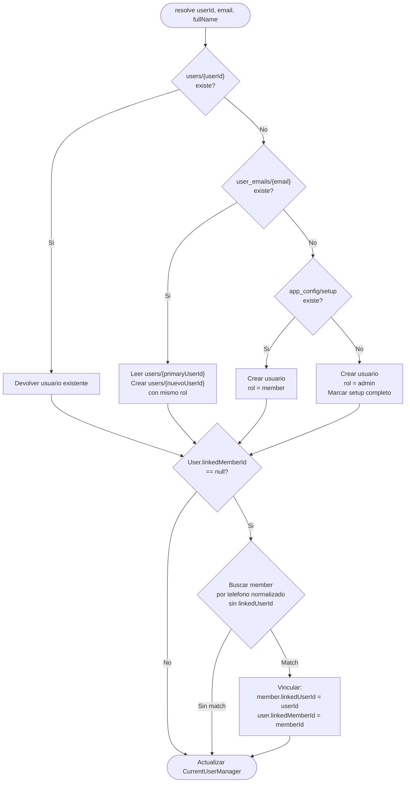

# Session Resolver

> Algoritmo que resuelve la sesion del usuario despues de autenticarse con Firebase Auth.

---

## Proposito

Despues de que Firebase Auth devuelve un `UserID`, necesitamos:
1. Encontrar o crear el documento del usuario en Firestore
2. Determinar su rol
3. Manejar sincronizacion multi-proveedor (mismo email, diferente UID)
4. Vincular automaticamente con un Member existente (si aplica)
5. Actualizar `CurrentUserManager`

---

## Ubicacion

```
SajaruBox/App/Presentation/AuthModule/SessionResolver.swift
```

---

## Dependencias

```swift
@MainActor
final class SessionResolver {
    @Dependency(\.userRepository) private var userRepository
    @Dependency(\.memberRepository) private var memberRepository
    @Dependency(\.currentUser) private var currentUserManager
}
```

> `memberRepository` se necesita para la vinculacion automatica User-Member.

---

## Algoritmo completo

### Paso 1: Buscar por userId directo

```swift
func resolve(userId: String, email: String, fullName: String) async throws -> User {
    // El userId viene de Firebase Auth (varia segun proveedor)
    if let existingUser = try await userRepository.getUser(byUserId: userId) {
        currentUserManager.user = existingUser
        return existingUser
    }
    // Si no existe, ir a paso 2
}
```

### Paso 2: Sync multi-proveedor via indice de email

Si el usuario no existe por userId, puede existir con otro UID (otro proveedor de auth):

```swift
private func resolveByEmailIndex(newUserId: String, email: String, fullName: String) async -> User? {
    // 1. Buscar en user_emails/{email}
    guard let primaryUserId = try await userRepository.resolveUserIdByEmail(email) else {
        return nil  // Email no registrado, ir a paso 3
    }
    
    // 2. Leer usuario original
    guard let originalUser = try await userRepository.getUser(byUserId: primaryUserId) else {
        return nil  // Inconsistencia, ir a paso 3
    }
    
    // 3. Crear nuevo documento con el nuevo UID, heredando datos y rol
    let syncedUser = User(
        id: newUserId,
        email: originalUser.email,
        fullName: originalUser.fullName.isEmpty ? fullName : originalUser.fullName,
        phone: originalUser.phone,
        role: originalUser.role,        // Hereda el rol
        createdAt: originalUser.createdAt,
        updatedAt: Date(),
        isActive: originalUser.isActive,
        photoURL: originalUser.photoURL
    )
    
    let createdUser = try await userRepository.createUser(syncedUser)
    return createdUser
}
```

**Ejemplo:** Admin se registro con email (UID-A). Ahora inicia sesion con Google (UID-B).
- `users/UID-A` existe con rol `admin`
- `user_emails/admin@gym.com` apunta a UID-A
- Se crea `users/UID-B` con rol `admin` (heredado)

### Paso 3: Crear usuario nuevo

Si no se encontro ni por userId ni por email, es un usuario completamente nuevo:

```swift
private func createNewUser(userId: String, email: String, fullName: String) async -> User {
    // 1. Determinar rol
    let role = await determineRoleForNewUser()
    
    // 2. Crear User
    let newUser = User(
        id: userId,
        email: email,
        fullName: fullName,
        role: role,
        createdAt: Date(),
        updatedAt: Date(),
        isActive: true,
        photoURL: nil
    )
    
    // 3. Guardar en Firestore
    let createdUser = try await userRepository.createUser(newUser)
    
    // 4. Registrar indice de email
    try await userRepository.registerEmailIndex(email: email, userId: userId)
    
    // 5. Si es admin, marcar setup
    if role == .admin {
        try await userRepository.markAdminSetupComplete(adminUserId: userId)
    }
    
    // 6. Actualizar CurrentUserManager
    currentUserManager.user = createdUser
    return createdUser
}
```

### Determinacion de rol

```swift
private func determineRoleForNewUser() async -> Role {
    do {
        let setupComplete = try await userRepository.isAdminSetupComplete()
        return setupComplete ? .member : .admin
    } catch {
        // Si hay error, asignar member (seguro por defecto)
        return .member
    }
}
```

Lee `app_config/setup`. Si el documento **no existe**, este es el primer usuario y sera admin.

### Paso 4: Vinculacion automatica con Member

Despues de crear o resolver el User (pasos 1-3), se intenta vincular con un Member existente.
Esto permite que miembros registrados por el admin puedan ver sus datos al crear cuenta en la app.

```swift
private func attemptMemberLinking(user: User) async {
    // Solo intentar si el User no tiene linkedMemberId
    guard user.linkedMemberId == nil else { return }

    // 1. Buscar por telefono normalizado
    if let phone = user.phone, !phone.isEmpty {
        let normalizedPhone = phone.filter { $0.isNumber }
        if let member = try? await memberRepository.searchMembers(query: normalizedPhone)
            .first(where: { $0.linkedUserId == nil && $0.phone == normalizedPhone }) {
            await linkUserAndMember(userId: user.id, memberId: member.id)
            return
        }
    }

    // 2. Buscar por email (como fallback)
    // Nota: members no tiene campo email, pero se puede buscar
    // si en el futuro se agrega. Por ahora, solo telefono.
}

private func linkUserAndMember(userId: String, memberId: String) async {
    do {
        // Actualizar Member.linkedUserId
        try await memberRepository.updateLinkedUserId(memberId: memberId, userId: userId)
        // Actualizar User.linkedMemberId
        try await userRepository.updateLinkedMemberId(userId: userId, memberId: memberId)
        // Refrescar CurrentUserManager
        if let updatedUser = try await userRepository.getUser(byUserId: userId) {
            currentUserManager.user = updatedUser
        }
    } catch {
        // Si falla la vinculacion, continuar sin vincular
        // El admin puede vincular manualmente despues
    }
}
```

**Cuando se ejecuta:**
- Despues de resolver el User en CADA login/registro
- No se ejecuta si el User ya tiene `linkedMemberId`
- No modifica Members que ya tienen `linkedUserId` (evita conflictos)

**Criterios de match (en orden de prioridad):**
1. Telefono normalizado (solo digitos) — match exacto
2. Email (futuro, cuando members tenga campo email)

---

## Diagrama de flujo completo



### Flujo resumido en texto

```
resolve(userId, email, fullName)
    |
    v
users/{userId} existe?
    |
   SI → obtener usuario existente
    |
   NO
    |
    v
user_emails/{email} existe?
    |
   SI → leer users/{primaryUserId}
    |     crear users/{nuevoUserId} con mismo rol
    |
   NO
    |
    v
app_config/setup existe?
    |
   SI → crear usuario con rol = member
    |
   NO → crear usuario con rol = admin
         marcar app_config/setup como completado
    |
    v
User.linkedMemberId == null?
    |
   NO → actualizar CurrentUserManager
    |
   SI → buscar member por telefono
    |
   MATCH → vincular ambos (member.linkedUserId, user.linkedMemberId)
    |
   SIN MATCH → continuar sin vincular
```

---

## Manejo de errores

El SessionResolver tiene un fallback: si Firestore falla al crear el usuario, usa datos locales temporales:

```swift
} catch {
    // Fallback: usar datos locales si Firestore falla
    currentUserManager.user = newUser
    return newUser
}
```

Esto permite que la app funcione parcialmente offline.

---

## Reglas

1. `SessionResolver` es `@MainActor` porque modifica `CurrentUserManager`
2. Se instancia directamente en el ViewModel (no es una dependencia)
3. El email se normaliza a minusculas antes de buscar en el indice
4. El indice de email se crea con `FieldValue.serverTimestamp()`
5. Si hay error al determinar rol, se asume `member` (seguro por defecto)
6. La vinculacion automatica (paso 4) se ejecuta en cada login, no solo al registrarse
7. Si la vinculacion falla por red, se continua sin vincular — no bloquea el login
8. Solo se vincula con Members que no tengan `linkedUserId` (evitar conflictos 1:1)
9. La vinculacion preserva todo el historial del Member (membresia, check-ins, pagos)
10. Si un User no logra vincularse, ve "Acude a recepcion" — el admin puede vincular manualmente