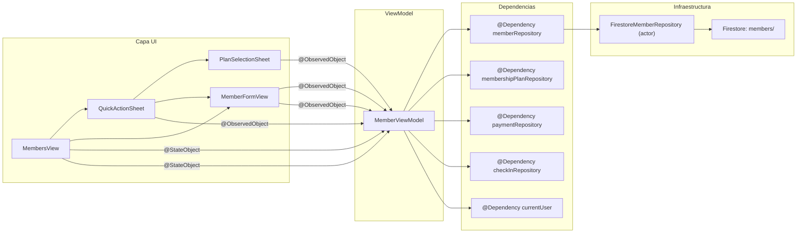
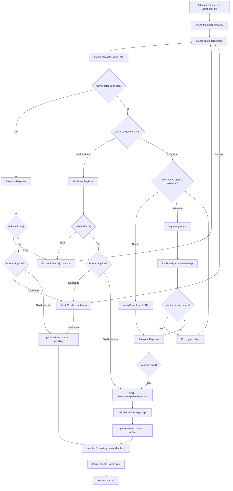
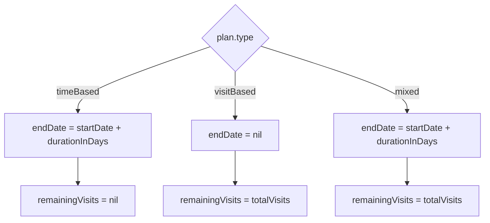
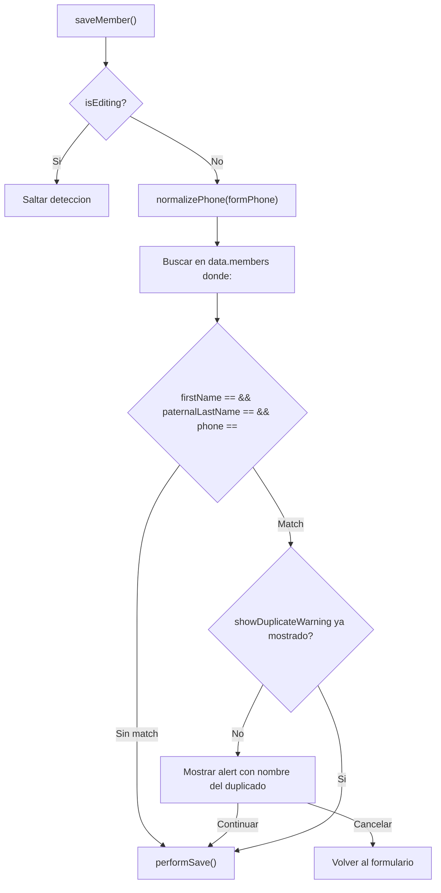
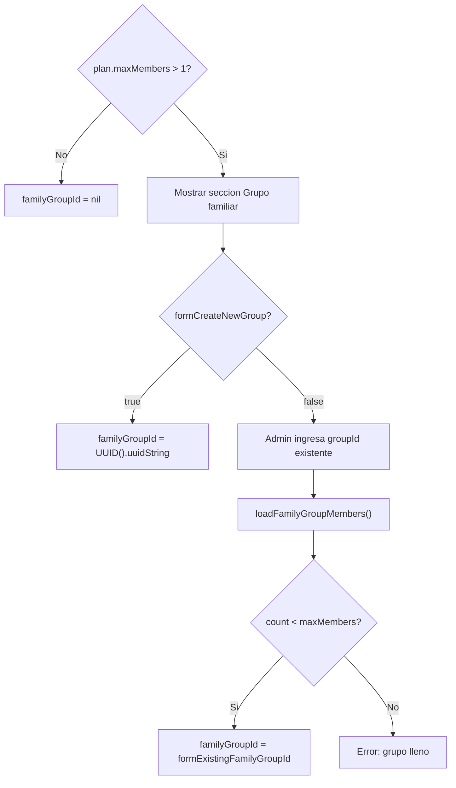
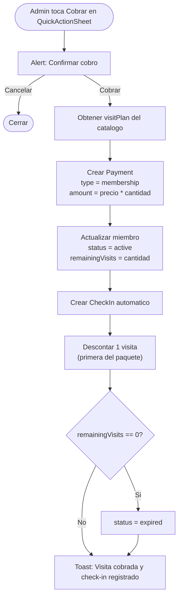

# Modulo de Miembros (iOS)

> Implementacion iOS del registro, edicion y gestion de miembros del gimnasio.
> Solo cubre **Camino 2: registro manual por admin**. El auto-registro (onboarding) es un modulo pendiente.
> Para reglas de negocio, ver `knowledge/business-rules/04-member-registration.md`.
> Para esquema Firestore, ver `knowledge/schema.md`.

---

## Estructura de archivos

```
sajaru-box-ios/
└── SajaruBox/App/Presentation/
    ├── MembersModule/
    │   ├── MemberViewData.swift      # Estado de la vista + MemberFormMode
    │   ├── MemberViewModel.swift     # CRUD, validacion, snapshot, familia, cobro rapido
    │   ├── MemberFormView.swift      # Formulario de registro/edicion completo
    │   ├── QuickActionSheet.swift    # Sheet de acciones rapidas (tap en miembro)
    │   └── PlanSelectionSheet.swift  # Sheet simplificado de seleccion de plan
    └── HomeModule/Pages/
        └── MembersView.swift         # Lista principal (tab Miembros)

sajarubox-mobile-ios-packages/
├── Packages/PlatformCore/Sources/MembersCore/
│   └── Member.swift                  # Modelo, protocolo, enums, errores
├── Packages/Vendors/Sources/FirebaseVendor/Services/Members/
│   └── FirestoreMemberRepository.swift  # Implementacion Firestore (actor)
└── Packages/PlatformAppiOS/Sources/PlatformAppiOS/Dependencies/
    └── MemberDependencies/
        └── MemberDependencies.swift  # DependencyKey registration
```

---

## Diagrama de arquitectura



---

## Flujo completo de registro (admin)



---

## Calculo de fechas por tipo de plan



| Tipo | `membershipEndDate` | `remainingVisits` |
|------|--------------------:|------------------:|
| `time_based` | `startDate + durationInDays` | `nil` |
| `visit_based` | `nil` | `plan.totalVisits` |
| `mixed` | `startDate + durationInDays` | `plan.totalVisits` |

---

## Creacion de snapshot

Al asignar un plan se crea un `MembershipPlanSnapshot` inmutable:

```swift
MembershipPlanSnapshot(
    planName: plan.name,
    planType: plan.type.rawValue,  // "time_based", "visit_based", "mixed"
    planPrice: plan.price,
    planCurrency: plan.currency,   // "MXN"
    durationInDays: plan.durationInDays,
    totalVisits: plan.totalVisits,
    maxMembers: plan.maxMembers,
    assignedAt: Date(),
    assignedBy: currentUser.user?.id ?? "unknown"
)
```

El snapshot se almacena como sub-mapa en Firestore (NO como JSON string). Se codifica/decodifica manualmente en `FirestoreMemberRepository`.

---

## Validaciones del formulario

Implementadas en `MemberViewModel.validateForm()`:

| Campo | Regla | Mensaje de error |
|-------|-------|------------------|
| Nombre | Requerido, min 2 caracteres | "El nombre es requerido." |
| Primer apellido | Requerido, min 2 caracteres | "El primer apellido es requerido." |
| Telefono | Opcional, si se llena: min 10 digitos | "El telefono debe tener al menos 10 digitos." |
| Tel. emergencia | Opcional, si se llena: min 10 digitos | "El telefono de emergencia debe tener al menos 10 digitos." |
| Fecha nacimiento | Opcional, no en el futuro | "La fecha de nacimiento no puede ser en el futuro." |
| Datos del tutor | Requerido si `isFormMinor == true` | "Los datos del tutor son requeridos para menores de edad." |
| Grupo familiar | Si plan familiar y grupo existente: no exceder `maxMembers` | "El grupo familiar ya alcanzo el limite de N miembros." |
| Fecha inicio | No anterior a hoy | "La fecha de inicio no puede ser anterior a hoy." |

---

## Deteccion de duplicados

Se ejecuta **solo en modo creacion** (no en edicion).



Criterios de match:
- `firstName` (case-insensitive, trimmed)
- `paternalLastName` (case-insensitive, trimmed)
- `phone` (normalizado a digitos, solo si no vacio)

---

## Normalizacion de telefono

```swift
private func normalizePhone(_ phone: String) -> String {
    phone.filter { $0.isNumber }
}
```

| Entrada | Normalizado |
|---------|-------------|
| `55 1234 5678` | `5512345678` |
| `+52 55 1234 5678` | `525512345678` |
| `(55) 1234-5678` | `5512345678` |
| Vacio | Vacio (se trata como "sin telefono") |

Se aplica antes de guardar y antes de buscar duplicados.

---

## Grupos familiares

### Decision de grupo en el formulario



### Datos mostrados al seleccionar grupo existente

- Lista de miembros actuales del grupo (nombre completo)
- Cupo disponible: `maxMembers - count`
- Color del cupo: verde si hay espacio, rojo si lleno

---

## Permisos por rol

| Accion | admin | receptionist | trainer | member |
|--------|:-----:|:------------:|:-------:|:------:|
| Ver lista de miembros | Todos | Solo activos | No | No |
| Crear miembro | Si | Si | No | No |
| Editar miembro | Si | Si | No | No |
| Desactivar miembro | Si | Si | No | No |
| Reactivar miembro | Si | No | No | No |
| Ver miembros inactivos | Si | No | No | No |

Implementacion:

```swift
var isAdmin: Bool { currentUser.isAdmin }
var isAdminOrReceptionist: Bool { currentUser.isAdmin || currentUser.role == .receptionist }
```

- `loadMembers()`: admin usa `getAllMembers()`, otros usan `getActiveMembers()`
- Toolbar "+" visible solo si `isAdminOrReceptionist`
- Seccion "Inactivos" visible solo si `isAdmin`

---

## Estructura de MemberViewData

```swift
struct MemberViewData {
    var members: [Member] = []
    var isLoading: Bool = false
    var errorMessage: String?
    var successMessage: String?
    var formMode: MemberFormMode?          // nil = sheet cerrada
    var showDeleteConfirmation: Bool = false
    var memberToDelete: Member?
    var showDuplicateWarning: Bool = false
    var duplicateName: String?
    var quickActionMember: Member?         // Miembro para QuickActionSheet
}
```

### MemberFormMode

```swift
enum MemberFormMode: Identifiable {
    case create(id: String = UUID().uuidString)
    case edit(Member)
    
    var id: String { ... }      // Unico por instancia
    var member: Member? { ... } // nil si .create
}
```

Se usa `Identifiable` para `.sheet(item:)` y evitar bugs de re-presentacion.

---

## Secciones del formulario (MemberFormView)

| # | Seccion | Visibilidad | Campos |
|---|---------|-------------|--------|
| 1 | Datos personales | Siempre | `firstName*`, `paternalLastName*`, `maternalLastName` |
| 2 | Contacto | Siempre | `phone`, `emergencyPhone` |
| 3 | Nacimiento | Siempre | Toggle + `DatePicker`, indicador menor |
| 4 | Datos del tutor | Si `isFormMinor` | `guardianInfo` (texto libre) |
| 5 | Salud | Siempre | `diseases`, `injuries`, `otherNotes` |
| 6a | Membresia actual | Solo edicion (si tiene plan) | Status, plan, vencimiento, visitas restantes |
| 6b | Asignar plan | Siempre | Picker de plan, detalles, fecha inicio |
| 7 | Grupo familiar | Solo si plan familiar | Segmented (nuevo/existente), lista grupo |
| 8 | Cobro | Si se selecciono plan | Metodo de pago (segmented), monto auto-calculado |
| 9 | Resumen | Si nombre completo | Nombre, plan, fecha, grupo, metodo de pago |

---

## Busqueda local

```swift
var filteredMembers: [Member] {
    guard !searchText.isEmpty else { return data.members }
    let query = searchText.lowercased()
    return data.members.filter { member in
        member.firstName.lowercased().contains(query) ||
        member.paternalLastName.lowercased().contains(query) ||
        (member.maternalLastName?.lowercased().contains(query) ?? false) ||
        (member.phone?.contains(searchText) ?? false)
    }
}
```

- Usa `.searchable()` de SwiftUI
- Case-insensitive para nombres
- Exact match para telefono (digitos)
- Se ejecuta sobre miembros ya cargados en memoria

---

## Encoding/Decoding Firestore (decisiones tecnicas)

### Por que encode/decode manual

`FirestoreMemberRepository` **no** usa `document.data(as: Member.self)` ni `Firestore.Encoder().encode()`. Usa funciones manuales `encode(_:)` y `decode(document:)` por tres razones:

1. **Excluir `id` del payload**: el `id` es el `documentID` de Firestore, no debe duplicarse dentro del documento
2. **Resiliencia**: si un campo no-optional falta en Firestore, `data(as:)` falla silenciosamente. El decode manual pone defaults seguros
3. **Composite index**: queries con `whereField` + `order(by:)` requieren indices compuestos. Se ordena en memoria en su lugar

### Snapshot como sub-mapa

`MembershipPlanSnapshot` se almacena como mapa anidado en Firestore (no como JSON string):

```swift
// Encode
data["membershipPlanSnapshot"] = encodeSnapshot(snapshot)

// Decode
let snapshot = decodeSnapshot(data["membershipPlanSnapshot"])
```

Esto permite queries futuras sobre campos del snapshot si se necesitan.

### Campos opcionales

Los campos opcionales (`phone`, `diseases`, `familyGroupId`, etc.) solo se incluyen en el payload si tienen valor:

```swift
if let v = member.phone { data["phone"] = v }
```

---

## Modo edicion vs creacion

| Aspecto | Creacion | Edicion |
|---------|----------|---------|
| Seccion membresia actual | Oculta | Visible (muestra plan vigente) |
| Seccion asignar plan | Visible | Visible (para renovar/cambiar plan) |
| Seccion cobro | Si plan seleccionado | Si plan seleccionado |
| Seccion grupo familiar | Visible si plan familiar | Visible si plan familiar |
| Deteccion duplicados | Activa | Desactivada |
| `registeredBy` | `"admin:{uid}"` | Se conserva el original |
| `membershipStatus` | Segun plan seleccionado | Se actualiza si nuevo plan seleccionado |
| `registrationDate` | `Date()` (hoy) | Se conserva el original |
| Boton | "Registrar" | "Guardar" |

En edicion, se pueden actualizar datos personales/contacto/salud Y asignar/renovar un plan con cobro.

---

## Lista de miembros (MembersView)

### Componentes de cada fila

```
┌──────────────────────────────────────────────────┐
│ Juan García López          🔗        [Activa]    │
│ [Mensual]              📞 5512345678             │
│ Vence: 15 Mar 2026 · 3 visitas restantes         │
└──────────────────────────────────────────────────┘
```

- Linea 1: nombre completo + icono link (si `linkedUserId != nil`) + chip de status
- Linea 2: nombre del plan (del snapshot) + telefono
- Linea 3: fecha vencimiento (rojo si <= 3 dias) + visitas restantes (rojo si <= 1)

### Acciones

| Gesto | Accion |
|-------|--------|
| **Tap en fila** | Abrir QuickActionSheet (acciones rapidas) |
| Swipe izquierda (trailing) | Desactivar/Activar |
| Swipe derecha (leading) | Check-in / Editar |
| Boton lapiz (azul) | Abrir MemberFormView (edicion completa) |
| Boton check-in (verde) | Check-in directo (solo miembros activos) |
| Context menu | Check-in / Editar / Historial pagos / Desactivar |
| Pull to refresh | Recargar lista |
| Toolbar "+" | Abrir formulario creacion |

### Status chip colores

| Status | Color |
|--------|-------|
| `active` | Verde |
| `expired` | Rojo |
| `suspended` | Naranja |
| `cancelled` | Gris |
| `pending` | Azul |

---

## QuickActionSheet (acciones rapidas)

Al tocar un miembro en la lista se abre un sheet con dos botones principales y acciones secundarias.

### Estructura

```
┌──────────────────────────────────────────────────┐
│ Header: Nombre + Plan actual + Status badge      │
│ (si activo: visitas restantes / dias restantes)   │
├──────────────────────────────────────────────────┤
│ [ Registrar visita ]  [ Registrar plan ]         │
├──────────────────────────────────────────────────┤
│ Seccion de cobro (solo si no activo):            │
│ Visitas: [-] 1 [+]   Total: $50 MXN             │
│ Metodo: [Efectivo] [Tarjeta] [Transferencia]     │
│ [ Cobrar $50 y registrar visita ]                │
├──────────────────────────────────────────────────┤
│ > Editar datos personales                        │
│ > Historial de pagos                             │
└──────────────────────────────────────────────────┘
```

### Comportamiento de "Registrar visita"

| Estado del miembro | Comportamiento |
|---|---|
| **Activo** (plan vigente) | Confirmacion directa → check-in normal, sin pago |
| **Pendiente** (primera visita, sin snapshot) | Confirmacion directa → visita gratis + check-in |
| **Expirado / cancelado / suspendido** | Seccion de pago visible: stepper 1-3 visitas, precio, metodo, confirmar |

### Comportamiento de "Registrar plan"

Siempre abre `PlanSelectionSheet` (ver abajo).

### Primera visita gratis

Un miembro se considera "primera visita" cuando:
- `membershipPlanSnapshot == nil` (nunca tuvo plan)
- `membershipStatus == .pending`

En este caso, "Registrar visita" va directo a confirmacion sin pedir pago. Se asigna un snapshot "Visita de cortesia" con monto $0.

### Flujo de cobro rapido (quickVisitPurchase)



### Metodos del ViewModel involucrados

- `visitPlan: MembershipPlan?` — computed que busca plan `visit_based` con `totalVisits == 1`
- `weeklyPlan: MembershipPlan?` — computed que busca plan con `durationInDays` entre 5-7
- `quickVisitPurchase(member:quantity:method:isFreeVisit:)` — crea pago (si no es gratis), asigna plan, hace check-in automatico

### Carga de planes

El sheet llama `viewModel.loadAvailablePlans()` en `.onAppear` para asegurar que `visitPlan` y `weeklyPlan` esten disponibles. Sin esto, la seccion de pago muestra "Cargando planes...".

### "Editar datos personales"

Cierra el QuickActionSheet y despues de 0.3s llama `viewModel.prepareEdit(member)`, que abre `MemberFormView` desde el `.sheet(item: $viewModel.data.formMode)` de `MembersView`.

---

## PlanSelectionSheet (seleccion de plan)

Sheet simplificado que solo muestra la seleccion de plan y pago, sin datos personales.

### Estructura

```
┌──────────────────────────────────────────────────┐
│ [Cancelar]    Seleccionar plan        [Asignar]  │
├──────────────────────────────────────────────────┤
│ SELECCIONA UN PLAN                               │
│ Visita           visit_based      $50   ○        │
│ Semanal          time_based      $120   ●        │
│ Mensualidad      time_based      $350   ○        │
├──────────────────────────────────────────────────┤
│ DETALLES DEL PLAN                                │
│ Tipo: Basado en tiempo                           │
│ Precio: $120 MXN                                 │
│ Duracion: 7 dias                                 │
│ Fecha de inicio: [DatePicker]                    │
├──────────────────────────────────────────────────┤
│ COBRO                                            │
│ [Efectivo] [Tarjeta] [Transferencia]             │
│ Total a cobrar:                     $120         │
└──────────────────────────────────────────────────┘
```

### Diferencias con MemberFormView

| Aspecto | PlanSelectionSheet | MemberFormView |
|---|---|---|
| Datos personales | No muestra | Muestra todos |
| Planes | Lista directa con seleccion | Picker con navigationLink |
| Pago | Incluido | Incluido |
| Uso | Desde QuickActionSheet | Desde toolbar "+" o editar |

### Metodos del ViewModel involucrados

- `preparePlanSelection(_:)` — guarda miembro en `planSelectionMember`, carga planes, NO toca `data.formMode`
- `assignPlanToMember()` — crea Payment, actualiza membresia del miembro, independiente de `performSave()`

### Separacion de formMode

`PlanSelectionSheet` usa `planSelectionMember` (propiedad simple del ViewModel) en vez de `data.formMode` para evitar que `MembersView` abra `MemberFormView` simultaneamente.

---

## Implementado

- **Check-in con descuento de visitas**: registra asistencia y descuenta `remainingVisits` para planes `visit_based` y `mixed`. Si llega a 0, marca la membresia como `expired`. Ver `07-checkin-module.md`
- **Expiracion automatica**: al ejecutar `loadMembers()`, se detectan membresias activas con `membershipEndDate < hoy` y se marcan como `expired` en Firestore via `expireOverdueMembers()`
- **Pagos integrados**: asignacion y renovacion de plan incluyen registro de cobro automatico. Ver `08-payment-module.md`
- **QuickActionSheet**: acciones rapidas al tocar un miembro (registrar visita, registrar plan, editar datos)
- **PlanSelectionSheet**: seleccion simplificada de plan con cobro, sin mostrar datos personales
- **Cobro rapido de visita**: `quickVisitPurchase()` para 1-3 visitas con check-in automatico
- **Primera visita gratis**: miembros nuevos sin snapshot reciben su primera visita sin pago
- **Historial de pagos**: accesible desde el context menu del miembro. Ver `PaymentHistoryView`
- **Usuarios registrados sin membresia**: seccion en MembersView que muestra Users de la coleccion `users` sin `linkedMemberId`
- **Seccion de membresia en edicion**: visible en modo edicion con opcion de asignar nuevo plan y cobrar

## Pendiente (no implementado)

1. **Auto-registro (Camino 1)**: flujo de onboarding donde el usuario se registra desde la app y se vincula por telefono. Documentado en `04-member-registration.md` pero no implementado en iOS
2. **Campo email en Member**: agregar campo `email` al modelo `Member` (ya definido en `schema.md`) para habilitar vinculacion automatica User-Member por email ademas de telefono
3. **Validacion de pase de dia en check-in**: verificar `payments` tipo `day_pass` del dia actual para miembros expirados
4. **Tab de historial de pagos global**: vista admin para ver todos los cobros del gimnasio
5. **PaymentFormView independiente**: cobros sin membresia (producto, servicio, pase de dia suelto)

---

## Checklist para modificar este modulo

- [ ] Verificar que los campos del modelo `Member` en `MembersCore` coincidan con el esquema Firestore (`knowledge/schema.md`)
- [ ] Si se agregan campos, actualizar `encode()` y `decode()` en `FirestoreMemberRepository`
- [ ] Si se agregan campos, actualizar `MemberLocal` (SwiftData) y su `toDomain()`/`fromDomain()`
- [ ] Si se agregan validaciones, actualizar `validateForm()` en `MemberViewModel` y la tabla de este documento
- [ ] Si se modifica el snapshot, actualizar `encodeSnapshot()` y `decodeSnapshot()` en el repositorio
- [ ] Ejecutar build con `xcodebuild` antes de commitear
- [ ] Commitear packages repo **primero**, luego app repo
- [ ] Actualizar **este documento** con los cambios realizados
