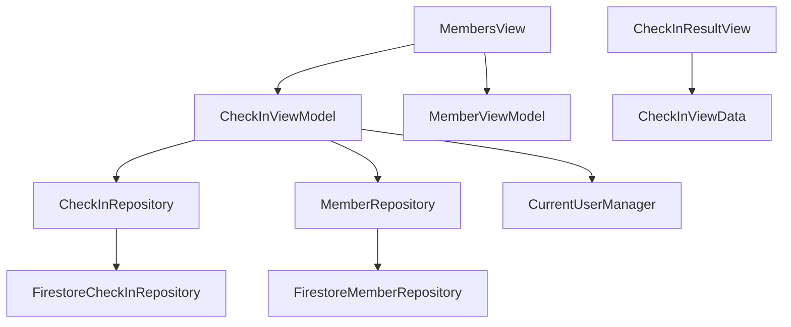
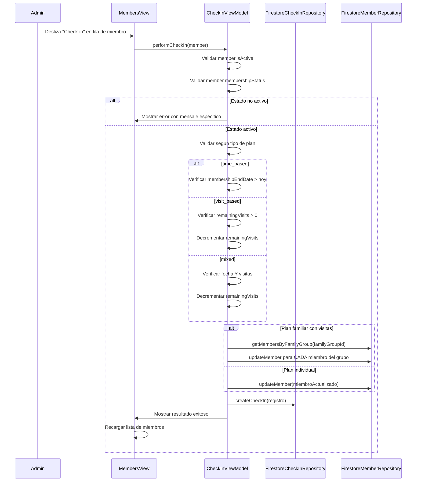

# Modulo de Check-in — Implementacion iOS

> Guia tecnica para la implementacion del modulo de check-in en la app iOS de SajaruBox.
> Referencia de reglas de negocio: `business-rules/07-membership-assignments.md` (seccion "Flujo: Check-in").

---

## Arquitectura

El modulo de check-in sigue el patron MVVM del proyecto y se integra directamente en el modulo de miembros (no tiene tab propio).

### Capas involucradas

| Capa | Archivo | Descripcion |
|------|---------|-------------|
| Modelo de dominio | `CheckInCore/CheckIn.swift` | Struct `CheckIn`, protocolo `CheckInRepository`, enum `CheckInError` |
| Repositorio Firestore | `FirebaseVendor/Services/CheckIn/FirestoreCheckInRepository.swift` | Implementacion `actor` con encode/decode manual |
| Dependencia | `PlatformAppiOS/Dependencies/CheckInDependencies/CheckInDependencies.swift` | Registro de `CheckInRepository` como `DependencyKey` |
| Modelo local | `App/Data/Local/CheckInLocal.swift` | Modelo `@Model` SwiftData para persistencia offline |
| ViewModel | `App/Presentation/CheckInModule/CheckInViewModel.swift` | Logica de negocio del check-in |
| ViewData | `App/Presentation/CheckInModule/CheckInViewData.swift` | Estado de la UI |
| Vista resultado | `App/Presentation/CheckInModule/CheckInResultView.swift` | Sheet de resultado (exito/error) |
| Vista principal | `App/Presentation/HomeModule/Pages/MembersView.swift` | Integracion via swipe action y menu contextual |

### Diagrama de dependencias

---

## Flujo de Check-in

### Diagrama de secuencia

### Validacion por estado de membresia

| Estado | Permitir check-in | Mensaje |
|--------|-------------------|---------|
| `active` | Si (continuar validacion) | — |
| `pending` | No | "Este miembro tiene membresia pendiente. Asigna un plan primero." |
| `suspended` | No | "La membresia esta suspendida. Contacta al administrador." |
| `cancelled` | No | "La membresia fue cancelada. Asigna un nuevo plan." |
| `expired` | No | "La membresia expiro. Renueva para continuar." |

### Validacion por tipo de plan

| Tipo | Validacion | Accion si pasa | Accion si falla |
|------|-----------|----------------|-----------------|
| `time_based` | `membershipEndDate > hoy` | Permitir entrada | Marcar `expired`, rechazar |
| `visit_based` | `remainingVisits > 0` | `remainingVisits -= 1`, si llega a 0 marcar `expired` | Marcar `expired`, rechazar |
| `mixed` | Fecha valida Y visitas > 0 | `remainingVisits -= 1`, verificar ambas condiciones | Marcar `expired` por la condicion que fallo |

### Mensajes de exito

| Situacion | Mensaje |
|-----------|---------|
| Entrada exitosa (time_based) | "Bienvenido, [nombre]. Tu membresia vence en [N] dias." |
| Entrada exitosa (visit_based) | "Bienvenido, [nombre]. Te quedan [N] visitas." |
| Entrada exitosa (mixed) | "Bienvenido, [nombre]. Visitas: [N], Dias: [M]." |
| Ultima visita | "Bienvenido, [nombre]. Esta es tu ultima visita. Renueva tu membresia." |

---

## Decisiones tecnicas

### 1. `memberId` requerido, `userId` opcional

El campo `memberId` es **siempre requerido** porque el check-in lo hace el admin buscando al miembro por nombre/telefono. Muchos miembros del gimnasio no tienen cuenta en la app, por lo que `userId` es opcional y solo se llena si el miembro tiene un `linkedUserId`.

### 2. Encode/decode manual en Firestore

Se sigue el mismo patron que `FirestoreMemberRepository` para evitar problemas con `Codable` y Firestore:
- Funcion `encode(_:)` que excluye el campo `id` (se usa como document ID)
- Funcion `decode(document:)` con defaults seguros para campos faltantes
- Fechas como `Timestamp` de Firestore
- Ordenamiento en memoria (sin `.order(by:)` de Firestore) para evitar indices compuestos

### 3. Visitas compartidas en planes familiares

Para planes `visit_based` o `mixed` con `maxMembers > 1`:
1. Obtener todos los miembros del grupo via `getMembersByFamilyGroup(familyGroupId)`
2. Decrementar `remainingVisits` en **todos** los miembros del grupo
3. Si `remainingVisits` llega a 0, marcar **todos** como `expired`

Esto asegura consistencia: cualquier miembro del grupo familiar puede consultar su saldo de visitas y ver el mismo numero.

### 4. Integracion en MembersView (no tab separado)

El check-in se integra directamente en la lista de miembros via:
- **Swipe action** (borde leading): acceso rapido para el admin en recepcion
- **Menu contextual**: alternativa al swipe
- **Sheet de resultado**: muestra mensaje de bienvenida o error

Razon: el flujo natural del admin es "buscar miembro → hacer check-in", que coincide con la pantalla de miembros.

### 5. ViewModel separado (CheckInViewModel)

Se usa un ViewModel independiente (`CheckInViewModel`) en lugar de agregar la logica al `MemberViewModel` por:
- **Separacion de responsabilidades**: check-in tiene logica de negocio compleja (validacion, decremento, actualizacion de multiples miembros)
- **Reutilizacion**: podria usarse desde otras pantallas en el futuro
- **Testing**: mas facil de testear aisladamente

---

## Coleccion Firestore

Coleccion: `check_ins`

Ver `schema.md` para la estructura completa de campos.

Indices recomendados:
- `memberId` + `checkInDate` (consultas de historial por miembro)
- `checkInDate` (consultas de check-ins del dia)

---

## Permisos por rol

| Accion | admin | receptionist | trainer | member |
|--------|:-----:|:------------:|:-------:|:------:|
| Hacer check-in | Si | Si | No | No |
| Ver check-ins del dia | Si | Si | No | No |
| Ver historial | Si | Si | No | Solo propio |

---

## Checklist de mantenimiento

- [ ] Si se agregan campos a `CheckIn`, actualizar `encode()` y `decode()` en `FirestoreCheckInRepository`
- [ ] Si se agregan campos a `CheckIn`, actualizar `CheckInLocal` y sus funciones `toDomain()`/`fromDomain()`
- [ ] Si cambia la logica de visitas, actualizar la seccion de grupo familiar en `CheckInViewModel`
- [ ] Si se agregan estados de membresia, actualizar el switch de validacion en `CheckInViewModel`
- [ ] Mantener sincronizado con `schema.md` y `07-membership-assignments.md` del MCP
