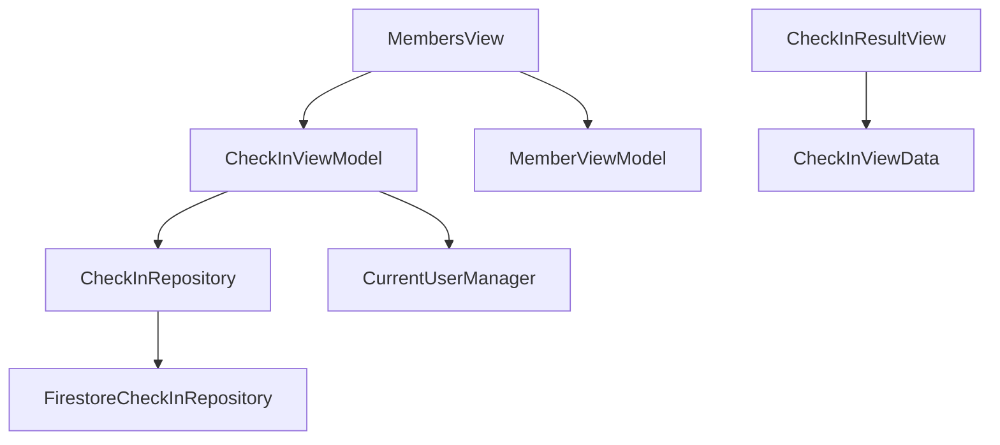
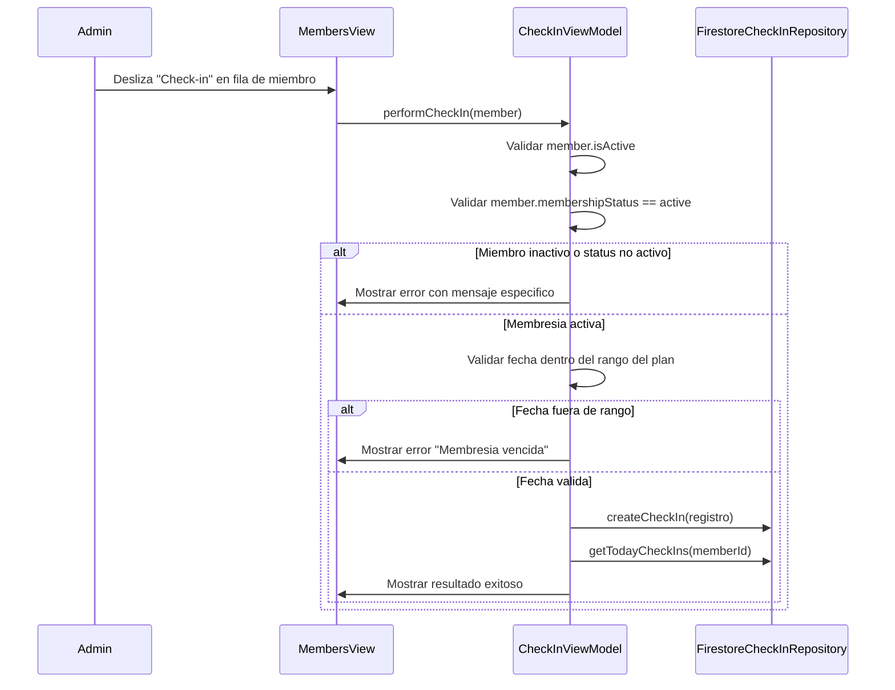

# Modulo de Check-in — Implementacion iOS

> Guia tecnica para la implementacion del modulo de check-in en la app iOS de SajaruBox.
> Referencia de reglas de negocio: `business-rules/07-membership-assignments.md` (seccion "Flujo: Check-in").
> **El check-in solo registra asistencia. NO descuenta visitas ni modifica la membresia.**

---

## Arquitectura

El modulo de check-in sigue el patron MVVM del proyecto y se integra directamente en el modulo de miembros (no tiene tab propio).

### Capas involucradas

| Capa | Archivo | Descripcion |
|------|---------|-------------|
| Modelo de dominio | `CheckInCore/CheckIn.swift` | Struct `CheckIn`, protocolo `CheckInRepository`, enum `CheckInError` |
| Repositorio Firestore | `FirebaseVendor/Services/CheckIn/FirestoreCheckInRepository.swift` | Implementacion `actor` con encode/decode manual |
| Dependencia | `PlatformAppiOS/Dependencies/CheckInDependencies/CheckInDependencies.swift` | Registro de `CheckInRepository` como `DependencyKey` |
| Modelo local | `App/Data/Local/CheckInLocal.swift` | Modelo `@Model` SwiftData para persistencia offline |
| ViewModel | `App/Presentation/CheckInModule/CheckInViewModel.swift` | Logica de negocio del check-in |
| ViewData | `App/Presentation/CheckInModule/CheckInViewData.swift` | Estado de la UI |
| Vista resultado | `App/Presentation/CheckInModule/CheckInResultView.swift` | Sheet de resultado (exito/error) |
| Vista principal | `App/Presentation/HomeModule/Pages/MembersView.swift` | Integracion via swipe action y menu contextual |

### Diagrama de dependencias

> Nota: `CheckInViewModel` **no** depende de `MemberRepository`. El check-in no modifica el documento del miembro.

---

## Flujo de Check-in

### Diagrama de secuencia

### Lo que el check-in hace

1. Valida que el miembro este activo (`isActive == true`)
2. Valida que `membershipStatus == active`
3. Valida que la fecha actual este dentro del rango de la membresia
4. Crea un documento nuevo en `check_ins`
5. Muestra mensaje de bienvenida con el conteo de visitas del dia

### Lo que el check-in NO hace

- **NO descuenta visitas** (`remainingVisits` no se modifica)
- **NO cambia el status** de la membresia (`membershipStatus` no se modifica)
- **NO actualiza ningun campo** del documento del miembro
- **NO depende de `MemberRepository`** — solo usa `CheckInRepository`

### Validacion por estado de membresia

| Estado | Permitir check-in | Mensaje |
|--------|-------------------|---------|
| `active` | Si (continuar validacion de fecha) | — |
| `pending` | No | "Membresia pendiente. Asigna un plan primero." |
| `suspended` | No | "Membresia suspendida." |
| `cancelled` | No | "Membresia cancelada. Asigna un nuevo plan." |
| `expired` | Verificar pase de dia | "Membresia expirada. Renueva para continuar." |

### Validacion de pase de dia (pendiente de implementar)

Si `membershipStatus == expired`, buscar en `payments` si existe un pago tipo `day_pass` con `status == completed` del dia actual para ese `memberId`. Si existe, permitir el check-in.

> **Estado actual**: esta validacion aun no esta implementada. Requiere inyectar `PaymentRepository` en `CheckInViewModel`.

### Mensajes de check-in

| Situacion | Mensaje |
|-----------|---------|
| Entrada exitosa | "Bienvenido, [nombre]. Asistencia registrada." |
| Segunda visita del dia | "Bienvenido de nuevo, [nombre]. Visita #N del dia." |
| Pase de dia (pendiente) | "Bienvenido, [nombre]. Pase de dia." |
| Membresia expirada | "Membresia expirada. Renueva para continuar." |
| Membresia pendiente | "Membresia pendiente. Asigna un plan primero." |
| Membresia suspendida | "Membresia suspendida." |
| Membresia cancelada | "Membresia cancelada. Asigna un nuevo plan." |
| Miembro inactivo | "Este miembro fue dado de baja." |

---

## Decisiones tecnicas

### 1. `memberId` requerido, `userId` opcional

El campo `memberId` es **siempre requerido** porque el check-in lo hace el admin buscando al miembro por nombre/telefono. Muchos miembros del gimnasio no tienen cuenta en la app, por lo que `userId` es opcional y solo se llena si el miembro tiene un `linkedUserId`.

### 2. Encode/decode manual en Firestore

Se sigue el mismo patron que `FirestoreMemberRepository` para evitar problemas con `Codable` y Firestore:
- Funcion `encode(_:)` que excluye el campo `id` (se usa como document ID)
- Funcion `decode(document:)` con defaults seguros para campos faltantes
- Fechas como `Timestamp` de Firestore
- Ordenamiento en memoria (sin `.order(by:)` de Firestore) para evitar indices compuestos

### 3. Check-in no modifica al miembro

Decisiones tomadas:
- El check-in **solo registra asistencia** para control (cuantas veces visita, a que hora)
- El descuento de visitas y cambio de status se manejara en el **modulo de pagos** al momento de cobrar
- Los dias no son acumulables — el check-in valida que la membresia este en rango de fechas
- Esto simplifica enormemente la logica y evita race conditions al actualizar multiples documentos

### 4. Integracion en MembersView (no tab separado)

El check-in se integra directamente en la lista de miembros via:
- **Swipe action** (borde leading): acceso rapido para el admin en recepcion
- **Boton visible**: boton verde circular con icono de check-in en cada fila de miembro activo
- **Menu contextual**: alternativa al swipe
- **Sheet de resultado**: muestra mensaje de bienvenida o error

Razon: el flujo natural del admin es "buscar miembro → hacer check-in", que coincide con la pantalla de miembros.

### 5. ViewModel separado (CheckInViewModel)

Se usa un ViewModel independiente (`CheckInViewModel`) en lugar de agregar la logica al `MemberViewModel` por:
- **Separacion de responsabilidades**: mantener la logica de check-in aislada
- **Reutilizacion**: podria usarse desde otras pantallas en el futuro (QR scan, etc.)
- **Testing**: mas facil de testear aisladamente

---

## Coleccion Firestore

Coleccion: `check_ins`

Ver `schema.md` para la estructura completa de campos.

Indices recomendados:
- `memberId` + `checkInDate` (consultas de historial por miembro)
- `checkInDate` (consultas de check-ins del dia)

---

## Permisos por rol

| Accion | admin | receptionist | trainer | member |
|--------|:-----:|:------------:|:-------:|:------:|
| Hacer check-in | Si | Si | No | No |
| Ver check-ins del dia | Si | Si | No | No |
| Ver historial | Si | Si | No | Solo propio |

---

## Pendiente de implementar

1. **Validacion de pase de dia**: buscar en `payments` si hay un `day_pass` del dia actual para miembros con membresia expirada
2. **Check-out**: registrar hora de salida en `checkOutDate` (actualmente solo se registra entrada)
3. **Historial de check-ins del miembro**: vista detallada con filtros por fecha

---

## Checklist de mantenimiento

- [ ] Si se agregan campos a `CheckIn`, actualizar `encode()` y `decode()` en `FirestoreCheckInRepository`
- [ ] Si se agregan campos a `CheckIn`, actualizar `CheckInLocal` y sus funciones `toDomain()`/`fromDomain()`
- [ ] Si se agregan estados de membresia, actualizar el switch de validacion en `CheckInViewModel`
- [ ] Mantener sincronizado con `schema.md` y `07-membership-assignments.md` del MCP
- [ ] Al implementar validacion de pase de dia, inyectar `PaymentRepository` en `CheckInViewModel`
