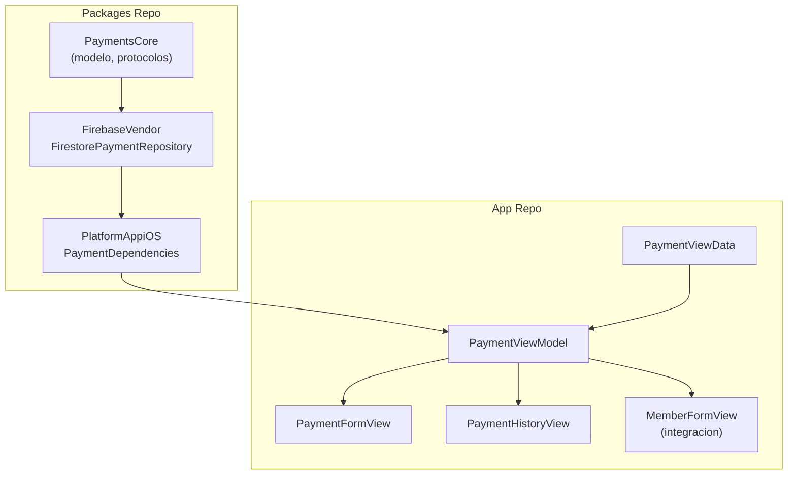

# Modulo de Pagos — Guia de Implementacion iOS

> Guia tecnica para implementar el modulo de pagos en la app iOS.
> El modelo de datos (`PaymentsCore`) ya existe en el packages repo.
> Falta: `FirestorePaymentRepository`, `PaymentDependencies`, y el modulo de presentacion.

---

## Arquitectura del modulo

### Diagrama de dependencias



---

## Paso 1: FirestorePaymentRepository (Packages Repo)

**Ruta**: `Packages/Vendors/Sources/FirebaseVendor/Services/Payments/FirestorePaymentRepository.swift`

El protocolo `PaymentRepository` ya existe en `PaymentsCore/Payment.swift`. Falta la implementacion.

### Patron a seguir

Usar el mismo patron de encode/decode manual que `FirestoreMemberRepository` y `FirestoreCheckInRepository`:

```swift
actor FirestorePaymentRepository: PaymentRepository {
    private let db = Firestore.firestore()
    private let collectionName = "payments"

    // Encode manual (Payment -> [String: Any])
    // Decode manual (DocumentSnapshot -> Payment)
    // Usar Timestamp para fechas
    // Usar FieldValue.serverTimestamp() para createdAt/updatedAt
}
```

### Metodos a implementar

Del protocolo `PaymentRepository`:

| Metodo | Descripcion |
|--------|-------------|
| `getPayment(by:)` | Obtener pago por ID |
| `createPayment(_:)` | Crear nuevo pago |
| `updatePayment(_:)` | Actualizar pago existente |
| `getPaymentsByUser(_:)` | Pagos por userId |
| `getPaymentsByMember(_:)` | Pagos por memberId (mas usado) |
| `getPayments(by:)` | Pagos por status |
| `getTransactions(by:)` | Transacciones por paymentId |
| `createTransaction(_:)` | Crear transaccion |

### Decisiones tecnicas

- **Encode/decode manual**: No usar `Codable` directo porque `Timestamp` no se mapea bien automaticamente
- **`memberId` siempre requerido**: Validar en el repository antes de escribir
- **`membershipPlanSnapshot`**: Almacenar como `Map` en Firestore (misma estructura que en `members`)
- **Ordenamiento**: `getPaymentsByMember` ordena por `createdAt` descendente

### Dependencia en `Package.swift` de Vendors

Agregar `PaymentsCore` a las dependencias del target `FirebaseVendor`:

```swift
.product(name: "PaymentsCore", package: "PlatformCore")
```

---

## Paso 2: PaymentDependencies (Packages Repo)

**Ruta**: `Packages/PlatformAppiOS/Sources/PlatformAppiOS/Dependencies/PaymentDependencies/PaymentDependencies.swift`

```swift
import FirebaseVendor
import PaymentsCore
import Dependencies

private enum PaymentRepositoryKey: Sendable, DependencyKey {
    static let liveValue: PaymentRepository = FirestorePaymentRepository()
}

public extension DependencyValues {
    var paymentRepository: PaymentRepository {
        get { self[PaymentRepositoryKey.self] }
        set { self[PaymentRepositoryKey.self] = newValue }
    }
}
```

> Nota: Si el directorio `Dependencies/` esta en `.gitignore`, usar `git add -f` para forzar.

---

## Paso 3: PaymentViewData (App Repo)

**Ruta**: `SajaruBox/App/Presentation/PaymentModule/PaymentViewData.swift`

```swift
struct PaymentViewData {
    var payments: [Payment] = []
    var isLoading: Bool = false
    var errorMessage: String?
    var successMessage: String?
    var showPaymentForm: Bool = false
}
```

### Campos del formulario de cobro

| Campo | Tipo | Descripcion |
|-------|------|-------------|
| `selectedType` | `PaymentType` | membership, day_pass, product, service |
| `selectedMethod` | `PaymentMethod` | cash, card, transfer |
| `amount` | `Double` | Monto (auto-llenado si es membership) |
| `description` | `String` | Concepto o descripcion |
| `selectedPlanId` | `String?` | Plan seleccionado (solo si type == membership) |

---

## Paso 4: PaymentViewModel (App Repo)

**Ruta**: `SajaruBox/App/Presentation/PaymentModule/PaymentViewModel.swift`

### Dependencias

```swift
@MainActor
final class PaymentViewModel: ObservableObject {
    @Dependency(\.paymentRepository) private var paymentRepository
    @Dependency(\.memberRepository) private var memberRepository
    @Dependency(\.membershipPlanRepository) private var planRepository
    @Dependency(\.currentUser) private var currentUser

    @Published var data = PaymentViewData()
    // ... form fields
}
```

### Metodos principales

| Metodo | Descripcion |
|--------|-------------|
| `loadPayments(for memberId:)` | Cargar historial de pagos del miembro |
| `registerMembershipPayment(member:planId:method:startDate:)` | Cobrar membresia: crea Payment + actualiza Member |
| `registerDayPassPayment(member:amount:method:)` | Cobrar pase de dia |
| `registerProductPayment(member:amount:description:method:)` | Cobrar producto/servicio |

### Flujo de `registerMembershipPayment`

```
1. Obtener plan por ID
2. Crear snapshot del plan
3. Crear Payment(type: .membership, status: .completed, membershipPlanSnapshot: snapshot)
4. Actualizar Member con nueva membresia (status, snapshot, fechas)
5. Si tenia membresia activa previa: marcarla como expired primero
6. Guardar Payment en Firestore
7. Guardar Member actualizado en Firestore
8. Mostrar confirmacion
```

---

## Paso 5: Integracion con MemberFormView

El formulario de edicion de miembros (`MemberFormView`) debe incluir la seccion de membresia
**tambien en modo edicion** (actualmente solo aparece en modo creacion).

### Cambios necesarios

1. Eliminar la condicion `if !viewModel.isEditing` que oculta la seccion de membresia
2. Agregar seccion de metodo de pago cuando se selecciona un plan
3. Al guardar, si se selecciono un plan nuevo: llamar a `registerMembershipPayment` en vez de solo `updateMember`

### Seccion de pago en el formulario

Cuando el admin selecciona un plan para asignar/renovar:

```
[ Seccion: Membresia ]
  Plan: [Picker con planes activos]
  Fecha inicio: [DatePicker]

[ Seccion: Pago ] (solo aparece si se selecciono plan)
  Metodo: [Segmented: Efectivo | Tarjeta | Transferencia]
  Monto: $350.00 MXN (auto-llenado desde el plan, no editable)
```

---

## Paso 6: PaymentHistoryView (App Repo)

**Ruta**: `SajaruBox/App/Presentation/PaymentModule/PaymentHistoryView.swift`

Vista que muestra el historial de pagos de un miembro. Se puede acceder desde:
- Perfil del miembro (vista admin)
- Perfil propio (vista member en la app)

### Estructura de la lista

```
| Fecha        | Concepto       | Monto  | Metodo      | Estado     |
|--------------|----------------|--------|-------------|------------|
| 15/Feb/2026  | Mensualidad    | $350   | Efectivo    | Completado |
| 01/Feb/2026  | Visita         | $30    | Efectivo    | Completado |
```

### Permisos

- **Admin/Recepcionista**: Ve historial de cualquier miembro
- **Member**: Solo ve su propio historial (si esta vinculado)

---

## Indices Firestore recomendados

| Indice | Campos | Uso |
|--------|--------|-----|
| `payments_by_member` | `memberId` ASC, `createdAt` DESC | Historial de pagos de un miembro |
| `payments_by_status` | `status` ASC, `createdAt` DESC | Pagos pendientes (futuro) |
| `payments_by_date` | `createdAt` DESC | Reporte diario de cobros |

---

## Migracion necesaria en PaymentsCore

El modelo `Payment` actual en `PaymentsCore/Payment.swift` tiene desalineaciones con `schema.md` que se deben corregir **antes** de implementar el modulo.

### Campos a corregir

| Campo | Estado actual | Debe ser | Accion |
|-------|-------------|----------|--------|
| `userId` | `String` (requerido) | `String?` (opcional) | Cambiar a opcional — muchos miembros no tienen cuenta |
| `memberId` | `String?` (opcional) | `String` (requerido) | Cambiar a requerido — todo cobro se vincula a un miembro |
| `membershipPlanSnapshot` | No existe | `MembershipPlanSnapshot?` | Agregar — necesario para pagos tipo `membership` |
| `registeredBy` | No existe | `String` | Agregar — UID del admin que registro el cobro (auditoria) |

### Enums a ajustar

| Enum | Valor | Accion |
|------|-------|--------|
| `PaymentMethod.stripe` | Existe | Mantener (uso futuro), pero no mostrar en UI por ahora |
| `PaymentMethod.applePay` | Existe | Mantener (uso futuro), pero no mostrar en UI por ahora |
| `PaymentMethod.googlePay` | Existe | Mantener (uso futuro), pero no mostrar en UI por ahora |
| `PaymentType.guestInvite` | Existe | Evaluar si se necesita o eliminar |

### Conformancias faltantes

| Protocolo | `Payment` | `PaymentRepository` | `PaymentService` |
|-----------|-----------|--------------------:|------------------:|
| `Sendable` | Falta | Falta | Falta |
| `CaseIterable` en enums | OK en `PaymentMethod` | — | — |

### Impacto en PaymentLocal (app repo)

Al modificar el modelo `Payment`, tambien se debe actualizar:
- `App/Data/Local/PaymentLocal.swift` — agregar campos nuevos (`registeredBy`, `membershipPlanSnapshotJSON`)
- `toDomain()` y `fromDomain(_:)` — mapear los nuevos campos
- Cambiar `userId` de requerido a opcional y `memberId` de opcional a requerido

---

## Checklist de implementacion

- [ ] **Migrar modelo** `Payment` en `PaymentsCore` (corregir campos, agregar `Sendable`)
- [ ] **Actualizar** `PaymentLocal` en app repo (nuevos campos)
- [ ] `FirestorePaymentRepository` en `FirebaseVendor` (actor, encode/decode manual)
- [ ] Agregar `PaymentsCore` a dependencias de `FirebaseVendor` en `Package.swift`
- [ ] `PaymentDependencies` en `PlatformAppiOS`
- [ ] `PaymentViewData` en app
- [ ] `PaymentViewModel` en app
- [ ] `PaymentFormView` (formulario de cobro)
- [ ] `PaymentHistoryView` (historial de pagos)
- [ ] Integrar seccion de pago en `MemberFormView` (modo edicion)
- [ ] Agregar tab o boton de "Historial de pagos" en perfil de miembro
- [ ] Commit en AMBOS repos
