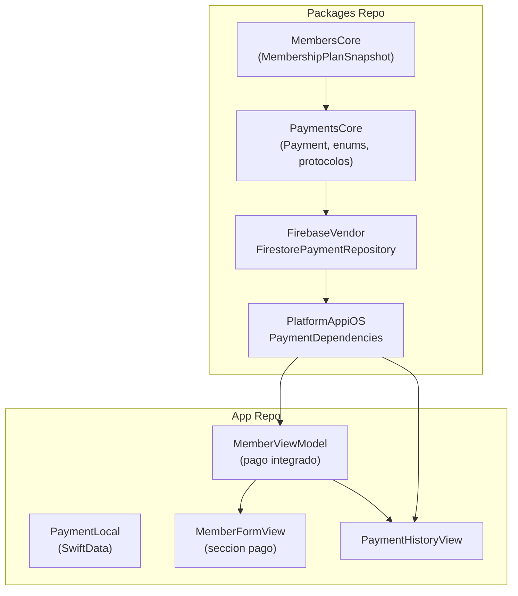

# Modulo de Pagos — Guia de Implementacion iOS

> Estado: **Implementado** (v1.3.2).
> El modelo `Payment` fue migrado, el repositorio Firestore creado, las dependencias registradas,
> y la integracion con `MemberFormView` y `PaymentHistoryView` completada.

---

## Arquitectura del modulo

### Diagrama de dependencias



---

## Implementacion completada

### PaymentsCore (modelo migrado)

**Ruta**: `Packages/PlatformCore/Sources/PaymentsCore/Payment.swift`

Cambios realizados respecto al modelo original:

| Campo | Antes | Despues | Razon |
|-------|-------|---------|-------|
| `memberId` | `String?` (opcional) | `String` (requerido) | Todo cobro se vincula a un miembro |
| `userId` | `String` (requerido) | `String?` (opcional) | Muchos miembros no tienen cuenta en la app |
| `membershipPlanSnapshot` | No existia | `MembershipPlanSnapshot?` | Captura estado del plan al cobrar membresia |
| `registeredBy` | No existia | `String` | UID del admin que registro el cobro (auditoria) |
| `Sendable` | Faltaba | Agregado | En `Payment`, `PaymentRepository`, `PaymentService`, `PaymentError` y todos los enums |

**Dependencia agregada**: `PaymentsCore` ahora depende de `MembersCore` para usar `MembershipPlanSnapshot`.

```swift
// PlatformCore/Package.swift
.target(
    name: "PaymentsCore",
    dependencies: [
        .product(name: "LoggingFoundation", package: "PlatformFoundation"),
        .product(name: "UtilsFoundation", package: "PlatformFoundation"),
        "MembersCore"  // <-- agregado
    ]
),
```

### Metodos de pago en UI

`PaymentMethod` tiene un computed property `inPersonMethods` que filtra solo los metodos para cobro en ventanilla:

```swift
public static var inPersonMethods: [PaymentMethod] {
    [.cash, .card, .transfer]
}
```

Los metodos `stripe`, `applePay`, `googlePay` se mantienen para uso futuro pero NO se muestran en la UI.

---

### FirestorePaymentRepository

**Ruta**: `Packages/Vendors/Sources/FirebaseVendor/Services/Payments/FirestorePaymentRepository.swift`

- `actor` con encode/decode manual (patron identico a `FirestoreCheckInRepository`)
- Coleccion: `payments`
- `Timestamp` para todas las fechas
- `membershipPlanSnapshot` se codifica/decodifica como sub-mapa (mismo patron que `FirestoreMemberRepository`)
- Ordenamiento por `createdAt` descendente en queries de lista

#### IMPORTANTE: Ambiguedad de `Transaction`

`FirebaseFirestore` define su propio tipo `Transaction` (para transacciones atomicas de Firestore). `PaymentsCore` tambien define `Transaction` (modelo de transaccion de pago). Cuando ambos se importan, el compilador no puede resolver cual `Transaction` usar.

**Solucion**: En `FirestorePaymentRepository`, calificar explicitamente:

```swift
// INCORRECTO — ambiguo
public func getTransactions(by paymentId: String) async throws -> [Transaction] { ... }

// CORRECTO — calificado
public func getTransactions(by paymentId: String) async throws -> [PaymentsCore.Transaction] { ... }
public func createTransaction(_ transaction: PaymentsCore.Transaction) async throws -> PaymentsCore.Transaction { ... }
```

**Regla general**: Cuando un modulo `XxxCore` define un tipo con nombre generico (`Transaction`, `Error`, `Status`, etc.) y se importa junto a `FirebaseFirestore` u otro framework grande, calificar con el modulo para evitar ambiguedades.

---

### PaymentDependencies

**Ruta**: `Packages/PlatformAppiOS/Sources/PlatformAppiOS/Dependencies/PaymentDependencies/PaymentDependencies.swift`

```swift
import FirebaseVendor
import PaymentsCore
import Dependencies

private enum PaymentRepositoryKey: Sendable, DependencyKey {
    static let liveValue: PaymentRepository = FirestorePaymentRepository()
}

public extension DependencyValues {
    var paymentRepository: PaymentRepository {
        get { self[PaymentRepositoryKey.self] }
        set { self[PaymentRepositoryKey.self] = newValue }
    }
}
```

> **Nota**: El directorio `Dependencies/` esta en `.gitignore` del packages repo. Se debe usar `git add -f` para forzar el staging.

---

### PaymentLocal (SwiftData)

**Ruta**: `SajaruBox/App/Data/Local/PaymentLocal.swift`

| Campo | Tipo | Notas |
|-------|------|-------|
| `memberId` | `String` | Requerido |
| `userId` | `String?` | Opcional |
| `registeredBy` | `String` | UID del admin |
| `membershipPlanSnapshotJSON` | `String?` | Serializado como JSON (mismo patron que `MemberLocal`) |
| `desc` | `String?` | Nombre `desc` en lugar de `description` para evitar conflicto con `CustomStringConvertible` |

Imports requeridos:

```swift
import Foundation
import SwiftData
import PaymentsCore
import MembersCore   // Para MembershipPlanSnapshot en toDomain()/fromDomain()
import DataSyncCore
```

---

### Integracion con MemberFormView

La seccion de membresia ahora aparece tanto en modo creacion como en modo edicion.

Nuevas secciones agregadas:

1. **Membresia actual** (solo en edicion): Muestra estado, plan, fecha de vencimiento y visitas restantes del miembro
2. **Asignar nuevo plan** (siempre visible): Picker de plan, fecha de inicio
3. **Cobro** (solo si se selecciono un plan): Picker segmentado de metodo de pago (Efectivo/Tarjeta/Transferencia) + monto auto-llenado

### Integracion con MemberViewModel

- `@Dependency(\.paymentRepository)` inyectado
- `@Published var formPaymentMethod: PaymentMethod = .cash`
- En `performSave()` modo creacion: si hay plan seleccionado, crea `Payment` tipo `.membership` despues de crear el miembro
- En `performSave()` modo edicion: si se selecciona un plan nuevo, crea `Payment` y actualiza la membresia del miembro

---

### PaymentHistoryView

**Ruta**: `SajaruBox/App/Presentation/MembersModule/PaymentHistoryView.swift`

Vista accesible desde el context menu del miembro en `MembersView` ("Historial de pagos").

#### IMPORTANTE: Import de Combine

El `PaymentHistoryViewModel` usa `ObservableObject` y `@Published`. En iOS 26 / Xcode 26, estos requieren `import Combine` explicito. Sin el import, el compilador muestra:

```
error: type 'PaymentHistoryViewModel' does not conform to protocol 'ObservableObject'
error: static subscript ... is not available due to missing import of defining module 'Combine'
```

**Regla**: Todo archivo que declare una clase `ObservableObject` con `@Published` debe incluir `import Combine`.

```swift
import SwiftUI
import Combine       // <-- REQUERIDO para ObservableObject + @Published
import SajaruUI
import PaymentsCore
import MembersCore
import Dependencies
```

---

## Indices Firestore recomendados

| Indice | Campos | Uso |
|--------|--------|-----|
| `payments_by_member` | `memberId` ASC, `createdAt` DESC | Historial de pagos de un miembro |
| `payments_by_status` | `status` ASC, `createdAt` DESC | Pagos pendientes (futuro) |
| `payments_by_date` | `createdAt` DESC | Reporte diario de cobros |

---

## Errores comunes y soluciones

### 1. `Transaction` ambiguo

**Error**: `'Transaction' is ambiguous for type lookup in this context`

**Causa**: `FirebaseFirestore.Transaction` (transacciones atomicas) vs `PaymentsCore.Transaction` (modelo de pago).

**Solucion**: Calificar como `PaymentsCore.Transaction` en archivos que importan `FirebaseFirestore`.

### 2. `ObservableObject` no disponible

**Error**: `type 'Xxx' does not conform to protocol 'ObservableObject'` + `missing import of defining module 'Combine'`

**Causa**: `import SwiftUI` no siempre re-exporta `Combine` en iOS 26.

**Solucion**: Agregar `import Combine` al archivo.

### 3. Dependencies en `.gitignore`

**Error**: `git add` ignora archivos en `Dependencies/` del packages repo.

**Solucion**: Usar `git add -f` para forzar.

---

## Checklist de implementacion

- [x] Migrar modelo `Payment` en `PaymentsCore` (campos, `Sendable`, dependencia a `MembersCore`)
- [x] Actualizar `PaymentLocal` en app repo (nuevos campos, JSON snapshot)
- [x] `FirestorePaymentRepository` en `FirebaseVendor` (actor, encode/decode manual)
- [x] Agregar `PaymentsCore` a dependencias de `FirebaseVendor` en `Package.swift`
- [x] `PaymentDependencies` en `PlatformAppiOS`
- [x] Integrar pago en `MemberViewModel.performSave()` (creacion y edicion)
- [x] Seccion de membresia en `MemberFormView` modo edicion + picker de metodo de pago
- [x] `PaymentHistoryView` con lista de pagos por miembro
- [x] Acceso a historial desde context menu en `MembersView`
- [x] Commit en AMBOS repos
- [ ] Pendiente: `PaymentFormView` independiente (cobros sin membresia: pase de dia, producto, servicio)
- [ ] Pendiente: Tab de historial de pagos global (admin)
