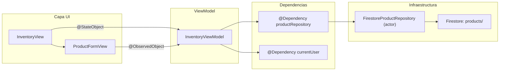

# Modulo de Inventario — Implementacion iOS

> Catalogo de productos y servicios del gimnasio.
> Los productos manejan stock. Los servicios (`category = .service`) no.
> Para reglas de negocio, ver `business-rules/09-inventory.md`.
> Para esquema Firestore, ver `schema.md` (coleccion `products`).

---

## Estructura de archivos

```
sajaru-box-ios/
└── SajaruBox/App/Presentation/
    ├── InventoryModule/
    │   ├── InventoryViewData.swift     # Estado de la vista + ProductFormMode
    │   ├── InventoryViewModel.swift    # CRUD, filtros, stock
    │   ├── InventoryView.swift         # Lista principal (tab Inventario)
    │   └── ProductFormView.swift       # Formulario de creacion/edicion
    └── HomeModule/
        └── HomeView.swift              # Tab "Inventario" (reemplazo del placeholder)

sajarubox-mobile-ios-packages/
├── Packages/PlatformCore/Sources/InventoryCore/
│   └── Product.swift                   # Modelo, enums, protocolos, errores
├── Packages/Vendors/Sources/FirebaseVendor/Services/Inventory/
│   └── FirestoreProductRepository.swift  # Implementacion Firestore (actor)
└── Packages/PlatformAppiOS/Sources/PlatformAppiOS/Dependencies/
    └── InventoryDependencies/
        └── InventoryDependencies.swift # DependencyKey registration
```

---

## Diagrama de arquitectura



---

## Modelo Product (InventoryCore)

### ProductCategory

```swift
public enum ProductCategory: String, Codable, CaseIterable, Sendable {
    case beverages, food, supplements, equipment, apparel, accessories, service, other
}
```

Computed properties: `displayName`, `icon`

### Product

Campos principales: `id`, `name`, `description`, `category`, `price`, `currency`, `stock`, `sku`, `imageURL`, `isActive`, `createdAt`, `updatedAt`

Computed properties:
- `isInStock: Bool` — `stock > 0 && isActive`
- `isService: Bool` — `category == .service`
- `formattedPrice() -> String` — formateado como MXN

### ProductRepository

| Metodo | Descripcion |
|--------|-------------|
| `getAllProducts()` | Todos (activos e inactivos, para admin) |
| `getActiveProducts()` | Solo activos |
| `getProduct(by:)` | Por ID |
| `createProduct(_:)` | Crear nuevo |
| `updateProduct(_:)` | Actualizar existente |
| `deleteProduct(_:)` | Soft delete (isActive = false) |
| `getProducts(by:)` | Por categoria |
| `getLowStockProducts(threshold:)` | Stock bajo |

---

## FirestoreProductRepository

- `actor` con encode/decode manual (patron identico a otros repositories)
- Coleccion: `products`
- `Timestamp` para fechas
- Ordenamiento en memoria por nombre (ascending)
- Soft delete via `isActive = false`
- `getLowStockProducts` filtra en memoria (no Firestore query)

---

## InventoryDependencies

```swift
@Dependency(\.productRepository) var repository
```

Registrado en `PlatformAppiOS/Dependencies/InventoryDependencies/InventoryDependencies.swift`.

---

## Estructura de InventoryViewData

```swift
struct InventoryViewData {
    var products: [Product] = []
    var isLoading: Bool = false
    var errorMessage: String?
    var successMessage: String?
    var formMode: ProductFormMode?
    var showDeleteConfirmation: Bool = false
    var productToDelete: Product?
    var selectedCategory: ProductCategory?  // filtro por categoria
}
```

### ProductFormMode

```swift
enum ProductFormMode: Identifiable {
    case create(id: String = UUID().uuidString)
    case edit(Product)
}
```

---

## InventoryView (lista principal)

### Componentes de cada fila

```
┌──────────────────────────────────────────────────┐
│ 🥤 Agua natural                        $20       │
│ [Bebidas]  📦 45                     SKU-001     │
│ Agua purificada 600ml                            │
└──────────────────────────────────────────────────┘
```

- Linea 1: icono de categoria + nombre + precio
- Linea 2: chip de categoria + badge de stock (verde si > 3, rojo si <= 3) + SKU
- Linea 3: descripcion (si existe)
- Servicios no muestran badge de stock

### Filtro por categoria

Chips horizontales scrolleables en la parte superior. Solo se muestran categorias que tienen al menos un producto. "Todos" como opcion predeterminada.

### Acciones

| Gesto | Accion |
|-------|--------|
| Swipe izquierda (trailing) | Desactivar/Activar |
| Swipe derecha (leading) | Editar |
| Context menu | Editar / Agregar stock / Quitar stock / Desactivar |
| Pull to refresh | Recargar lista |
| Toolbar "+" | Abrir formulario creacion |
| Busqueda | `.searchable` por nombre, descripcion, SKU |

---

## ProductFormView (formulario)

| Seccion | Campos | Notas |
|---------|--------|-------|
| Informacion | Nombre*, Descripcion | Nombre requerido |
| Categoria | Picker con todas las categorias | Incluye icono |
| Precio | $ [monto] MXN | Teclado decimal |
| Stock | Cantidad | Oculto si categoria == service |
| Identificacion | SKU (opcional) | Codigo interno |

---

## Busqueda local

```swift
var filteredProducts: [Product] {
    // 1. Filtrar por categoria seleccionada
    // 2. Filtrar por texto de busqueda (nombre, descripcion, SKU)
}
```

---

## Permisos

- `isAdmin`: ve todos (activos e inactivos), puede reactivar
- `isAdminOrReceptionist`: ve activos, CRUD completo
- Otros roles: no ven el tab

---

## Pendiente

1. **Venta con cobro**: al vender, crear Payment tipo `product`/`service` + reducir stock
2. **Movimientos de inventario**: historial (modelo `Inventory` ya existe en InventoryCore)
3. **Alertas de stock bajo**: `getLowStockProducts(threshold:)` ya existe en el repository
4. **Imagenes de producto**: `imageURL` existe en el modelo pero la UI no lo usa aun

---

## Checklist de mantenimiento

- [ ] Si se agregan campos a `Product`, actualizar `encode()` y `decode()` en `FirestoreProductRepository`
- [ ] Si se agregan campos a `Product`, actualizar `ProductLocal` y sus funciones `toDomain()`/`fromDomain()`
- [ ] Commitear packages repo **primero**, luego app repo
- [ ] Actualizar `schema.md` si cambian los campos de la coleccion `products`
