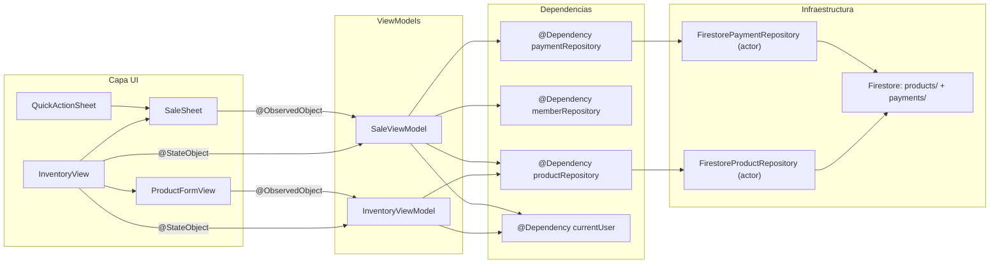

# Modulo de Inventario — Implementacion iOS

> Catalogo de productos y servicios del gimnasio.
> Los productos manejan stock. Los servicios (`category = .service`) no.
> Para reglas de negocio, ver `business-rules/09-inventory.md`.
> Para esquema Firestore, ver `schema.md` (coleccion `products`).

---

## Estructura de archivos

```
sajaru-box-ios/
└── SajaruBox/App/Presentation/
    ├── InventoryModule/
    │   ├── InventoryViewData.swift     # Estado de la vista + ProductFormMode
    │   ├── InventoryViewModel.swift    # CRUD, filtros, stock
    │   ├── InventoryView.swift         # Lista principal (tab Inventario)
    │   └── ProductFormView.swift       # Formulario de creacion/edicion
    ├── SalesModule/
    │   ├── SaleViewData.swift          # Carrito, miembro, estado de venta
    │   ├── SaleViewModel.swift         # Logica de venta (carrito + Payment + stock)
    │   └── SaleSheet.swift             # UI del punto de venta
    └── HomeModule/
        └── HomeView.swift              # Tab "Inventario" (reemplazo del placeholder)

sajarubox-mobile-ios-packages/
├── Packages/PlatformCore/Sources/InventoryCore/
│   └── Product.swift                   # Modelo, enums, protocolos, errores
├── Packages/Vendors/Sources/FirebaseVendor/Services/Inventory/
│   └── FirestoreProductRepository.swift  # Implementacion Firestore (actor)
└── Packages/PlatformAppiOS/Sources/PlatformAppiOS/Dependencies/
    └── InventoryDependencies/
        └── InventoryDependencies.swift # DependencyKey registration
```

---

## Diagrama de arquitectura



---

## Modelo Product (InventoryCore)

### ProductCategory

```swift
public enum ProductCategory: String, Codable, CaseIterable, Sendable {
    case beverages, food, supplements, equipment, apparel, accessories, service, other
}
```

Computed properties: `displayName`, `icon`

### Product

Campos principales: `id`, `name`, `description`, `category`, `price`, `costPrice`, `currency`, `stock`, `sku`, `imageURL`, `isActive`, `priceHistory`, `createdAt`, `updatedAt`

Computed properties:
- `isInStock: Bool` — `stock > 0 && isActive`
- `isService: Bool` — `category == .service`
- `profitPerUnit: Double` — `price - costPrice`
- `marginPercentage: Double` — `(price - costPrice) / price * 100`
- `formattedPrice() -> String` — precio de venta formateado como MXN
- `formattedCostPrice() -> String` — precio de costo formateado como MXN

### PriceHistoryEntry

```swift
public struct PriceHistoryEntry: Codable, Equatable, Sendable {
    public let price: Double       // precio de venta anterior
    public let costPrice: Double   // costo anterior
    public let changedAt: Date
    public let changedBy: String   // UID del admin
}
```

Se genera automaticamente al editar un producto cuando cambia `price` o `costPrice`.

### ProductRepository

| Metodo | Descripcion |
|--------|-------------|
| `getAllProducts()` | Todos (activos e inactivos, para admin) |
| `getActiveProducts()` | Solo activos |
| `getProduct(by:)` | Por ID |
| `createProduct(_:)` | Crear nuevo |
| `updateProduct(_:)` | Actualizar existente |
| `deleteProduct(_:)` | Soft delete (isActive = false) |
| `getProducts(by:)` | Por categoria |
| `getLowStockProducts(threshold:)` | Stock bajo |

---

## FirestoreProductRepository

- `actor` con encode/decode manual (patron identico a otros repositories)
- Coleccion: `products`
- `Timestamp` para fechas
- Ordenamiento en memoria por nombre (ascending)
- Soft delete via `isActive = false`
- `getLowStockProducts` filtra en memoria (no Firestore query)

---

## InventoryDependencies

```swift
@Dependency(\.productRepository) var repository
```

Registrado en `PlatformAppiOS/Dependencies/InventoryDependencies/InventoryDependencies.swift`.

---

## Estructura de InventoryViewData

```swift
struct InventoryViewData {
    var products: [Product] = []
    var isLoading: Bool = false
    var errorMessage: String?
    var successMessage: String?
    var formMode: ProductFormMode?
    var showDeleteConfirmation: Bool = false
    var productToDelete: Product?
    var selectedCategory: ProductCategory?  // filtro por categoria
}
```

### ProductFormMode

```swift
enum ProductFormMode: Identifiable {
    case create(id: String = UUID().uuidString)
    case edit(Product)
}
```

---

## InventoryView (lista principal)

### Componentes de cada fila

```
┌──────────────────────────────────────────────────┐
│ 🥤 Agua natural                        $20       │
│                                    C: $12  40%   │
│ [Bebidas]  📦 45                     SKU-001     │
│ Agua purificada 600ml                            │
└──────────────────────────────────────────────────┘
```

- Linea 1: icono de categoria + nombre + precio de venta
- Linea 1b: costo + % margen (solo admin/recepcionista, solo si costPrice > 0)
- Linea 2: chip de categoria + badge de stock (verde si > 3, rojo si <= 3) + SKU
- Linea 3: descripcion (si existe)
- Servicios no muestran badge de stock

### Filtro por categoria

Chips horizontales scrolleables dentro de la List (como Section sin fondo). Solo se muestran categorias con al menos un producto. "Todos" como opcion predeterminada.

### Acciones

| Gesto | Accion |
|-------|--------|
| **Tap en fila** | **Abrir formulario de edicion** |
| Swipe izquierda (trailing) | Desactivar/Activar |
| Swipe derecha (leading) | Editar |
| Context menu | Vender / Editar / Agregar stock / Quitar stock / Desactivar |
| Pull to refresh | Recargar lista |
| Toolbar carrito | Abrir SaleSheet (nueva venta) |
| Toolbar "+" | Abrir formulario creacion |
| Boton "Nueva venta" (en lista) | Abrir SaleSheet |
| Boton "Agregar nuevo producto" (en lista) | Abrir formulario creacion |
| Busqueda | `.searchable` por nombre, descripcion, SKU |

---

## ProductFormView (formulario)

| Seccion | Campos | Notas |
|---------|--------|-------|
| Banner verde | Feedback de "Guardar y agregar otro" | Solo al crear en modo continuo |
| Informacion | Nombre*, Descripcion | Nombre requerido |
| Categoria | Picker con todas las categorias | Incluye icono |
| Precios | Costo ($), Venta ($), Margen calculado | Margen en tiempo real |
| Stock | Cantidad | Oculto si categoria == service |
| Identificacion | SKU (opcional) | Codigo interno |
| Historial de precios | Lista de cambios anteriores | Solo en modo edicion, ultimos 10 |
| Guardar y agregar otro | Boton al fondo | Solo en modo creacion |

### Seccion de precios

```
┌─────────────────────────────────────┐
│ Costo    $ [120]              MXN   │
│ Venta    $ [200]              MXN   │
│ Margen   ↗ $80 (40%)               │
└─────────────────────────────────────┘
```

El margen se calcula en tiempo real conforme el usuario escribe. Verde si positivo, rojo si negativo.

### Guardar y agregar otro

Boton al fondo del formulario (solo en modo creacion):
1. Guarda el producto actual
2. Limpia todos los campos excepto la categoria
3. Muestra banner verde: "NombreProducto guardado"
4. El sheet permanece abierto para el siguiente producto

---

## Busqueda local

```swift
var filteredProducts: [Product] {
    // 1. Filtrar por categoria seleccionada
    // 2. Filtrar por texto de busqueda (nombre, descripcion, SKU)
}
```

---

## Permisos

- `isAdmin`: ve todos (activos e inactivos), puede reactivar
- `isAdminOrReceptionist`: ve activos, CRUD completo
- Otros roles: no ven el tab

---

## SalesModule (Punto de Venta)

### Estructura

```swift
// SaleViewData.swift
struct SaleCartItem: Identifiable, Equatable {
    let product: Product
    var quantity: Int
    var subtotal: Double { product.price * Double(quantity) }
    var isValid: Bool // stock check para productos, siempre true para servicios
}

struct SaleViewData {
    var products: [Product]         // catalogo activo
    var members: [Member]           // todos los miembros activos
    var cartItems: [SaleCartItem]   // carrito actual
    var selectedMember: Member?     // miembro para la venta
    var paymentMethod: PaymentMethod // efectivo/tarjeta/transferencia
    var searchMemberText: String    // busqueda de miembro
    var searchProductText: String   // busqueda de producto
    var selectedCategory: ProductCategory? // filtro
    var total: Double               // suma de subtotales
    var cartIsValid: Bool           // !cart.isEmpty && member != nil
}
```

### SaleViewModel - Dependencias

```swift
@Dependency(\.productRepository) var productRepository
@Dependency(\.memberRepository) var memberRepository
@Dependency(\.paymentRepository) var paymentRepository
@Dependency(\.currentUser) var currentUser
```

### SaleViewModel - Metodos principales

| Metodo | Descripcion |
|--------|-------------|
| `loadProducts()` | Carga productos activos |
| `loadMembers()` | Carga miembros activos |
| `addToCart(_:)` | Agrega producto o incrementa cantidad |
| `removeFromCart(_:)` | Decrementa cantidad o elimina del carrito |
| `removeItemCompletely(_:)` | Elimina item del carrito |
| `clearCart()` | Vacia el carrito |
| `selectMember(_:)` | Selecciona miembro |
| `preselectMember(_:)` | Pre-selecciona miembro (desde QuickActionSheet) |
| `preselectProduct(_:)` | Pre-agrega producto al carrito (desde context menu) |
| `requestConfirmation()` | Muestra alert de confirmacion |
| `confirmSale()` | Procesa la venta: crea Payments + reduce stock |

### SaleSheet - Secciones UI

| Seccion | Contenido |
|---------|-----------|
| Miembro | Busqueda por nombre/telefono, chip del miembro seleccionado |
| Carrito | Items con +/- cantidad, subtotal por item, boton vaciar |
| Productos | Catalogo con filtro por categoria y busqueda, boton +/- por producto |
| Metodo de pago | Segmented control (Efectivo/Tarjeta/Transferencia) |
| Total | Total general + boton "Cobrar $X" |

### Puntos de entrada

| Origen | Pre-seleccion |
|--------|--------------|
| `InventoryView` toolbar (carrito) | Ninguna |
| `InventoryView` context menu "Vender" | Producto en carrito |
| `InventoryView` boton "Nueva venta" | Ninguna |
| `QuickActionSheet` "Vender producto" | Miembro seleccionado |

### Flujo de procesamiento (confirmSale)

```
Por cada SaleCartItem:
  1. Crear Payment(type: .product/.service, amount: subtotal, description: "Nombre xN")
  2. Si es producto fisico: updateProduct(stock: stock - quantity)
  3. Si es servicio: no modificar stock

Al terminar:
  - Toast: "Venta registrada: N articulos por $Total"
  - Cerrar sheet
  - Recargar productos en InventoryView
```

---

## Implementado

- CRUD completo de productos y servicios
- Precio de costo + precio de venta con calculo de margen en tiempo real
- Historial automatico de cambios de precio (PriceHistoryEntry)
- "Guardar y agregar otro" para carga masiva
- Tap en fila para editar (ademas de swipe y context menu)
- Filtro por categoria (chips dentro de la List)
- Badge de stock (verde/rojo) y badge de margen (%) en cada fila
- Boton "Agregar nuevo producto" visible en la lista
- **Punto de venta (SaleSheet)**: carrito con seleccion de productos y miembro, cobro con Payment + reduccion automatica de stock
- **Integracion en QuickActionSheet**: opcion "Vender producto" con miembro pre-seleccionado
- **Context menu "Vender"**: abre SaleSheet con producto pre-seleccionado en carrito

## Pendiente

1. **Movimientos de inventario**: historial (modelo `Inventory` ya existe en InventoryCore)
2. **Alertas de stock bajo**: `getLowStockProducts(threshold:)` ya existe en el repository
3. **Imagenes de producto**: `imageURL` existe en el modelo pero la UI no lo usa aun

---

## Checklist de mantenimiento

- [ ] Si se agregan campos a `Product`, actualizar `encode()` y `decode()` en `FirestoreProductRepository`
- [ ] Si se agregan campos a `Product`, actualizar `ProductLocal` y sus funciones `toDomain()`/`fromDomain()`
- [ ] Commitear packages repo **primero**, luego app repo
- [ ] Actualizar `schema.md` si cambian los campos de la coleccion `products`
