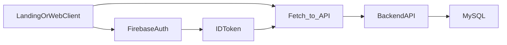

# Landing Web -> API Backend

> Integración oficial entre landing/frontend y backend REST en subdominio dedicado.

---

## Arquitectura de despliegue

- `https://sajarubox.com` -> frontend (landing o app web)
- `https://api.sajarubox.com` -> backend Node.js

---

## Reglas de integracion

1. El frontend no accede directo a MySQL ni a Firestore.
2. Toda operacion de negocio pasa por API REST.
3. URL de API configurada por entorno (`VITE_API_URL` o equivalente).
4. CORS en backend solo permite dominios autorizados.

---

## Variables de entorno frontend

| Variable | Ejemplo |
|----------|---------|
| `VITE_API_URL` | `https://api.sajarubox.com` |

---

## Flujo de llamada

---

## Buenas practicas

- Centralizar cliente HTTP en un solo módulo.
- Manejar timeouts y reintentos con backoff.
- Estandarizar manejo de errores (`ok`, `error.code`, `error.message`).
- No exponer secretos en frontend.

---

## Checklist de deploy web

1. `api.sajarubox.com` responde `GET /api/v1/health`
2. `VITE_API_URL` apunta al entorno correcto
3. CORS permite `https://sajarubox.com`
4. Flujo de auth con token Firebase funciona de extremo a extremo
